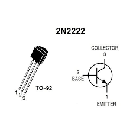
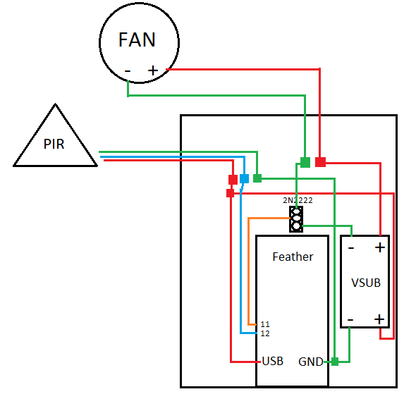
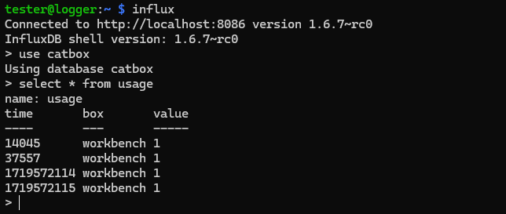
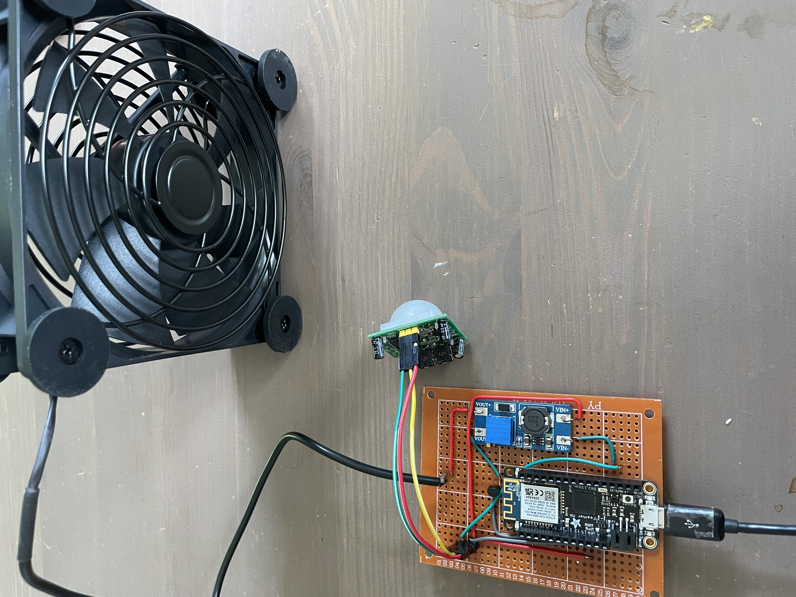

## A smart catbox... sorta

Recently, I have been getting into building stuff, and I've had the idea for a while to add some sort of air filter to one of my cats' litter boxes. Why buy a smart box when you can make one? They're both quite large, and one cat is particularly messy, so this was a fun project to help keep them healthy and happy, and cut down on mess and stank.

Below are my notes from this project, with a little bit of narration.

#### Components

- 2-wire fan
- Transistor - NPN 2N2222
- PIR Motion sensor
- Feather m0 + WiFi

Optional - Voltage step-up board

#### Transistor pinout



## Wiring

This prototype uses a voltage step-up board (VSUB) to drive the fan off a 5v input (USB), producing ~6.5v output to the fan. 

I am Currently using an "AC INFINITY" (?) fan I found at a local overstock store. This fan operates at lower voltages despite being 120mm. I am uncertain of the CFM, but with the VSUB it's possible to run higher voltage fans off 5v, so maybe I'll do that in the future.

- Fan + Terminal connected to VSUB OUT +
- Fan - Terminal connected to Transistor Collector
- Transistor Base connected to GPIO
- Transistor Emitter connected to VSUB OUT -
- PIR GND -> VSUB IN - / GND
- PIR OUT -> GPIO
- PIR VCC -> VSUB IN +
- VSUB IN + -> USB (5v)
- VSUB IN - -> GND

#### Diagram



### InfluxDB Setup

Later edit: Originally, I wanted this to work with an InfluxDB to track some usage stats. While this works, it's not very helpful right now because I don't know what cat used the box, and there are some interesting FP events every once in a while. My thought is ghosts, but I can't confirm that. 

Create Database:
```
# influx
> create database catbox
> CTRL+D
# curl -i -XPOST 'http://192.168.1.9:8086/write?db=catbox' --data-binary 'usage,box=workbench value=1 1719572114'
HTTP/1.1 204 No Content
Content-Type: application/json
Request-Id: 30d422e9-353d-11ef-809e-000000000000
X-Influxdb-Build: OSS
X-Influxdb-Version: 1.6.7~rc0
X-Request-Id: 30d422e9-353d-11ef-809e-000000000000
Date: Fri, 28 Jun 2024 10:57:20 GMT
# influx
> use catbox
Using database catbox
> show measurements
name: measurements
name
----
usage
> select * from usage;
name: usage
time       box       value
----       ---       -----
1719572114 workbench 1
```

Influx requires a timestamp of some variety in the measurements. For the time being, I decided to use `millis()` in Arduino C, which tracks the milliseconds since the device has turned on. See: POST below.

## Arduino Code

#### POST Request -> Influx

This PoC:
1. Connects to WiFi
2. Checks `irSensorPin` value
3. If HIGH, calls `sendData()`
4. Sends a POST request to Influx @ 192.168.1.9 `catbox db, usage measurement, location, millis()`
5. Sleeps for 15 seconds
6. Repeats `loop()` 

PoC to turn on fan for 15 seconds and send a GET request when the PIR is tripped

```C
#include <SPI.h>
#include <WiFi101.h>
#include "ArduinoHttpClient.h"
#include "arduino_secrets.h" 

// WiFi setup
char ssid[] = "XXXX";
char pass[] = "XXXXXXXXXXXXXXXXXXXXXXXXXXXXXXXXX";
int status = WL_IDLE_STATUS;
char serverAddress[] = "192.168.1.9";  // server address
int port = 8086;
WiFiClient wifi;
HttpClient client = HttpClient(wifi, serverAddress, port);

// Pins
const int irSensorPin = 12;
const int fanPin = 11;
const int ledPin = 13;

void setup() {
  WiFi.setPins(8,7,4,2);
  pinMode(fanPin, OUTPUT);// Set fanPin as OUT
  pinMode(ledPin, OUTPUT);// Set fanPin as OUT
  pinMode(irSensorPin, INPUT); // Set the irPin as IN
  Serial.begin(9600); // Initialize serial communication for debugging

  while (status != WL_CONNECTED) {
    Serial.print("Attempting to connect to SSID: ");
    Serial.println(ssid);
    // Connect to WPA/WPA2 network. Change this line if using open or WEP network:
    status = WiFi.begin(ssid, pass);

    // wait 10 seconds for connection:
    delay(10000);
  }

  Serial.println("Connected to wifi");
  printWiFiStatus();
}

void loop() {
  int irSensorValue = digitalRead(irSensorPin); // Read the IR sensor value

  if (irSensorValue == HIGH) { // Check if the IR sensor is triggered
    digitalWrite(fanPin, HIGH); // Turn the Fan on
    digitalWrite(ledPin, HIGH); // Turn the led on
    Serial.print("calling sendData");
    sendData();
    delay(15000);
  } else {
    digitalWrite(fanPin, LOW); // Ensure the Fan is off    
    digitalWrite(ledPin, LOW); // Turn the led off
  }
}

// Send POST request
void sendData() {
  Serial.println("making POST request");
  String contentType = "application/x-www-form-urlencoded";
  String postData = "usage,box=workbench value=1 ";
  postData += millis();

  client.post("/write?db=catbox", contentType, postData);
  // read the status code and body of the response
  int statusCode = client.responseStatusCode();
  String response = client.responseBody();

  Serial.print("Status code: ");
  Serial.println(statusCode);
  Serial.print("Response: ");
  Serial.println(response);
}

void printWiFiStatus() {
  // print the SSID of the network you're attached to:
  Serial.print("SSID: ");
  Serial.println(WiFi.SSID());

  // print your WiFi shield's IP address:
  IPAddress ip = WiFi.localIP();
  Serial.print("IP Address: ");
  Serial.println(ip);

  // print the received signal strength:
  long rssi = WiFi.RSSI();
  Serial.print("signal strength (RSSI):");
  Serial.print(rssi);
  Serial.println(" dBm");
}
```



## It works! 

Super Pooper v1.0 has been completed. Not much to document when going form the above design and code, to the "final" product. I got to do some casual "wood working" with this project, too, so that was pretty fun. As always, there was troubleshooting at almost every step, here are a couple things I encountered / thoughts about it:

1. Fried a motion sensor attempting to solder a jumper to it
2. Breadboard to actual soldered board was way harder than I want to admit
	1. When was the last time I soldered more than a quick fix??
3. Hot glue is ur friend
4. Calibration of the PIC sensor was a bit of a PITA
	1. Lots of FPs... or ghosts?
5. The stacking headers on the feather were also a PITA
6. Mounting the fan and filter to the catbox was a challenge
### Builds

Here's the initial prototype-- lots of jumpers here...


"Finalized" version, a bit rough but it works:



With a soldered board, it was just a matter of figuring out how to mount the fan and filter in a way that made sense.

## Assembled

Here's the initial assembled photo. It's been modified to look a bit nicer now, but this is the overall gist of it!


## Future Improvements?

Will I do these? *Maybe.* 

Now that it's all together, I've thought of several improvements and features I'd add if I were to make a v2. I'm not sure I will, but it would be pretty cool.
#### 1. Better fans and filter

The fan I am running is a max 6.5v or so-- this is probably because it's a set of two daisy chained fans that I found at a nearby "overstock" store. I considered running both, but I don't think the feather can provide the necessary amps through the 5v pin with the step up regulator. It's possible, but one fan is fine for the moment; it's very easy to clean the filter I have in it, which is good, because it kinda sucks.

Ideally, I'd want to be running HEPA filters (because why not?), but that means the fans would need upgrading to something more capable, without breaking the bank, nor being too noisy. So, that's probably the first improvement I can think of.
#### 2. RFID / BT tags, or something

Cat one, cat two!

Wouldn't it be cool if I could tell what cat went in the box? Well, that's pretty easy with bluetooth. The cats don't really want to wear collars, so an alternative could be a scale, but I feel like that would be more complex. I did the computer vision thing once with tensorflow, and I guess that's *another* way. Low power bluetooth is easiest though, I'm certain of it.
#### 3. Air quality sensor

There are some really cool sensors out there, and air quality sensors on the inside of the box would be pretty kick ass, but useless if the filters can't actually clean the air. So this one, like the RFID, is more of a pipe dream.
#### 4. A nice, low profile housing

Right now it's just  aboard hot glued to wood. That's cool, it works ya know. but what if it wasn't a board hot glued to wood? That would be neat.

#### 5. Custom board

It would be AWESOME to buy each chip individually, instead of relying on the feather. I've love to get a SOC  / MCU, flash memory and a wifi chipset / anything else that's necessary, and go through the process of flashing firmware onto them myself. This is end game, but something I'm really interested in doing. Design a custom PCB and stuff. Hell yeah!

