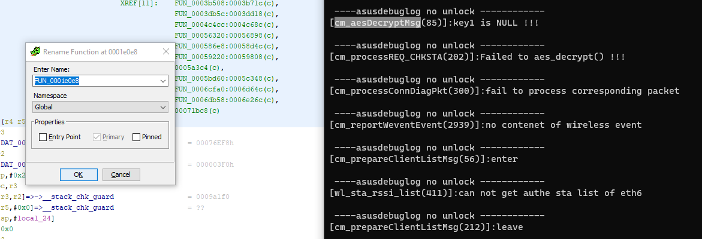

This post is just a collection of my notes and experiences reversing, compiling and emulating Asus proprietary and Asuswrt-Merlin software, on an Ubuntu 20.04 box. It's a bit of a pain really, I thought it would be pretty easy but everything's been an issue, which is also what makes it sorta fun.

Worked primarily with https://github.com/RMerl/asuswrt-merlin.ng for the RT-AX88U router, but some binaries are just closed-source :/<!--more-->

----------

Various, helpful and unhelpful links:

qemu / Reversing:
- https://resources.infosecinstitute.com/topic/fundamentals-of-iot-firmware-reverse-engineering/
- https://gitbook.seguranca-informatica.pt/arm/reverse-iot-devices/reverse-asus-rt-ac5300#emulation-nvram
- https://www.zerodayinitiative.com/blog/2020/5/27/mindshare-how-to-just-emulate-it-with-qemu

AFL Examples:
- https://animal0day.blogspot.com/2017/05/fuzzing-apache-httpd-server-with.html
- https://mmmds.pl/cherokee-revisited-with-AFL/
- https://securitylab.github.com/research/fuzzing-apache-1/

AFL Mutators
- https://aflplus.plus/docs/custom_mutators/
- https://github.com/AFLplusplus/Grammar-Mutator

#### Source, toolchain, compiling
First off, setup the system and build the toolchains as the directions show in merlin.ng: https://github.com/RMerl/asuswrt-merlin.ng/wiki/Compile-Firmware-from-source

#### Clone down arm static bins

- strace
- gdb
- etc

### NVRAM

One of the things that makes this such a pain is needing to get the nvram set up. I used Firmadyne's libnvram project for this: https://github.com/firmadyne/libnvram

#### Clone libnvram

`git clone https://github.com/firmadyne/libnvram.git`

Run this on router:

`admin@RT-AX88U-C100:/tmp/home/root# nvram getall`

Copy nvram values out, regex to fix for fimadyne's config.h format-- careful with ones that have "=" in em, e.g.

`ENTRY("http_passwd", nvram_set, "+S8a5usKANuNzKOaPXpI0Js0McOBF2Mgjz0/x9AR8YM") \`

Compile libnvram to ARM, copy into path

`arm-linux-gcc-5.5.0 -shared -nostdlib nvram.c -o libnvram.so -ldl && chmod 777 libnvram.so && ~/amng-build/release/src-rt-5.02axhnd/targets/94908HND/fs && cp ~/libnvram/libnvram.so firmadyne/`

Brutal regex thing for creating nvram files

`tester@asuserlin-ubuntu20:~/amng-build/release/src-rt-5.02axhnd/targets/94908HND/fs$ while read line; do test=$(echo $line | sed 's/ABAB.*//'); test2=$(echo $line | sed -E 's/.*ABAB//'); echo -n $test2 > "firmadyne/libnvram/$test" ; done < nvrams`

with nvrams file containing keys like `vpn_client5_portABAB1194`. Dumb, but it works

Script for rebuilding httpd and relaunching qemu with the updated version:

`cd ~/amng-build/release/src-rt-5.02axhnd && make httpd && cd targets/94908HND/fs && sudo cp /home/tester/amng-build/release/src/router/httpd/httpd usr/sbin/httpd && sudo chroot . ./qemu-arm-static -E LD_PRELOAD=/firmadyne/libnvram.so /bin/sh`

```bash
sudo chroot . ./qemu-arm-static /bin/sh
/ # export LD_PRELOAD=/firmadyne/libnvram.so && cd www && httpd
```

`sudo chroot . ./qemu-arm-static -E LD_PRELOAD=/firmadyne/libnvram.so /bin/sh`

still many nvram errors, just keep fixing them as they come up, or edit them out of source, I guess.

Annoying to deal with https stuff on stratup, commented out the https stuff

524d9c08074d62b145d44001c78f0e65


## cfg_server

First, created the directories I saw from a real Router, an AC-1900

```bash
mkdir etc/cfg_mount
touch etc/cfg_mount/cert.pem
touch etc/cfg_mount/key.pem
touch etc/cfg_mount/pubkey.pem
```

`nvram set cfg_syslog=1` creates some debug files in `/tmp/asusdebuglog/`


Fought a bit more with nvram, created "debug_cprintf_file" key in libnvram.override/

```
3503008 semget(1094647810,1,0,17,-1,0) = 11
3503008 semctl(11,0,IPC_STAT,0xfffee410) = 0
3503008 semop(11,-72600,1,1672422623,-8805904,-8675096) = 0
3503008 write(2,0xfffebf48,67)nvram_get_buf: Unable to open key: /firmadyne/libnvram/cfg_syslog!
 = 67
3503008 write(1,0x9c5c0,13)Exit daemon!
```

This: `Unable to open key: /firmadyne/libnvram/cfg_syslog` means do this 
```
/fs $ sudo su
/fs # echo 1 > firmadyne/libnvram.override/cfg_syslog
/fs # echo 1 > firmadyne/libnvram/cfg_syslog
/fs # exit
```


Saw that the cprintf file now existed in tmp, full of entries like

```
[check_auth(72)]:This is not ASUS router

Error locking /tmp/asusdebuglog_lock_1156484.lock: 2 No such file or directory
---------asusdebuglog failed to lock file! -------
[main(15700)]:auth check failed, exit

Error locking /tmp/asusdebuglog_lock_1156484.lock: 2 No such file or directory
---------asusdebuglog failed to lock file! -------
[check_auth(72)]:This is not ASUS router

Error locking /tmp/asusdebuglog_lock_1156592.lock: 2 No such file or directory
---------asusdebuglog failed to lock file! -------
[main(15700)]:auth check failed, exit
```

see this:

`[cm_task(10185)]:create a folder for cfg_mnt (/jffs/.sys/cfg_mnt/)`

do this:

`mkdir -p jffs/.sys/cfg_mnt`

seems like nothing changed lol

Took a look at the ghidra for this stuff

Found in FUN_00014300:
```C
iVar4 = FUN_0001e608();
if (iVar4 == 1) {
pcVar2 = (char *)func_nvram_Check-2("cfg_dbg");
iVar3 = strcmp(pcVar2,"1");
if (iVar3 == 0) {
cprintf("[%s(%d)]:auth check failed, exit\n",&DAT_000800e1,0x2860);
}
pcVar2 = (char *)func_nvram_Check-2("cfg_syslog");
iVar3 = strcmp(pcVar2,"1");
if (iVar3 == 0) {
uVar6 = 0x2860;
pcVar2 = "[%s(%d)]:auth check failed, exit\n";
goto LAB_00014464;
}
}
else { 
...
```

FUN_0001e608 == auth_check()

These debug logs made renaming functions in ghidra a breeze



Line 31: checks auth_check return val, patched this to flip it by patching via ghidra


then exporting the program as an elf, writing it back to the file system *annnnd*:

```
[main(10340)]:auth check success

Error locking /tmp/asusdebuglog_lock_1157672.lock: 2 No such file or directory
---------asusdebuglog failed to lock file! -------
[cm_task(10174)]:task start

Error locking /tmp/asusdebuglog_lock_1157700.lock: 2 No such file or directory
---------asusdebuglog failed to lock file! -------
[cm_task(10185)]:create a folder for cfg_mnt (/jffs/.sys/cfg_mnt/)

Error locking /tmp/asusdebuglog_lock_1157700.lock: 2 No such file or directory
---------asusdebuglog failed to lock file! -------
[cm_initKeyInfo(9622)]:open public PEM file : /etc/cfg_mnt/pubkey.pem ...

Error locking /tmp/asusdebuglog_lock_1157700.lock: 2 No such file or directory
---------asusdebuglog failed to lock file! -------
[cm_initKeyInfo(9648)]:Done
```

It worked! How cool. Now it's running, but it fails :((
```
----asusdebuglog no unlock ------------
[cm_generateGroupKey(9549)]:generate group key

----asusdebuglog no unlock ------------
[cm_addDutInfo(624)]:add DUT releated information

----asusdebuglog no unlock ------------
[chmgmt_get_chan_info(54)]:get chan info failed

----asusdebuglog no unlock ------------
[update_cost(777)]:lldp result(0)

----asusdebuglog no unlock ------------
[cm_updateOnboardingStatus(691)]:update onboarding status, obStatus(1), cfg_obstatus(0)

----asusdebuglog no unlock ------------
[cm_getChanspec(257)]:get chan info failed

----asusdebuglog no unlock ------------
[cm_getIfInfo(9784)]:get own address of br0 failed!

----asusdebuglog no unlock ------------
[cm_task(10273)]:get interface information failed

----asusdebuglog no unlock ------------
[...]
```

It bails out trying to get networking information for br0 -- looking at the ghidra, this checks out, fails in this section send it back to the entry point and exit

So, use netplan to rename interface to br0 as epxlained here:
https://askubuntu.com/questions/1317036/how-to-rename-a-network-interface-in-20-04

And! Now it's running >:D
```bash
➜  asus nmap -sT 192.168.1.180 -p0- -v --open
Starting Nmap 7.92 ( https://nmap.org ) at 2022-10-10 18:58 EDT
Initiating Ping Scan at 18:58
Scanning 192.168.1.180 [2 ports]
Completed Ping Scan at 18:58, 0.00s elapsed (1 total hosts)
Initiating Parallel DNS resolution of 1 host. at 18:58
Completed Parallel DNS resolution of 1 host. at 18:58, 0.00s elapsed
Initiating Connect Scan at 18:58
Scanning 192.168.1.180 [65536 ports]
Discovered open port 22/tcp on 192.168.1.180
Discovered open port 7788/tcp on 192.168.1.180
Completed Connect Scan at 18:58, 0.86s elapsed (65536 total ports)
Nmap scan report for 192.168.1.180
Host is up (0.00010s latency).
Not shown: 65534 closed tcp ports (conn-refused)
PORT     STATE SERVICE
22/tcp   open  ssh
7788/tcp open  unknown

Read data files from: /usr/bin/../share/nmap
Nmap done: 1 IP address (1 host up) scanned in 0.90 seconds
```

Looking at the cprintf log file, now seeing more stuff, and some stuff about received packets:
```
----asusdebuglog no unlock ------------
[cm_rcvUdpHandler(196)]:own addr 192.168.1.180

----asusdebuglog no unlock ------------
[cm_rcvUdpHandler(202)]:got packet from 192.168.1.2

----asusdebuglog no unlock ------------
[cm_processConnDiagPkt(298)]:process packet (5)

----asusdebuglog no unlock ------------
[cm_selectGroupKey(3980)]:gKeyTime(312), gKey1Time(1665445160), groupKeyExpireTime(3600), rekeyTime(3150)

----asusdebuglog no unlock ------------
[cm_selectGroupKey(3988)]:gKey1Time > groupKeyExpireTime, select key

----asusdebuglog no unlock ------------
[cm_selectGroupKey(3980)]:gKeyTime(312), gKey1Time(1665445160), groupKeyExpireTime(3600), rekeyTime(3150)

----asusdebuglog no unlock ------------
[cm_selectGroupKey(3988)]:gKey1Time > groupKeyExpireTime, select key1

----asusdebuglog no unlock ------------
[cm_aesDecryptMsg(82)]:Failed to aes_decrypt() by key!!!

----asusdebuglog no unlock ------------
[cm_aesDecryptMsg(85)]:key1 is NULL !!!

----asusdebuglog no unlock ------------
[cm_processREQ_CHKSTA(202)]:Failed to aes_decrypt() !!!

----asusdebuglog no unlock ------------
[cm_processConnDiagPkt(300)]:fail to process corresponding packet
```


First calls `cm_rcvUdpHandler()`, believe this is triggered by the router at 192.168.1.2, it's preiodically broadcasting a message on UDP/7788 so this makes sense

Can enable better debugging by creating the following nvrams

```
cfg_syslog
cfg_dbg
asuslog_debug_test
debug_cprintf_file

touch tmp/cfg_mnt.log
touch tmp/asusdebuglog/cfg_mnt.log
```

Alright, so looking at the above, we see what's happening, some sort of key / encryption issue based on the key times
```
----asusdebuglog no unlock ------------
[cm_selectGroupKey(3980)]:gKeyTime(312), gKey1Time(1665445160), groupKeyExpireTime(3600), rekeyTime(3150)

----asusdebuglog no unlock ------------
[cm_selectGroupKey(3988)]:gKey1Time > groupKeyExpireTime, select key1

----asusdebuglog no unlock ------------
[cm_aesDecryptMsg(82)]:Failed to aes_decrypt() by key!!!
```

So, the "gKey1Time" epoch timestamps is 1665578564, or, the current time.

Maybe can generate a fake key or something?

### AFL -> cfg_server

Can use defork  and desock from preeny
`sudo chroot . ./qemu-arm-static -E LD_PRELOAD=/firmadyne/libnvram.so:/desock.so:/defork.so /usr/sbin/cfg_server`

^ runs... exits, doesn't seem to work

Need to get this accepting from stdin

Need a seed, previously captured some 7788/udp traffic

[...]


## httpd... crash?

First for debugging-- 

`touch /tmp/HTTPD_DEBUG`

Enables debug mode, writing HTTPD_DEBUG info to /jffs/HTTPD_DEBUG

The httpd crash is from sending a digit as the first character of the payload body happens in httpd.c, around line 1605 in `handler->output(file, conn_fp);`
```C
}
if (strcasecmp(method, "head") != 0 && handler->output) {
    printf("FFFFFFFFFFFF\r\n", 16);
    handler->output(file, conn_fp);
    printf("GGGGGGGGGGGG\r\n", 16);
}
break;
}
```

Out:
```
FFFFFFFFFFFF
nvram_get_buf: preferred_lang
sem_get: Key: 410d0002
sem_get: Key: 410d0002
nvram_get_buf: = "EN"
nvram_get_buf: odmpid
sem_get: Key: 410d0002
sem_get: Key: 410d0002
nvram_get_buf: = ""
nvram_get_buf: rc_support
sem_get: Key: 410d0002
sem_get: Key: 410d0002
nvram_get_buf: = "mssid 2.4G 5G update usbX2 switchctrl manual_stb 11AX pwrctrl WIFI_LOGO nandflash smart_connect movistarTriple wifi2017 app ofdma wpa3 reboot_schedule ipv6 ipv6pt PARENTAL2 dnsfilter dnspriv dualwan pptpd openvpnd utf8_ssid printer modem webdav rrsut clou"
qemu: uncaught target signal 11 (Segmentation fault) - core dumped
Segmentation fault (core dumped)
/www #
```

Set up host system to create core dumps with ulimit

can directly run httpd with qemu-user mode

`sudo chroot ../ ./qemu-arm-static -E LD_PRELOAD=/firmadyne/libnvram.so -E PWD=/www /usr/sbin/httpd`

PWD env var doesnt seem to work, trying symlink

`cp --symbolic-link www/* .`

^ worked well enough, getting expected responses, including crash

`sudo chroot . ./qemu-arm-static -E LD_PRELOAD=/firmadyne/libnvram.so /usr/sbin/httpd`

Now to set up afl++? Need to get the bin accepting requests from stdin, and exit after the request is handled

Modified source to exit after request is handled:
```C
if(filter_ban_ip())
{
    printf("AAAAAAAAAAAA\r\n", 16);
    handle_request();
    exit(1);
    printf("BBBBBBBBBBBB\r\n", 16);
}
```

That defo works

took a lot of work but I got the bin reading in and processing requests from files, still fighting with the output though, its writing to the same file used as input, which appends it with the response and for some reason does not crash?

OK, after more editing I realized it is very simple to get httpd accepting requests from stdin:

within `handle_request()`, near it's declaration you need to add:
```C
  /* Parse the first line of the request. */
	conn_fp = fopen(inputFile, "r+"); // <-- this
```

and in main():
```C
int main(int argc, char **argv)
{
usockaddr usa;
int listen_fd[3];
fd_set active_rfds;
conn_list_t pool;
int i, c;
//int do_ssl = 0;

inputFile = argc[argv - 1]; // Add this
handle_request(); // and this
fprintf(stderr, "Exit handle_request()\n"); // meh
exit(1); // and this

[...]
```

Sttill a few issues but the io works:

```bash
$ cat http_request
GET / HTTP/1.0
Host: 192.168.1.180:80


$ sudo chroot . ./qemu-arm-static -E LD_PRELOAD=/firmadyne/libnvram.so /usr/sbin/httpd /http_request
[...]
nvram_unset: httpd_handle_request
sem_get: Key: 415f0002
sem_get: Key: 415f0002
nvram_unset: httpd_handle_request_fromapp
sem_get: Key: 415f0002
sem_get: Key: 415f0002
Exit handle_request()

$ cat http_request
GET / HTTP/1.0
Host: 192.168.1.180:80

HTTP/1.0 404 Not Found
Server: httpd/2.0
x-frame-options: SAMEORIGIN
x-xss-protection: 1; mode=block
Date: Mon, 19 Dec 2022 15:33:14 GMT
Content-Type: text/html
Connection: close

<HTML><HEAD><TITLE>404 Not Found</TITLE></HEAD>
<BODY BGCOLOR="#cc9999"><H4>404 Not Found</H4>
File not found.
</BODY></HTML>
```

It's writing it's output after the input, and *doesn't* crash. Not sure if that's good or bad for this, probably bad, but I still fuzzed.


### AFL -> httpd

Used afl++ in qemu mode to begin fuzzing the httpd bin using a few example requests and a dictionary file from: https://github.com/antonio-morales/Apache-HTTP-Fuzzing

install AFLplusplus: https://aflplus.plus/building/

Compile for QEMU with arm support:

`~/AFLplusplus/qemu_mode$ CPU_TARGET=arm ./build_qemu_support.sh`

Using mime_handlers and httpd.c and httpd.h I created a small dictionary which contains the contents of /www/, common headers, specific headers and anything else interesting, based off of the dict mentioned above

Then:

`/fs$ QEMU_LD_PREFIX=/home/tester/amng-build/release/src-rt-5.02axhnd/targets/94908HND/fs/ /home/tester/AFLplusplus/afl-fuzz -Q -i /home/tester/afl-in/ -o /home/tester/afl-out/ -x /home/tester/http.dict -- usr/sbin/httpd @@`


This works... sorta, but since AFL is built for fuzzing random binary data it's not "context aware" and has no idea how to fuzz data with any structure, or grammar, so it just throws fuck all at it and watches what happens.

With a dictionary AFL does encounter some valid requests, and lots of broadcasts are sent in some cases:


To perform more targetted fuzzing for languages like HTTP, which expect requests to be in specific formats and are parsed for specific keywords and structures, there are cool AFL tools like [Grammar Mutator](https://github.com/AFLplusplus/Grammar-Mutator). 

### Custom Mutators-- teaching AFL http

Followed tutorials on custom grammar:
https://github.com/AFLplusplus/Grammar-Mutator

Cloned mutator to AFL dir

`export AFL_CUSTOM_MUTATOR_LIBRARY=/home/tester/AFLplusplus/Grammar-Mutator/libgrammarmutator-http.so`
`export AFL_CUSTOM_MUTATOR_ONLY=1`

ended up just running commands and just including the mutator var

edit mutator to be more targeted-- this is so sick, then

`make GRAMMAR_FILE=grammars/http.json`

generate the trees and seeds (can do more than 100)

`./grammar_generator-http 100 1000 ./seeds ./trees`

Now, copy the trees into the session directory

`cp -r trees/ ~/afl-out/http-1` etc...

kicked it off with seeds

`$ AFL_CUSTOM_MUTATOR_LIBRARY=/home/tester/AFLplusplus/Grammar-Mutator/libgrammarmutator-http.so AFL_CUSTOM_MUTATOR_ONLY=1 QEMU_LD_PREFIX=/home/tester/amng-build/release/src-rt-5.02axhnd/targets/94908HND/fs/ /home/tester/AFLplusplus/afl-fuzz -Q -i /home/tester/AFLplusplus/Grammar-Mutator/seeds/ -o /home/tester/afl-out/ -M http-1 -- usr/sbin/httpd @@`

Still seeing broadcasts 


Constant tuning of grammar, creating  "definitions" for the data structure I'd like to fuzz. It's begun to get a little unwieldly as I began to add more and more POST and GET params, so I'm seeing the benefits of having fuzzers hitting specific functionality only. This makes sense as it's more of a targetted approach than casting a wide net, making it possible to fuzz individual requests very thoroughly. It's probably possible to create one giant definition file for the grammar stuff but I think it wastes a LOT of cycles touching stuff that is useless.

So, I began to rewrite the grammar for requests which I've found vulns in already.

After some finagling, have a seemingly solid test case generator for the apps_test.asp page. I think I may need to work on the content-length header tho, make it dynamic on the length of POST body

http-apps_test.json

```
$ cat seeds/28
POST /apps_test.asp?F=f HTTP/0.9
Authorization: /apps_test.asp?w=t


apps_action=enable&apps_action=remove&apps_action=update&
```

Neat, that was generated by a more specific http.json format! Need to figure out the length of the body for Content-Length 

As I get more specific in my grammar mutation I'm also finding overlap between tools like AFL and Burp, which is interesting

### Crash Update

The below request causes a segfault :') woohoo

```html
GET /Main_Login.asp HTTP/1.0
Host: 192.168.1.180:80
Content-Length: 4

0000
```

fuzzing with a dict does get some crashes pretty quickly, have four workers going, as of writing this, there are ~7 similar crashes

I left it running for a couple days this time, confident at least the crashes I expected were happening. Over the few days it ran AFL was able to cause and save 205 crashes. The majority are moslty garbage-- huge requests or just non-ASCII stuff that gets generated by AFL when it is left to it's own devices. Check it out:

Garbage "crash" (2873 lines O_O):
```
$ cat ~/afl-out/http-4/crashes/id\:000041\,sig\:11\,src\:000414+000778\,time\:32213464\,execs\:27016271\,op\:splice\,rep\:2
[...]
Host: 192F168t.asp
H.asp
Hgth:0:80
Cont:80
Co t
HoZtI 1nt.asp
8�:80
Transfer-E
HoZt:92s:80
a�p
HoZ
$ cat ~/afl-out/http-4/crashes/id\:000041\,sig\:11\,src\:000414+000778\,time\:32213464\,execs\:27016271\,op\:splice\,rep\:2 | wc -l
2873
```

Or this one... it's almost an HTTP request?

```
$ cat ~/afl-out/http-4/crashes/id\:000004\,sig\:11\,src\:000474\,time\:1066760\,execs\:878783\,op\:havoc\,rep\:16
GET /start_apply2.htm    A  !  sp
Host:clop 1%-?+�                        ys`o        `�              sp
Host:clop 1%-?+�b%Es /Mainqi�/AmPqotect��GEf /Ma                   sp
H.0
Host: 192.   0                �gin.aspu&modemHost:�lnge_location.cgiGET
+ou
Content-Length:14

5+++++++
```

And, we see some that are clearly "valid" HTTP requests and are effectively what I had hoped to see to guarantee everything is "working". "Working" means crashing, lol

```
cat ~/afl-out/http-4/crashes/id\:000001\,sig\:11\,src\:000000\,time\:17901\,execs\:4760\,op\:havoc\,rep\:4
GET /Main_Login.asp �ost: 192.168.1.180:Ha
Content-Length: 4

0
```

So, why did AFL save *so many* of these crashes? Most aren't unique from one another or at least I don't think they are, but the whole goal is to find a useable crash, so I began triaging to see if anything stuck out. 

### Crash troubleshooting 

So, let's take a look at two of these crashes. They are generated from the following two HTTP requests-- the first one I found through various testing, the second was found by AFL, as planned.

`known_crash`:
```
GET /Main_Login.asp HTTP/1.0
Host: 192.168.1.180:80
Content-Length: 4

0000
```

`http_request`:
```
GET /get_ig_config.cgi
HostGET �upload_cert_key.�giGET
Content-Length:54

2222222222222222222222222222222222222222222222222222222222222222222222222222222222222222222222222de-ch2a
GET /Main_Login.aspAdvance
```

Running gdb-multiarch with the binary and associated coredumps:

`http_request` crash:
```
# gdb-multiarch -q usr/sbin/httpd qemu_httpd_20230101-134448_1803079.core
Reading symbols from usr/sbin/httpd...
[New LWP 1803079]

warning: Unable to find libthread_db matching inferior's thread library, thread debugging will not be available.

warning: Unable to find libthread_db matching inferior's thread library, thread debugging will not be available.
Core was generated by `
                       ������'.
Program terminated with signal SIGSEGV, Segmentation fault.
#0  0x000444b4 in do_json_decode ()
(gdb) bt
#0  0x000444b4 in do_json_decode ()
#1  0x00047714 in do_get_ig_config_cgi ()
#2  0x00019c5c in handle_request ()
#3  0x00016ef8 in main ()
(gdb)
```

`known_crash` crash:
```
# gdb-multiarch -q usr/sbin/httpd qemu_httpd_20230101-134349_1803037.core
Reading symbols from usr/sbin/httpd...
[New LWP 1803037]

warning: Unable to find libthread_db matching inferior's thread library, thread debugging will not be available.

warning: Unable to find libthread_db matching inferior's thread library, thread debugging will not be available.
Core was generated by `������'.
Program terminated with signal SIGSEGV, Segmentation fault.
#0  0x000444b4 in do_json_decode ()
(gdb) bt
#0  0x000444b4 in do_json_decode ()
#1  0x0001b390 in do_ej (path=<optimized out>, stream=0x0) at ej.c:309
#2  0x00019c5c in handle_request ()
#3  0x00016ef8 in main ()
(gdb)
```

Both stem from `do_json_decode` though no backtrace info beyond that is available as it wasn't compiled with debug symbols (-g):
```
(gdb) bt full
#0  0x000444b4 in do_json_decode ()
No symbol table info available.
#1  0x00047714 in do_get_ig_config_cgi ()
No symbol table info available.
#2  0x00019c5c in handle_request ()
No symbol table info available.
#3  0x00016ef8 in main ()
No symbol table info available.
```

Quick fix:

../src/router/httpd/Makefile:342
```Makefile
httpd: $(OBJS)
        @echo " [httpd] CC $@"
        $(CC) -g -o $@ $(OBJS) $(LIBS) $(EXTRALDFLAGS)
```
Annnddd.. recompile

Alright, so now the `known_crash-1` file's core dump (with `-g`) looks like this:

```
# gdb-multiarch -q usr/sbin/httpd qemu_httpd_20230101-143447_1811053.core
Reading symbols from usr/sbin/httpd...
[New LWP 1811053]

warning: Unable to find libthread_db matching inferior's thread library, thread debugging will not be available.

warning: Unable to find libthread_db matching inferior's thread library, thread debugging will not be available.
Core was generated by `������'.
Program terminated with signal SIGSEGV, Segmentation fault.
#0  0x000444b4 in do_json_decode ()
(gdb) bt full
#0  0x000444b4 in do_json_decode ()
No symbol table info available.
#1  0x0001b390 in do_ej (path=<optimized out>, stream=0x0) at ej.c:309
        pat_buf = '\000' <repeats 484 times>...
        pattern = 0xfffec7cc ""
        asp = 0x0
        asp_end = 0x0
        key = 0x0
        key_end = 0x0
        start_pat = <optimized out>
        end_pat = <optimized out>
        lang = 0x1098a0 "EN"
        fp = 0x108150
        ret = <optimized out>
        read_len = <optimized out>
        len = <optimized out>
        no_translate = 1
        kw = {len = 0, tlen = 0, idx = 0x0, buf = 0x0}
        current_lang = <optimized out>
        root = 0x1099d8
#2  0x00019c5c in handle_request ()
No symbol table info available.
#3  0x00016ef8 in main ()
No symbol table info available.
```

Sadly no additional info comes from the other crash after enabling debug symbols. Looking at where the decode call comes from, ej.c:309

ej.c:298
```C
#ifdef TRANSLATE_ON_FLY
	// Load dictionary file
	lang = nvram_safe_get("preferred_lang");
	if(!check_lang_support(lang)){
		lang = nvram_default_get("preferred_lang");
		nvram_set("preferred_lang", lang);
	}

	char *current_lang;
	struct json_object *root = json_object_new_object();

	do_json_decode(root); // Line 309
	if ((current_lang = get_cgi_json("current_lang", root)) != NULL){
		if (load_dictionary (current_lang, &kw)){
			no_translate = 0;
		}
	}
	else{
		if (load_dictionary (lang, &kw)){
			no_translate = 0;
		}
	}
	if (root) json_object_put(root);
#endif  //defined TRANSLATE_ON_FLY
```

Cool! So the crash occurs from `do_json_decode(root);` not sure exactly WHY yet but that's OK, can figure that out. I assume this function isn't expecting a numeric value as `root`.

So, what's `do_json_decode()` do? Well, I only see it referenced in `ej.c`

`45: extern int do_json_decode(struct json_object *root);`

`*root` is defined as: `struct json_object *root = json_object_new_object();`
```
# grep -R "json_object_new_object" ../* 2<&-
../src/router/arm-glibc/stage/usr/include/json-c/json_object.h:extern struct json_object* json_object_new_object(void);
[...]
```

what is it?

`json_object_new_object: /release/src-rt-5.02L.07p2axhnd/bcmdrivers/broadcom/net/wl/impl69/main/components/opensource/jsonc/json_object.h`
```C
/* object type methods */

/** Create a new empty object with a reference count of 1.  The caller of
 * this object initially has sole ownership.  Remember, when using
 * json_object_object_add or json_object_array_put_idx, ownership will
 * transfer to the object/array.  Call json_object_get if you want to maintain
 * shared ownership or also add this object as a child of multiple objects or
 * arrays.  Any ownerships you acquired but did not transfer must be released
 * through json_object_put.
 *
 * @returns a json_object of type json_type_object
 */
extern struct json_object* json_object_new_object(void);
```
exists in the source:

```bash
$ find ../ -name json_object.c
../src-rt-5.02axhnd/bcmdrivers/broadcom/net/wl/impl51/main/components/opensource/jsonc/json_object.c
../src/router/libfastjson/json_object.c
../src/router/json-c/json_object.c
../src-rt-5.04axhnd.675x/bcmdrivers/broadcom/net/wl/impl87/main/components/opensource/jsonc/json_object.c
../src-rt-5.02L.07p2axhnd/bcmdrivers/broadcom/net/wl/impl69/main/components/opensource/jsonc/json_object.c
```

json_object.c
```C
[...]
struct json_object* json_object_new_object(void)
{
  struct json_object *jso = json_object_new(json_type_object);
  if(!jso) return NULL;
  jso->_delete = &json_object_object_delete;
  jso->_to_json_string = &json_object_object_to_json_string;
  jso->o.c_object = lh_kchar_table_new(JSON_OBJECT_DEF_HASH_ENTRIES,
					NULL, &json_object_lh_entry_free);
  return jso;
}
```

can at least begin troubleshooting with trust `printf`s
```C struct json_object* json_object_new_object(void)
{
  printf("Enter\r\n", 9);
  struct json_object *jso = json_object_new(json_type_object);
  printf("After struct\r\n", 16);
  if(!jso) return NULL;
  printf("Past if\r\n", 11);
  jso->_delete = &json_object_object_delete;
  printf("delete\r\n", 11);
  jso->_to_json_string = &json_object_object_to_json_string;
  printf("_to_json_string\r\n", 19);
  jso->o.c_object = lh_kchar_table_new(JSON_OBJECT_DEF_HASH_ENTRIES,
					NULL, &json_object_lh_entry_free);
  printf("o.c_object\r\n", 14);
  return jso;
}
```

TODO: COME BACK TO THIS

### "known_crash" analysis

So while looking at my known and "new" (AFL generated) crashes I was doing the above triage and ended up in the bcmdrivers to chase down the behavior. 

I wanted to continue chasing down the root cause of the OG crash I had, so I recompiled with `CFLAGS += -g`, which seemed to get the debug symbols created. For some reason just adding -g to the gcc command wasn't sufficient.

The `known_crash` crash looks like this now:

```
# gdb-multiarch -q usr/sbin/httpd qemu_httpd_20230104-203755_3086479.core
Reading symbols from usr/sbin/httpd...
[New LWP 3086479]

warning: Unable to find libthread_db matching inferior's thread library, thread debugging will not be available.

warning: Unable to find libthread_db matching inferior's thread library, thread debugging will not be available.
Core was generated by `
'.
Program terminated with signal SIGSEGV, Segmentation fault.
#0  0x00043fa4 in do_json_decode (root=0x1049d8) at web.c:11576
11576                   json_object_object_foreach(tmp_obj, key, val){
(gdb) bt full
#0  0x00043fa4 in do_json_decode (root=0x1049d8) at web.c:11576
        entrykey = <optimized out>
        entry_nextkey = <optimized out>
        key = 0x0
        val = 0x0
        name_tmp = '\000' <repeats 49 times>
        tmp_obj = 0x104e58
        copy_json = 0x0
#1  0x0001af94 in do_ej ()
No symbol table info available.
#2  0x000199f8 in handle_request ()
No symbol table info available.
#3  0x00016c84 in main ()
No symbol table info available.
```
 
install pwndbg, lol
```
git clone https://github.com/pwndbg/pwndbg
cd pwndbg
./setup.sh
```

### Router app

Having a hard time proxying traffic from the app, packet captured on the pfsense from my phone, gave me a bit of info

Noted this user agent `User-Agent: asusrouter-Windows-DUTUtil-1.0.1.278`

```
➜  /tmp tcpdump -r pcap.pcap -X port 80
[...]
15:41:53.287671 IP 192.168.1.14.52456 > pfSense.home.local.http: Flags [P.], seq 1:122, ack 1, win 2058, options [nop,nop,TS val 1340893486 ecr 1213537481], length 121: HTTP: GET /appGet_image_path.cgi HTTP/1.1
        0x0000:  4500 00ad 0000 4000 4006 b6eb c0a8 010e  E.....@.@.......
        0x0010:  c0a8 0101 cce8 0050 678d a3b1 80f6 d177  .......Pg......w
        0x0020:  8018 080a 8523 0000 0101 080a 4fec 692e  .....#......O.i.
        0x0030:  4855 1cc9 4745 5420 2f61 7070 4765 745f  HU..GET./appGet_
        0x0040:  696d 6167 655f 7061 7468 2e63 6769 2048  image_path.cgi.H
        0x0050:  5454 502f 312e 310d 0a48 6f73 743a 2031  TTP/1.1..Host:.1
        0x0060:  3932 2e31 3638 2e31 2e31 0d0a 4163 6365  92.168.1.1..Acce
        0x0070:  7074 3a20 2a2f 2a0d 0a75 7365 722d 4167  pt:.*/*..user-Ag
        0x0080:  656e 743a 2061 7375 7372 6f75 7465 722d  ent:.asusrouter-
        0x0090:  5769 6e64 6f77 732d 4455 5455 7469 6c2d  Windows-DUTUtil-
        0x00a0:  312e 302e 312e 3237 380d 0a0d 0a         1.0.1.278....
15:41:53.287685 IP pfSense.home.local.http > 192.168.1.14.52456: Flags [.], ack 122, win 513, options [nop,nop,TS val 1213537484 ecr 1340893486], length 0
        0x0000:  4500 0034 0000 4000 4006 b764 c0a8 0101  E..4..@.@..d....
        0x0010:  c0a8 010e 0050 cce8 80f6 d177 678d a42a  .....P.....wg..*
        0x0020:  8010 0201 8386 0000 0101 080a 4855 1ccc  ............HU..
        0x0030:  4fec 692e                                O.i.
15:41:53.287735 IP pfSense.home.local.http > 192.168.1.14.52456: Flags [P.], seq 1:401, ack 122, win 514, options [nop,nop,TS val 1213537484 ecr 1340893486], length 400: HTTP: HTTP/1.1 301 Moved Permanently
        0x0000:  4500 01c4 0000 4000 4006 b5d4 c0a8 0101  E.....@.@.......
        0x0010:  c0a8 010e 0050 cce8 80f6 d177 678d a42a  .....P.....wg..*
        0x0020:  8018 0202 8516 0000 0101 080a 4855 1ccc  ............HU..
        0x0030:  4fec 692e 4854 5450 2f31 2e31 2033 3031  O.i.HTTP/1.1.301
        0x0040:  204d 6f76 6564 2050 6572 6d61 6e65 6e74  .Moved.Permanent
        0x0050:  6c79 0d0a 5365 7276 6572 3a20 6e67 696e  ly..Server:.ngin
        0x0060:  780d 0a44 6174 653a 2054 6875 2c20 3035  x..Date:.Thu,.05
        0x0070:  204a 616e 2032 3032 3320 3230 3a34 313a  .Jan.2023.20:41:
        0x0080:  3533 2047 4d54 0d0a 436f 6e74 656e 742d  53.GMT..Content-
        0x0090:  5479 7065 3a20 7465 7874 2f68 746d 6c0d  Type:.text/html.
        0x00a0:  0a43 6f6e 7465 6e74 2d4c 656e 6774 683a  .Content-Length:
        0x00b0:  2031 3632 0d0a 436f 6e6e 6563 7469 6f6e  .162..Connection
        0x00c0:  3a20 6b65 6570 2d61 6c69 7665 0d0a 4c6f  :.keep-alive..Lo
        0x00d0:  6361 7469 6f6e 3a20 6874 7470 733a 2f2f  cation:.https://
        0x00e0:  3139 322e 3136 382e 312e 312f 6170 7047  192.168.1.1/appG
        0x00f0:  6574 5f69 6d61 6765 5f70 6174 682e 6367  et_image_path.cg
        0x0100:  690d 0a58 2d46 7261 6d65 2d4f 7074 696f  i..X-Frame-Optio
        0x0110:  6e73 3a20 5341 4d45 4f52 4947 494e 0d0a  ns:.SAMEORIGIN..
        0x0120:  0d0a 3c68 746d 6c3e 0d0a 3c68 6561 643e  ..<html>..<head>
        0x0130:  3c74 6974 6c65 3e33 3031 204d 6f76 6564  <title>301.Moved
        0x0140:  2050 6572 6d61 6e65 6e74 6c79 3c2f 7469  .Permanently</ti
        0x0150:  746c 653e 3c2f 6865 6164 3e0d 0a3c 626f  tle></head>..<bo
        0x0160:  6479 3e0d 0a3c 6365 6e74 6572 3e3c 6831  dy>..<center><h1
        0x0170:  3e33 3031 204d 6f76 6564 2050 6572 6d61  >301.Moved.Perma
        0x0180:  6e65 6e74 6c79 3c2f 6831 3e3c 2f63 656e  nently</h1></cen
        0x0190:  7465 723e 0d0a 3c68 723e 3c63 656e 7465  ter>..<hr><cente
        0x01a0:  723e 6e67 696e 783c 2f63 656e 7465 723e  r>nginx</center>
        0x01b0:  0d0a 3c2f 626f 6479 3e0d 0a3c 2f68 746d  ..</body>..</htm
        0x01c0:  6c3e 0d0a
```


#### api.asp?


#### login.cgi

Found a new crash

```http
GET /login.cgi HTTP/1.1
Host: 192.168.1.2
User-Agent: asusrouter-Windows-DUTUtil-1.0.1.278
```

Triage:

```bash
$ ulimit -c unlimited
$ chroot . ./qemu-arm-static -E LD_PRELOAD=/firmadyne/libnvram.so /usr/sbin/httpd crash3
[...]
nvram_get_buf: = "admin"
nvram_get_int: p_Setting
sem_get: Key: 414b0002
sem_get: Key: 414b0002
nvram_get_int: Unable to read key: /firmadyne/libnvram/p_Setting!
Segmentation fault (core dumped)
$ gdb-multiarch usr/sbin/httpd qemu_httpd_20230105-215542_3503814.core
[...]
pwndbg> bt full
#0  0xfef6d6a4 in strlen () from /home/tester/amng-build/release/src-rt-5.02axhnd/targets/94908HND/fs/lib/libc.so.6
No symbol table info available.
#1  0x00034c40 in login_cgi (wp=0x103150, query=<optimized out>, path=<optimized out>, url=<optimized out>, arg=<optimized out>, webDir=<optimized out>, urlPrefix=<optimized out>) at web.c:19175
        authorization_t = <optimized out>
        authinfo = '\000' <repeats 499 times>
[...]
```

And, from source:

web.c:19169
```c
/* Is this the right user and password? */
if(nvram_match("http_username", authinfo) && compare_passwd_in_shadow(authinfo, authpass))
        auth_pass = 1;
if(!nvram_get_int("p_Setting")){
        if(strlen(authinfo) > 20)
                authinfo[20] = '\0';
        if(strlen(authpass) > 16)
                *(authpass+16) ='\0';
        if(nvram_match("http_username", authinfo) && compare_passwd_in_shadow(authinfo, authpass))
                auth_pass = 1;
}
```

seems boring, next


#### apply.cgi

found another crash in apply.cgi, but it's another boring one, a null pointer exception due to not including the `current_page` POST param vvvv

request:
```
POST /apply.cgi HTTP/1.1
Host: 192.168.1.180
Content-Length: 36
Content-Type: application/x-www-form-urlencoded
User-Agent: Mozilla/5.0 (Windows NT 10.0; Win64; x64) AppleWebKit/537.36 (KHTML, like Gecko) Chrome/108.0.0.0 Safari/537.36
Cookie: hwaddr=3C:7C:3F:53:C1:00; apps_last=; asus_token=GTySYitXojpulvj1oVADaysOOsFw6Ga; clickedItem_tab=0

action_mode=+Refresh+&SystemCmd=test
```

gdb:
```
#0  0xfef6cbf0 in strcmp () from /home/tester/amng-build/release/src-rt-5.02axhnd/targets/94908HND/fs/lib/libc.so.6
No symbol table info available.
#1  0x00057e8c in apply_cgi (wp=0x103150, query=<optimized out>, path=<optimized out>, url=<optimized out>, arg=<optimized out>, webDir=<optimized out>, urlPrefix=<optimized out>) at web.c:11988
        system_cmd = 0xb13a8 <post_buf+32> "test"
        action_mode = <optimized out>
        action_para = <optimized out>
        current_url = 0x0
        config_name = <optimized out>
#2 ...
```

source:
web.c:11988
```c
if(!strcmp(current_url, "Main_Netstat_Content.asp") && (
        strncasecmp(system_cmd, "netstat", 7) == 0
```

BORING, NEXT


