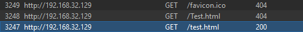
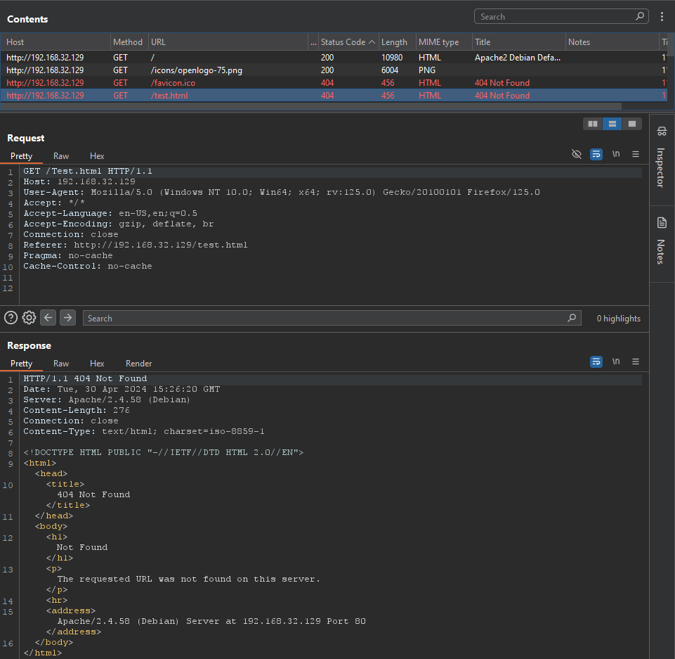

## When Burp LIES.

On a recent red team I was testing a weird app with some complex routing crap happening, and I noticed some odd behavior in burp. The app was load balanced by a case sensitive front-end, ala awslb etc, and certain endpoints were being routed to case-insensitive apps, ala IIS. This matters as I was fuzzing pretty hard and passing in ffuf results to burp with `--replay-proxy`. After fuzzing for a while, I went back to my sitemap tab in burp to look for interesting requests and for some reason I couldn't fine the applications landing page anymore. It was just displayed as a `404`. But that's weird, I had just been on that page? In fact, I could see `POST` requests *to it*, yet the `GET` contents were nowhere to be found. 

Oddly, in the site map for the endpoint the URI was listed as `GET /Buyer/Main` (with a `404` response), but the request and response pair actually showed something different: a `404` for `GET /Buyer/main`.

I refreshed the page, saw the `200` in proxy, saw the `200` in sitemap, and the sitemap request and response pair now showed what I originally expected: a `GET /Buyer/Main` returning a `200`. But, even with all site map filters enabled (disabled?), I no longer saw the lowercase request that got a `404`. So where'd it go?

I did the same test again, but this time requesting the lower case `main` and wouldn't you know it, burp *overwrote the `200` response*... with a `404`. Instead of getting a new sitemap entry for `GET /Buyer/main`, burp straight up overwrote the other request, the valid one, with the contents of the file not found. Ouch.

[I reported this to Portswigger and it was confirmed the next day](https://forum.portswigger.net/thread/site-map-overwriting-responses-on-case-sensitive-website-73e2b111)-- as it turns out, the way burp consolidates items in the site map is a little overzealous and doesn't account for mixed-case-sensitive applications, which makes sense for the most part. With applications becoming more and more of a clusterfuck though, I don't doubt that I have come across this issue before and well, just not noticed :/ 

This obviously isn't some egregious issue but it warranted reporting and I'm glad that it's not just a ME thing :P

## How to make a testers life a nightmare

So I started thinking about it, and for the most part this doesn't really matter... buuuut, I wanted more.

I wondered if somehow this behavior (overwriting legitimate responses with garbo) could be leveraged or useful in some capacity. The answer is mostly a resounding "no", UNLESS... you're a dev working on a case-sensitive app and want to make a testers life a nightmare; then this post is for you! 

Think about it: if a request for the *same page* the user / tester is on is made, but with a single letter of a different case, well... burp's gonna overwrite it in the site map. Sure, it'll be in the proxy and logger, but who cares! You can effectively *hide your responses by overwriting them* lol!

As a little test case / PoC, spin up an Apache server and create a `test.html`. Within it, add an xhr:
```js
var xhttp = new XMLHttpRequest();
xhttp.onreadystatechange = function() {
    if (this.readyState == 4) {
       console.log("Check sitemap, page response overwritten with 404")
    }
};
xhttp.open("GET", "/Test.html", true);
xhttp.send();
```

Now, request the page in your fav browser :^)

```http
HTTP/1.1 200 OK
Date: Tue, 30 Apr 2024 15:26:20 GMT
Server: Apache/2.4.58 (Debian)
Last-Modified: Tue, 30 Apr 2024 15:26:17 GMT
ETag: "179-61751fdbdb45e-gzip"
Accept-Ranges: bytes
Vary: Accept-Encoding
Content-Length: 377
Connection: close
Content-Type: text/html

<html>
	This is a case sensitive endpoint: /test.html
	<script>
		var xhttp = new XMLHttpRequest();
		xhttp.onreadystatechange = function() {
			if (this.readyState == 4) {
				console.log("Check sitemap, response overwritten");
			}
		};
		xhttp.open("GET", "/Test.html", true);
		xhttp.send();
	</script>
</html>
```
Tada, it's gone! Note the proxy history. We see the original request, then the one made by the XHR.



The sitemap now displays `/test.html` -> `404` within the "Contents" tab, and has a "Request" value of `/Test.html`:



Weird huh?
