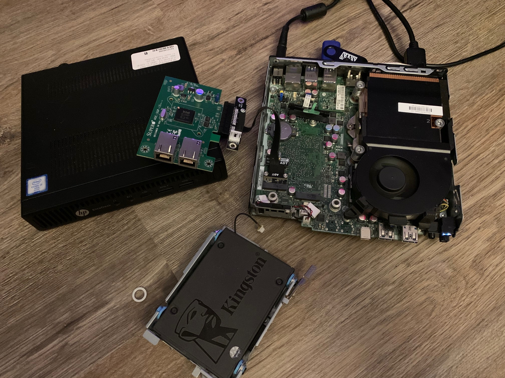

## Homelab pfsense Update

This past year I purchased a permanent location for my networking gear-- it also happened to come with bathrooms, bedrooms and a kitchen, which were all a plus. I've been fortunate to be able to buy a home and one of my dreams as a kid was to be able to have a cool "home lab". While I've had a bit of a lab, it's been getting upgraded since moving and I found myself running a pfsense / pfblockerng setup at the suggestion of my friend [Outrun207](https://github.com/Outrun207). It's been up for about eight months now, running on a 6th gen i5 Optiplex 7040, with an Asus RT-AX88U (yeah, the same one I hacked) acting as a glorified AP / switch:

Fun for a time, I had it hooked up to Telegraf sending its, as well as a bunch of other device's, logs to a Grafana server I hosted on a Pi which gave me some cool insight, as well as large volumes of unnecessary and totally awesome data. Here's a screnshot of when I first got it working:

It was... pretty bland. But over time I built it out a little bit and had a cool interface for log aggregation. After some time the little RaspberryPi it ran on just couldn't keep up with the influx of logs / database queries and it just chugged. I eventually gave it up and turned the pi off, rather than troubleshoot the Telegraf stuff... RIP logger. 

The stats from the pfsense v1 were pretty kickass nearing retirement, check out the pfBlockerNG stats, there's over 1.8m blocked packets from DNSBL_ADs_Basic, and 1.5m blocked by Firebog_Trackers!

Anyway, I eventually came across [this post](https://www.reddit.com/r/PFSENSE/comments/rxps6q/my_tiny_cheap_pfsense_box/) on reddit while browsing and I was intrigued. I thought the use of an old mini PC, plus the modifications to the internals to be really neat, so I poked around for similar mini PCs and found a good deal on an HP 800 G2 Mini with a 6th gen i7, 8gb of ram and a 256 SSD. While not the most exciting machines in the world, the PSU on this little guy is only 65w-- yeah I know it's still way higher than equivalently powerful (maybe even more powerful) NUCs and other specialized hardware, but this is how I wanted to do it :)

In addition to the G2, I also needed to buy a low-profile (and low-power) [PCIe LAN adapter](https://www.ebay.com/itm/165085593224) and a cable to connect it to the motherboard of these machines. Since there aren't any PCIe slots available to plug into, I bought an [M.2 -> PCIe WiFi adapter](https://smile.amazon.com/dp/B07YDFMRY9) to leverage the mobos M.2 slots and connect the LAN adapter to that bus. Lastly, since storage media is so cheap, I snagged a small nvme drive to install pfsense onto. This was overkill and unnecessary, and I don't care.

Once everything arrived I took apart the G2 and found that I'd pretty much just need to remove the SSD and cage to fit the NIC. Sadly, this also would remove the SSD's fan, which I'm sure didn't really do a ton but does provide some airflow in those close component areas. I did attempt to cut the SSD's metal mounting frame / cage up in a way that would enable me to keep the fan in the chassis but ended up mangling the absolute fuck out of it, and that was that. Now, I own some very overpowered metal shears though. Here's some shots of the first stages:

Once I made sure everything fit (and worked, lol, had to fight with the NIC) I was able to drop in the nvme and install pfsense to it. I also noticed that because the components were basically being smashed into the case, the NIC could make contact with the case's metal frame, which could be fine or not fine. In this case, it was not fine and I found it was quite hot after being turned off. Not good. Thankfully I caught it and was able to come up with a solution. You can also notice in some of these pictures that I've removed the headphone and microphone jack from the mobo altogether, which is where the ethernet will be routed through the case. nvme in, ethernet works, pfsense installed (also a tiny little ethernet cable):

Next up was actually crimping some new CAT6 through the case. Since the ethernet routes through the headphone / mic jack, ya gotta wire the cables through those holes initially. This wasn't really an issue, just more of a pain than I anticipated, I guess, though it was super cool at the end:

And OK I KNOW that the 240w PSU in the optiplex isn't actually pulling 240, and realistically likely not much more than the HP, but ~~who cares~~ the new HP pfsense is shweet. 

Here's the old one and the new one! The difference in size is pretty clear. 

I am happy to report that everything is working smoothly after two weeks and pray this second hand HP doesn't die. At least I have a back up now! Granted, the back up is also a second hand desktop that's been used for unknown amounts of time. Maybe I'll go with a NUC next time.
