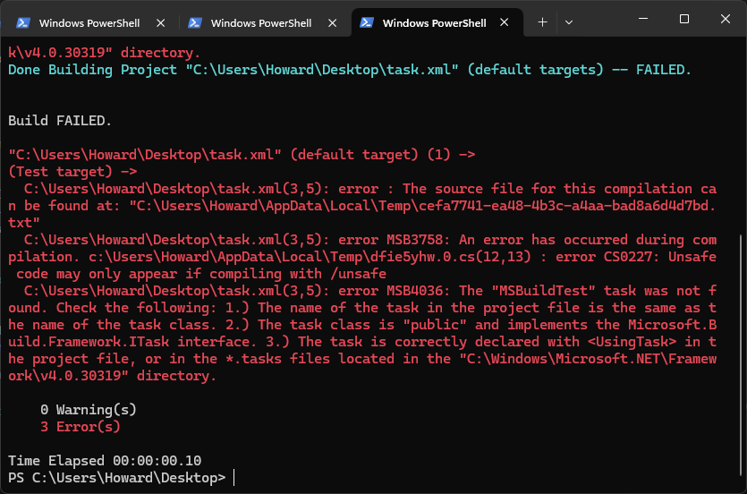
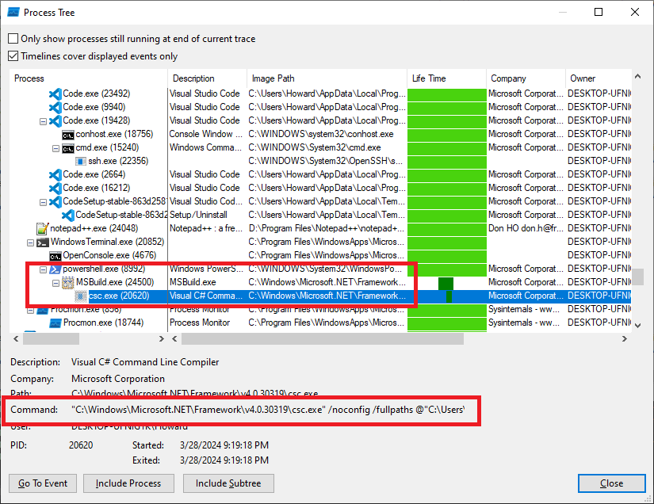
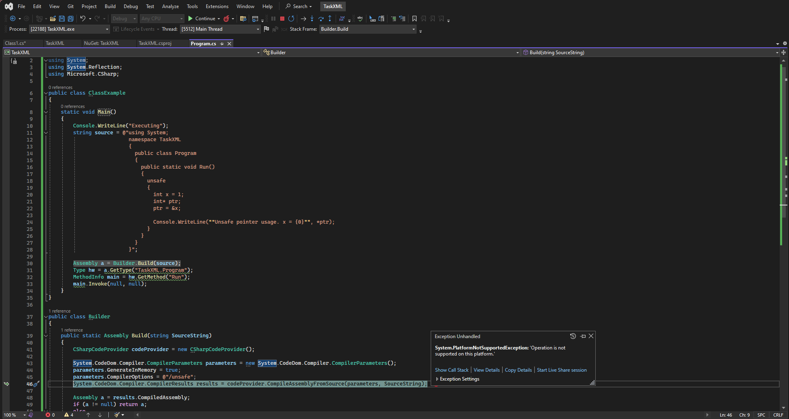
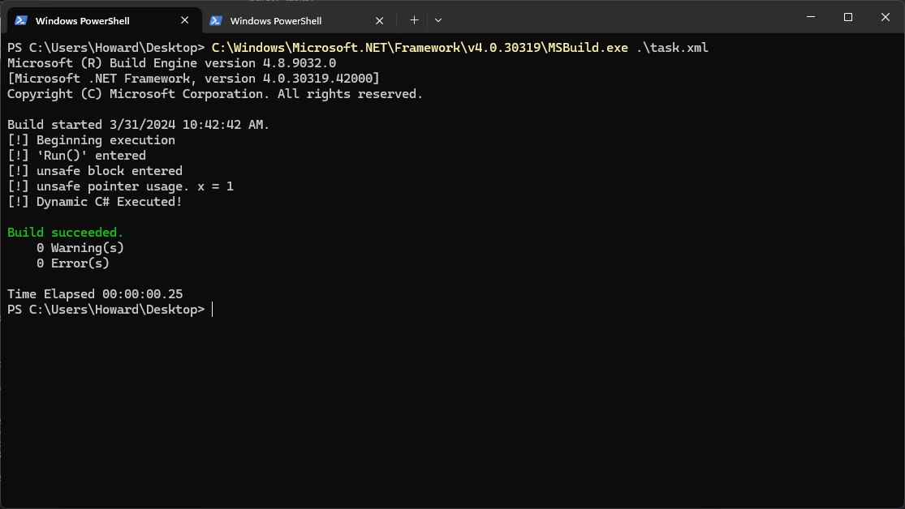
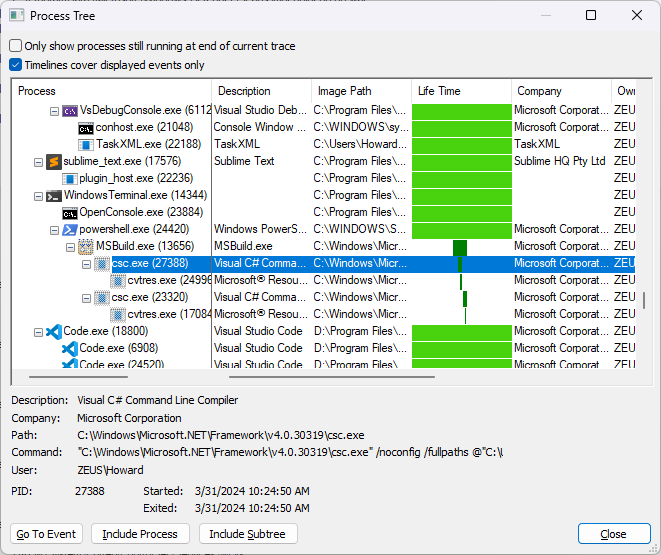

## MSBuild'ing unsafe inline tasks

Recently while doing a bit of research I came across a few blockers (classic)-- the basic problem seemed like it should be fairly simple (also classic), and yet I googled fruitlessly. 

Reading innumerable stack overflow answers **assured me**, the problem was simple! For I must be the fool; how could so many accepted answers to what seemed to be *my exact issue* be mistaken?

*My* question boiled down to this:

    "How do I run msbuild inline tasks which include unsafe code?"

It seems as though many people have asked this, but digging deeper I couldn't find definitive answers that applied to *inline tasks, specifically*-- most suggested passing msbuild CLI switches that didn't work and the remaining answers tended to point the questioner toward modifying their project or build options. The latter was the solution for many, but is ultimately inapplicable to inline task execution.

### tldr; malware

One particularly annoying thing about C#, in all its glory, is that it's not really meant to do low level memory operations. Sure, we have cool classes like `Marshal`, and C# can do what you need, generally. But for the most part, we're abstracted farther away from core memory manipulations. This makes sense in the macro usage, "memory safe" languages are becoming more popular and for good reason, but sometimes when we're developing certain... software we have even better reasons to go under the hood. There are times where it's prudent to perform "unsafe" (read: unmanaged) operations in memory safe languages, and *normally*, in languages such as C#, that's not an issue... provided we have access to things like unsafe code blocks. 

The purpose of this post is to consider the ability to perform unsafe memory operations within *inline msbuild tasks*. Inline tasks are limited to executing C# or VB, so it follows that cool new process injection techniques, generally written in C/++, can't be leveraged via inline tasks without first porting them over, then making C# do naughty things. Therein lies the problem: process injection techniques, such as the new [PoolParty variants](https://github.com/SafeBreach-Labs/PoolParty), heavily manipulate memory. In C# this means: "unga bunga lots of unsafe"

### The root of the (my) problem

If you've followed the full execution chain of running msbuild with inline tasks, you'll find that msbuild does its magic, a temporary file is created (the inline task itself), and in the case of C#, `csc.exe` is called upon it, where the task is compiled and executed. Voila, your program runs.

That's all fine and good, we expect that msbuild will compile and execute our code. While inline tasks give us a lot of flexibility, we're still at the whims of memory safe operations... even if we P/Invoke, etc. In terms of payload development, this puts a cap on what's possible. People use msbuild and inline tasks because they're reliable-- it's a sure fire way to run your payload.

To reiterate-- that's the point of this post. When using inline tasks there's no clear way (if at all) to pass CLI flags to the *compiler*.

Here's an inline task:

```xml
<Project ToolsVersion="4.0" xmlns="http://schemas.microsoft.com/developer/msbuild/2003">
  <Target Name="Test">
    <MSBuildTest />
  </Target>
  <UsingTask
    TaskName="MSBuildTest"
    TaskFactory="CodeTaskFactory"
    AssemblyFile="C:\Windows\Microsoft.Net\Framework\v4.0.30319\Microsoft.Build.Tasks.v4.0.dll" >
    <Task>    
      <Code Type="Class" Language="cs">
        <![CDATA[
        using System;
        using System.Runtime.InteropServices;
        using Microsoft.Build.Framework;
        using Microsoft.Build.Utilities;

        public class MSBuildTest :  Task, ITask
        {   
          public override bool Execute()
          {
            Console.WriteLine("Test MSBuild Task");            
            return true;
          } 
        }
        ]]>
      </Code>
    </Task>
  </UsingTask>
</Project>
```

It does nothing except print a single line when it's compiled (cool):

```Powershell
PS C:\Users\Howard\Desktop> C:\Windows\Microsoft.NET\Framework\v4.0.30319\MSBuild.exe .\task.xml
Microsoft (R) Build Engine version 4.8.9032.0
[Microsoft .NET Framework, version 4.0.30319.42000]
Copyright (C) Microsoft Corporation. All rights reserved.

Build started 3/18/2024 9:20:17 PM.
Test MSBuild Task

Build succeeded.
    0 Warning(s)
    0 Error(s)

Time Elapsed 00:00:00.15
```

So, imagine now that you think "Hey wouldn't it be cool to make a dropper that launches msbuild and  execs my c00l warez?" and then some time later, when the cyber cops are detecting your c00l payloads you think "man I should really update my msbuild dropeprs with a cool new process injection variant like that one the [safebreach guys discovered](https://github.com/SafeBreach-Labs/PoolParty)" lol

A quick test (it's not actually unsafe):
```C#
public override bool Execute()
{
  unsafe{
    Console.WriteLine("Test MSBuild Task");
  }
  return true;
}
```

and msbuild throws a bunch of errors:



You might think the fix is simple: `msbuild /unsafe task.xml`, but you'd be wrong. 



`csc.exe` is called with the following command: `"C:\Windows\Microsoft.NET\Framework\v4.0.30319\csc.exe" /noconfig /fullpaths @"C:\Users\Howard\AppData\Local\Temp\nj5oygpi.cmdline"`

`msbuild` calls `csc.exe`-- presumably, supplying the switch to `csc.exe` will compile successfully. Side note, what's in that `.cmdline` file? Turns out it's a temporary file created by msbuild. I found a [specterops article](https://posts.specterops.io/documenting-and-attacking-a-windows-defender-application-control-feature-the-hard-way-a-case-73dd1e11be3a) that mentions it. In the article, Matt runs `while ($true) { ls $Env:TEMP\*.cmdline | cp -Destination C:\Test\ }` in a PS session while compiling with msbuild.

Output:
```
/t:library /utf8output /R:"C:\WINDOWS\Microsoft.Net\assembly\GAC_MSIL\Microsoft.Build.Utilities.v4.0\v4.0_4.0.0.0__b03f5f7f11d50a3a\Microsoft.Build.Utilities.v4.0.dll" /R:"C:\WINDOWS\Microsoft.Net\assembly\GAC_MSIL\Microsoft.Build.Framework\v4.0_4.0.0.0__b03f5f7f11d50a3a\Microsoft.Build.Framework.dll" /R:"C:\WINDOWS\Microsoft.Net\assembly\GAC_MSIL\System.Core\v4.0_4.0.0.0__b77a5c561934e089\System.Core.dll" /R:"C:\WINDOWS\Microsoft.Net\assembly\GAC_MSIL\System\v4.0_4.0.0.0__b77a5c561934e089\System.dll" /out:"C:\Users\Howard\AppData\Local\Temp\cmmkcghg.dll" /D:DEBUG /debug+ /optimize-  "C:\Users\Howard\AppData\Local\Temp\cmmkcghg.0.cs"
```

There may be some ability to pass in arguments like `/p:AllowUnsafeBlocks=true` but I haven't found that to have an effect on what ends up passed to the CLI. Reviewing procmon output when building via VStudio shows `devenv.exe` -> `msbuild.exe` -> `vbcscompiler.exe`.

### Safety-tasks? 

Alright bigger picture: attempting to make an msbuild task perform some sort of process injection, process hollowing for instance. I might be able to safety-fy stuff but there's no promises that will work for everything. `Sharphollower` appears to be an aptly named C# port of process hollowing routines, so pretty relevant. Take a look at the [code beginning at line 218](https://github.com/Pickfordmatt/SharpHollower/blob/master/SharpHollower/Program.cs#L218):

```C#
public void CopyShellcode(byte[] buf)
{
    long lsize = size_;
    if (buf.Length > lsize)
        throw new IndexOutOfRangeException("[x] Shellcode buffer is too long!");

    unsafe
    {
        byte* p = (byte*)localmap_;

        for (int i = 0; i < buf.Length; i++)
        {
            p[i] = buf[i];
        }
    }
}
```

This is basic write-- data from `buf` is written one byte at a time to `localmap_`. This code requires `unsafe{}`, as the operations are on *unmanaged* memory, specifically. As far as I can tell, there are no ways to give arguments on the command line to msbuild and pass them to `csc.exe`

That being said, I stumbled upon the following [xml task](https://github.com/trustedsec/social-engineer-toolkit/blob/master/src/teensy/ino_build_file.xml) from the social engineer toolkit (SET) recently, which accomplishes this within the task itself! Turns out, it's possible to use reflection to load and compile unsafe code blocks. 

It's a bit finnicky to get this to work-- msbuild errors are cryptic, and troubleshooting them by dropping code into VS can help, but I found I'd often get additional puzzling errors, such as the one below which says `Operation is not supported on this platform.` What?



> What it seems to boil down to is that msbuild itself uses different assemblies... or something. I found that it's possible to use the "Roslyn" compiler to perform this type of dynamic C# execution, which *does work* in VS on .NET 5 / 6. [Check out this code](https://github.com/joelmartinez/dotnet-core-roslyn-sample/blob/master/Program.cs) for MS's example.

### PoC

First, a screenshot. The code builds, runs msbuild `Execute()`, then compiles and executes the dynamic C# and unafe code block!



and, the task code itself:

```xml
<Project ToolsVersion="4.0" xmlns="http://schemas.microsoft.com/developer/msbuild/2003">
<Target Name="TestTask">
<TestTask />
</Target>
<UsingTask
TaskName="TestTask"
TaskFactory="CodeTaskFactory"
AssemblyFile="C:\Windows\Microsoft.Net\Framework\v4.0.30319\Microsoft.Build.Tasks.v4.0.dll" >
<Task>
<Using Namespace="System" />
<Using Namespace="System.Reflection" />
<Using Namespace="System.Diagnostics" />
<Code Type="Class" Language="cs">

<![CDATA[

using System;
using System.Reflection;
using Microsoft.CSharp;
using Microsoft.Build.Framework;
using Microsoft.Build.Utilities;

public class TestTask : Task, ITask
{
    public override bool Execute()
    {

        Console.WriteLine("[!] Beginning execution");
        string source = @"using System;
                          namespace TaskXML
                          {
                            public class Program
                            {
                              public static void Run()
                              {
                                Console.WriteLine(""[!] 'Run()' entered"");
                                unsafe
                                {
                                  Console.WriteLine(""[!] unsafe block entered"");
                                  int x = 1;
                                  int* ptr;
                                  ptr = &x;

                                  Console.WriteLine(""[!] unsafe pointer usage. x = {0}"", *ptr); 
                                }
                              }
                            }
                          }";

        Assembly a = Builder.Build(source);
        Type hw = a.GetType("TaskXML.Program");
        MethodInfo r = hw.GetMethod("Run");
        r.Invoke(null, null);
        Console.WriteLine("[!] Dynamic C# Executed!");
        return true;
    }
}

public class Builder
{
    public static Assembly Build(string SourceString)
    {
        CSharpCodeProvider codeProvider = new CSharpCodeProvider();

        System.CodeDom.Compiler.CompilerParameters parameters = new System.CodeDom.Compiler.CompilerParameters();
        parameters.GenerateInMemory = true;
        parameters.CompilerOptions = @"/unsafe";
        System.CodeDom.Compiler.CompilerResults results = codeProvider.CompileAssemblyFromSource(parameters,SourceString);

        Assembly a = results.CompiledAssembly;
        if(a != null) return a;
        else
        {
            Assembly nullAssembly = Assembly.GetExecutingAssembly();
            Console.WriteLine("Null Assembly");
            return nullAssembly;
        }
    }
}
]]>
</Code>
</Task>
</UsingTask>
</Project>
```

### Where's unsafe? 

After running this, it's presumed that `/unsafe` is passed to the CLI, but looking in procmon there's no `csc.exe ... /unsafe`. So what happened? 



Recall that both `msbuild.exe` and `csc.exe` accept `*.cmdline` files as arguments. Running the powershell to auto-copy out the temporary `*.cmdline` files (or simply cat them out) finds the solution to the mysterious unsafe.

```Powershell
PS C:\> while ($true) { cat $Env:TEMP\*.cmdline -ErrorAction SilentlyContinue }
...
/t:library /utf8output /R:"C:\WINDOWS\Microsoft.Net\assembly\GAC_MSIL\Microsoft.Build.Utilities.v4.0\v4.0_4.0.0.0__b03f5f7f11d50a3a\Microsoft.Build.Utilities.v4.0.dll" /R:"C:\WINDOWS\Microsoft.Net\assembly\GAC_MSIL\Microsoft.Build.Framework\v4.0_4.0.0.0__b03f5f7f11d50a3a\Microsoft.Build.Framework.dll" /R:"C:\WINDOWS\Microsoft.Net\assembly\GAC_MSIL\System.Core\v4.0_4.0.0.0__b77a5c561934e089\System.Core.dll" /R:"C:\WINDOWS\Microsoft.Net\assembly\GAC_MSIL\System\v4.0_4.0.0.0__b77a5c561934e089\System.dll" /out:"C:\Users\Howard\AppData\Local\Temp\ahqtg2kh.dll" /D:DEBUG /debug+ /optimize-  "C:\Users\Howard\AppData\Local\Temp\ahqtg2kh.0.cs"
...
/t:library /utf8output /out:"C:\Users\Howard\AppData\Local\Temp\v4kj4ex5.dll" /debug- /optimize+ /unsafe  "C:\Users\Howard\AppData\Local\Temp\v4kj4ex5.0.cs"
```

In the above output, the first file, `ahqtg2kh.cmdline` is generated for the first bit of code, the actual inline task being executed / compiled. The second file that's printed though, `v4kj4ex5.cmdline` finally gets to the bottom of it all, as it's generated for the dynamic C# execution:

`/t:library /utf8output /out:"C:\Users\Howard\AppData\Local\Temp\v4kj4ex5.dll" /debug- /optimize+ /unsafe  "C:\Users\Howard\AppData\Local\Temp\v4kj4ex5.0.cs"`

As hoped, `/unsafe` is passed down to `csc.exe`! All thanks to our good friend reflection.

Now, go forth and execute inline tasks the cool, unsafe way ;)

#### References:

SET Task: 
- https://github.com/trustedsec/social-engineer-toolkit/blob/3611133a5a77d4feed969b3a07e1571cd8456356/src/teensy/ino_build_file.xml

MS Roslyn Compiler: 
- https://github.com/joelmartinez/dotnet-core-roslyn-sample/blob/master/Program.cs

Other interesting potential methods: 
- https://stackoverflow.com/questions/826398/is-it-possible-to-dynamically-compile-and-execute-c-sharp-code-fragments
- https://github.com/Fody/Fody

