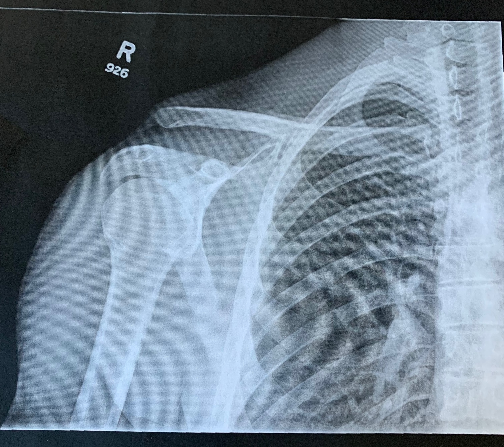
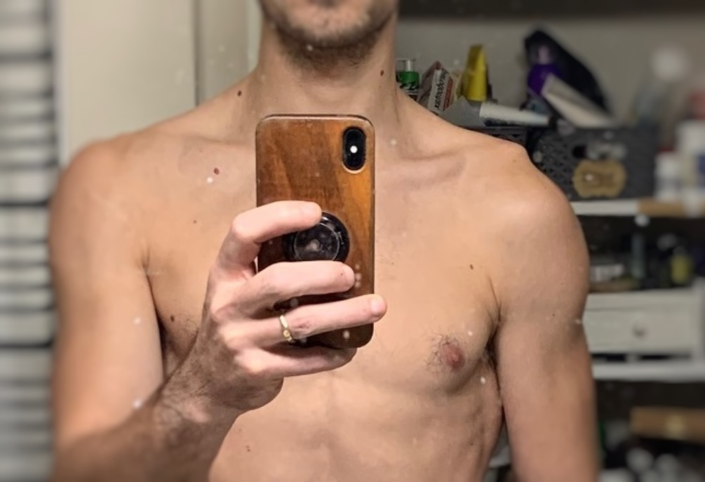

## ARM... wait no, an arm!

For the last 15 years I've identified myself as a climber-- a boulderer at heart. I've spent a significant amount of my life pebble wrestling, with a good bit of sport climbing mixed in. Things changed this past September when I hit a not-so-rad jump on my mountain bike and got a grade 5 AC separation-- oops. This could be considered a **catastrophic** injury for a person such as myself to face. 

I've gone from doing one arm pull-ups, front-levers, and holding a planche (*I have witnesses!*) to... doing 5lb curls. To not being able to put a shirt on. To not being able to *sleep*. More than just a brutal hit to my body, I found myself with a bit of a bruised ego, and a real fear of the future. 

Here's an x-ray and a photo

Ouch!

### I'm a lefty now, I guess

The AC joint is responsible for being the only skeletal connections your shoulders have to your body. Made up of several (3 maybe?) ligaments, these connections are under *immense* passive pressure, and it's what's responsible for giving our shoulders stability. When the connections to these locations are severed, you can think of it like a loaded spring-- one end goes UP, the other DOWN. Turns out it's the most mobile joint in our bodies (wow!).

The result of an AC separation varies, with a Gade 1 - 3 being treated almost exclusively via physical therapy. As I only do things that push the limits, I naturally got a severe separation (grade 5 out of 6 ;_; ) resulting in a large protrusion of my collar bone and a (temporarily) dead-weight right arm, as you (probably) saw earlier. So after 32 years of being right handed, the universe has decided a fun game would be to become a lefty.

### Surgery - 3 Months Out

It's now been just over three months since I had a full surgical reconstruction of my right AC joint using something [like this](https://www.arthrex.com/shoulder/ac-dog-bone-technique). I can plank again, *almost* hang off a bar, and am beginning to introduce more complex movements into my PT routines. 

A side effect of being in a sling for six weeks after a shoulder surgery is that your rotator cuff actually atrophies quite quickly. In a measurement of the degrees of motion, I had about -10 degrees when I got my sling off. Not good, but apparently expected?? A harsh reality! 

### The Mental

My life has been pulling on things, and climbing is who I am at my core. Feeling like I had that ripped away from me was absolutely devastating, I can't really even explain it. It just sucked. so. bad. 

A friend sent me a podcast soon after surgery, from which I've adopted a new mantra. [Believing the Best Days are Ahead](https://freetrail.com/freetrail-podcast/believing-the-best-days-are-ahead-with-hillary-allen/) is an episode of the [Freetrail podcast](https://freetrail.com/podcasts/freetrail-podcast/), where Hillary Allen, an accomplished and world champion ultra/sky runner shared her story and experiences after quite literally *falling off a mountain* during a race in 2017. And *yeah*, it was as bad as it sounds.

Hillary speaks on her experiences recovering, and how she went from being told she would never run again, to competing in (and placing in!) ultra marathons again just two years later. It's an incredible story and one that has helped me immensely. It's given me something to remember and focus on when I'm bummed, and even though it's not bulletproof, I can trust that things will get better in time, and with a **ton** of work, lol.

Six month update in May.